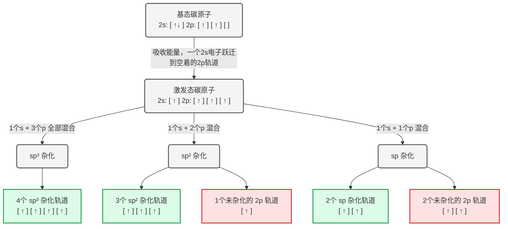
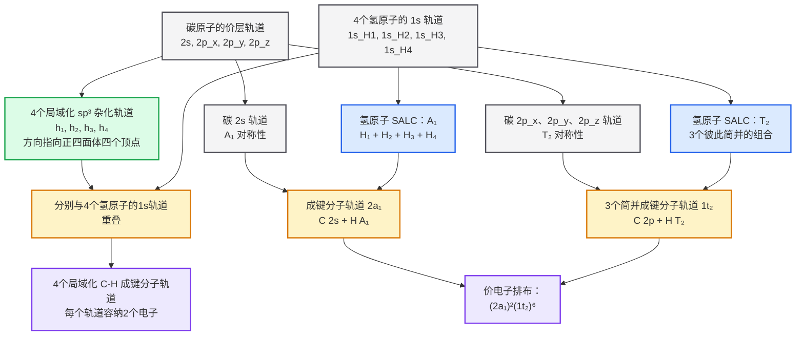

# sp杂化轨道

> sp杂化轨道是一种方便的数学模型与思维工具，其并不真实存在。

碳原子的基态电子排布为 $1s^2 2s^2 2p^2$ 。

## 甲烷

以甲烷 $\ce{CH4}$ 为例。

### 一、事实与矛盾

事实一：甲烷的碳氢比为 1 比 4。

矛盾一：碳原子满足：

- $2s$ 轨道有 2 个电子 （已配对：$\uparrow\downarrow$ ）

- $2p$ 轨道有 3 个子轨道 ($p_x, p_y, p_z$) 。根据洪特规则，2 个电子会分别占据两个不同的 $p$ 轨道 (未配对： $\uparrow, \uparrow, -$)，留空一个 $p$ 轨道

根据价键理论的基础：共价键是由两个原子各自提供一个为成对电子（单电子）配对形成的。

基态的碳原子只有 2 个未成对电子。如果不做出任何改变，它理应只能和 2 个氢原子结合，形成 $\ce{CH2}$ 。这无法解释为什么碳能结合 4 个氢原子形成 $\ce{CH4}$ 。

### 二、事实与矛盾

事实二：考虑甲烷 $\ce{CH4}$ 的空间结构，甲烷是完美的正四面体，四个 $\ce{C-H}$ 键完全等价，键角均为 109.5°。

矛盾二：为了使得碳原子能够形成四个共价键，早期的化学家提出了一个假设：碳原子通过吸收一点能量，把 $2s$ 轨道上的一个电子“跃迁”到哪个空着的 $2p$ 轨道上，电子排布变成了$2s^12p^3$ 。

虽然形成了四个共价键，但新的矛盾随之而来：这 4 个电子分别处在不同性质的轨道中。$2s$ 轨道是球形的，离原子核稍近，能量较低。三个 $2p$ 轨道是哑铃形的，离原子较远，能量较高。

如果这 4 个未经修改的轨道去和氢原子的 $1s$ 轨道重叠成键，必然会形成一个 $s-s$ 和三个 $s-p$ 键。这两种键的键长、键能理应是不一样的。

即使假设键长、键能的差异小到忽略不计，也无法解释空间构型。$p_x, p_y, p_z$ 这三个轨道在三维空间中是互相垂直的（沿 X、Y、Z 轴分布）。这意味着，有这三个 $p$ 轨道形成的三个 $\ce{C-H}$ 键，它们之间的夹角必须是 90°。这与正四面体的性质相去甚远。

### 提出杂论理论

为了解决以上矛盾，鲍林（Linus Pauling）提出了杂化理论：碳原子在成键时，原子轨道可以进行线性组合，重新形成若干个能量相同、形状相同、方向不同的杂化轨道。

在基态时，碳原子的价电子排布为 $2s^2 2p^2$。在成键前，碳原子可以吸收一定能量，使 $2s$ 轨道中的一个电子跃迁到空着的 $2p$ 轨道，形成含有 4 个未配对电子的激发态，电子排布变为 $2s^1 2p^3$。随后，$s$ 轨道和一定数量的 $p$ 轨道发生杂化。

根据参与杂化的轨道数量不同，碳原子可以形成三种常见的杂化方式：
  - **$sp^3$ 杂化**：1 个 $s$ 轨道和 3 个 $p$ 轨道混合，形成 4 个能量相同、形状相同的 $sp^3$ 杂化轨道。4 个轨道中各有 1 个未配对电子。
  - **$sp^2$ 杂化**：1 个 $s$ 轨道和 2 个 $p$ 轨道混合，形成 3 个 $sp^2$ 杂化轨道，3 个轨道中各有 1 个未配对电子；剩下 1 个未参与杂化的 $2p$ 轨道，其中有 1 个未配对电子。
  - **$sp$ 杂化**：1 个 $s$ 轨道和 1 个 $p$ 轨道混合，形成 2 个 $sp$ 杂化轨道，2 个轨道中各有 1 个未配对电子；剩下 2 个未参与杂化的 $2p$ 轨道，其中各有 1 个未配对电子。

## Mermaid 表示

### 甲烷

> AI 给我干到哪儿来了，这还是普通化学吗？

