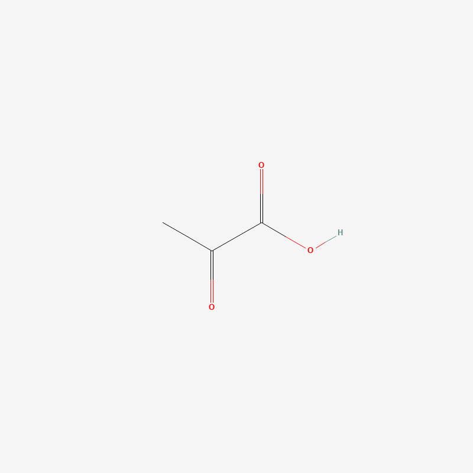
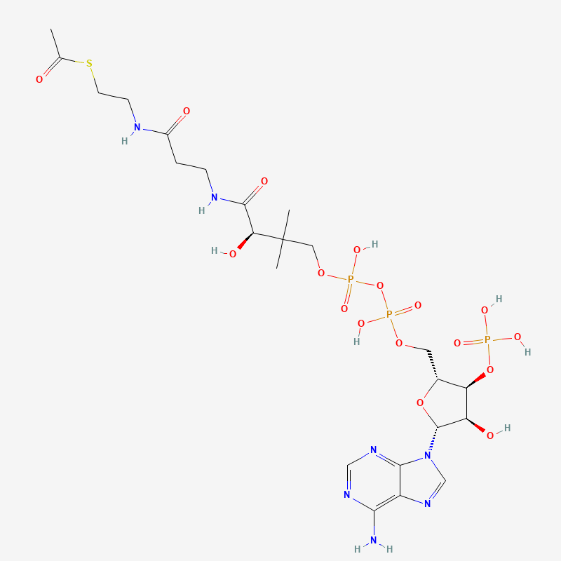

# 丙酮酸氧化（Pyruvate Oxidation）学习笔记

## 一、反应步骤总览

丙酮酸氧化发生在线粒体基质（mitochondrial matrix），是连接糖酵解和柠檬酸循环的桥梁步骤。与糖酵解不同，这一步在坎贝尔生物学教材层面只作为**一个整体反应**处理，不展开内部的多酶复合体机制（丙酮酸脱氢酶复合体 PDC 内部实际分几个子步骤，涉及 TPP、硫辛酰胺等辅酶，属于生物化学课程内容，此处不深究）。

---

### 唯一步骤：丙酮酸 → 乙酰辅酶A

**反应式**：[丙酮酸](#丙酮酸) + [NAD+](#nad) + [辅酶A](#coa) → [乙酰辅酶A](#acetylcoa) + CO₂ + [NADH](#nadh)

**类型**：氧化脱羧 + 缩合（同时发生）

**机制**：丙酮酸（3 碳）的羧基碳被氧化并以 CO₂ 形式脱去，这是葡萄糖 6 个碳中第一批真正被释放为 CO₂ 的碳（糖酵解本身不产生 CO₂）。剩下的 2 碳片段（乙酰基）在被氧化的同时把释放的电子交给 NAD+，生成 NADH；乙酰基随后与辅酶A 上的硫醇基团（-SH）形成高能硫酯键（thioester bond），生成乙酰辅酶A。

**ATP/NADH 变化**：产生 1 个 NADH，不消耗、不产生 ATP。（因为一个葡萄糖对应 2 个丙酮酸，这一步整体发生两次，共产生 2 个 NADH、2 个 CO₂、2 个乙酰辅酶A）

> **知识边界提示**：以上反应实际由丙酮酸脱氢酶复合体（pyruvate dehydrogenase complex, PDC）催化，内部分为脱羧、氧化转移、转给辅酶A、辅酶再生等多个子步骤，涉及硫胺素焦磷酸（TPP）、硫辛酰胺（lipoamide）、FAD 等辅酶接力，这些细节属于生物化学课程内容，超出了坎贝尔生物学的知识范围。现阶段只需记住净反应的结论（丢一个碳、生成一个 NADH、乙酰基挂到辅酶A上），不必强行理解复合体内部机制，留待后续学习生物化学时自然衔接。

**跨章节连接点**：这一步是葡萄糖彻底氧化为 CO₂ 的开始——6 个碳里的第一个碳在这里离开，剩下 2 个碳作为乙酰基进入柠檬酸循环，会在那里被逐一氧化释放剩余的碳。

**疑问与讨论记录：丙酮酸三个碳的具体走向**：

丙酮酸按碳编号可写成 C1（羧基碳，-COOH）、C2（酮基碳，-CO-，"丙酮酸"名称的来源）、C3（甲基碳，-CH₃）。反应中**不是三个碳各自独立分配到三处**，而是：

- **C1（羧基碳）单独脱落，变成 CO₂**。这个碳本来就处于高度氧化状态（羧基），脱羧只是"临门一脚"。
- **C2 和 C3 始终保持相连，作为一个完整的 2 碳单位（乙酰基，CH₃-CO-）整体转移到辅酶A 的硫醇基团上**，形成乙酰辅酶A。C2 在此过程中被进一步氧化（释放的电子交给 NAD+ 生成 NADH），但没有脱离分子，仍留在乙酰基里。

简言之：**1 个碳（C1）离开变成 CO₂，另外 2 个碳（C2+C3）作为一整个乙酰基单位一起进入乙酰辅酶A**，不是三碳各奔东西。

---

## 二、分子词汇表

本节涉及的分子中，丙酮酸、NAD+、NADH 三个在糖酵解学习笔记中已有完整条目，此处沿用相同图片重新登记（不重复解释命名细节，只标注在本反应中的角色）；辅酶A 和乙酰辅酶A 是本笔记新增的分子。

结构图均为 800×800 PNG，存放在本文件同级目录下。

### 目录（点击跳转）

1. [丙酮酸（Pyruvate）](#丙酮酸)
2. [烟酰胺腺嘌呤二核苷酸·氧化型（NAD+）](#nad)
3. [辅酶A（CoA）](#coa)
4. [乙酰辅酶A（Acetyl-CoA）](#acetylcoa)
5. [烟酰胺腺嘌呤二核苷酸·还原型（NADH）](#nadh)

---

### 1. 丙酮酸（Pyruvate） 

- **英文全称**：Pyruvic acid（阴离子形式称 Pyruvate）
- **中文全称**：丙酮酸
- **命名解析**：详见糖酵解学习笔记，此处不重复。
- **在丙酮酸氧化中的位置**：反应物，糖酵解的终点产物，进入线粒体基质后在这里被氧化脱羧。
- PubChem CID：1060（酸式，本笔记图片对应此形式）

---

### 2. 烟酰胺腺嘌呤二核苷酸·氧化型（NAD+） 

- **英文全称**：Nicotinamide adenine dinucleotide
- **中文全称**：烟酰胺腺嘌呤二核苷酸（氧化型）
- **命名解析**：详见糖酵解学习笔记，此处不重复。
- **在丙酮酸氧化中的位置**：反应物，接收丙酮酸氧化脱羧释放的电子，生成 [NADH](#nadh)。
- PubChem CID：925

.png)

---

### 3. 辅酶A（CoA） 

- **英文全称**：Coenzyme A
- **英文简写**：CoA
- **中文全称**：辅酶A
- **中文简写**：CoA（中文语境通常直接用英文简写）
- **命名解析**："A" 代表 acetylation（乙酰化），因其最初被发现的功能是参与乙酰化反应而得名。结构上由泛酸（pantothenic acid，维生素 B5）、巫胺（β-mercaptoethylamine，带有关键的 -SH 硫醇基团）和 ADP 三部分组成。真正参与反应的活性位点是末端的硫醇基团（-SH），其余部分是识别和连接用的"手柄"。
- **在丙酮酸氧化中的位置**：反应物，其硫醇基团（-SH）与丙酮酸氧化脱羧后剩下的乙酰基形成硫酯键，生成 [乙酰辅酶A](#acetylcoa)。
- **当前阶段理解程度**：结构图看起来复杂（腺苷+磷酸+泛酸+巫胺拼接而成），但坎贝尔层面只需认出**末端的 -SH（硫醇基团）**——这是分子里唯一真正参与化学反应的位点。剩下的一大串骨架是识别和连接用的"手柄"，不参与化学变化本身，不需要逐个原子记忆。类比：像一辆车只需认出"挂钩"在哪，不用记住底盘和轮子的细节。
- PubChem CID：87642

---

### 4. 乙酰辅酶A（Acetyl-CoA） 

- **英文全称**：Acetyl coenzyme A
- **英文简写**：Acetyl-CoA
- **中文全称**：乙酰辅酶A
- **中文简写**：乙酰CoA（中文语境常混用）
- **命名解析**：辅酶A（CoA）的硫醇基团（-SH）与一个乙酰基（acetyl，CH3-CO-）通过硫酯键（thioester bond）连接而成。硫酯键是一种高能键，水解时释放的能量比普通酯键更多，这也是为什么乙酰辅酶A能作为"活化的乙酰基"参与后续柠檬酸循环第一步的缩合反应。
- **在丙酮酸氧化中的位置**：本反应的最终产物，携带着丙酮酸剩余的 2 个碳，是丙酮酸氧化和柠檬酸循环之间的连接分子。
- **当前阶段理解程度**：只需在辅酶A 结构的基础上，认出末端多挂了一个 2 碳的乙酰基（CH₃-CO-），通过硫酯键（thioester bond）连接。需要记住的生物学意义是：这根硫酯键是高能键，使乙酰辅酶A 成为"活化的乙酰基"，能推动柠檬酸循环第一步的缩合反应；但"硫酯键为什么比普通酯键能量高"背后的电子云分布等化学细节属于生物化学范畴，此处不必深究。
- PubChem CID：444493

---

### 5. 烟酰胺腺嘌呤二核苷酸·还原型（NADH） 

- **英文全称**：Nicotinamide adenine dinucleotide + Hydrogen
- **中文全称**：烟酰胺腺嘌呤二核苷酸（还原型）
- **命名解析**：详见糖酵解学习笔记，此处不重复。
- **在丙酮酸氧化中的位置**：本反应的产物，携带从丙酮酸氧化脱羧中获得的电子，后续进入电子传递链。
- PubChem CID：439153

.png)

---

## 总账

| 项目 | 数量（每个丙酮酸） | 数量（每个葡萄糖，对应 2 个丙酮酸） |
|---|---|---|
| 消耗 CoA | 1 | 2 |
| 消耗 NAD+ | 1 | 2 |
| 产生 CO₂ | 1 | 2 |
| 产生 NADH | 1 | 2 |
| 产生 乙酰辅酶A | 1 | 2 |
| ATP 变化 | 0 | 0 |

丙酮酸氧化把糖酵解产生的 2 个丙酮酸各转化为 1 个乙酰辅酶A，过程中释放 2 个 CO₂（葡萄糖 6 个碳中最先离开的 2 个），并把电子存进 2 个 NADH。至此葡萄糖还剩 4 个碳（以 2 个乙酰辅酶A 的形式），将进入柠檬酸循环被彻底氧化。
