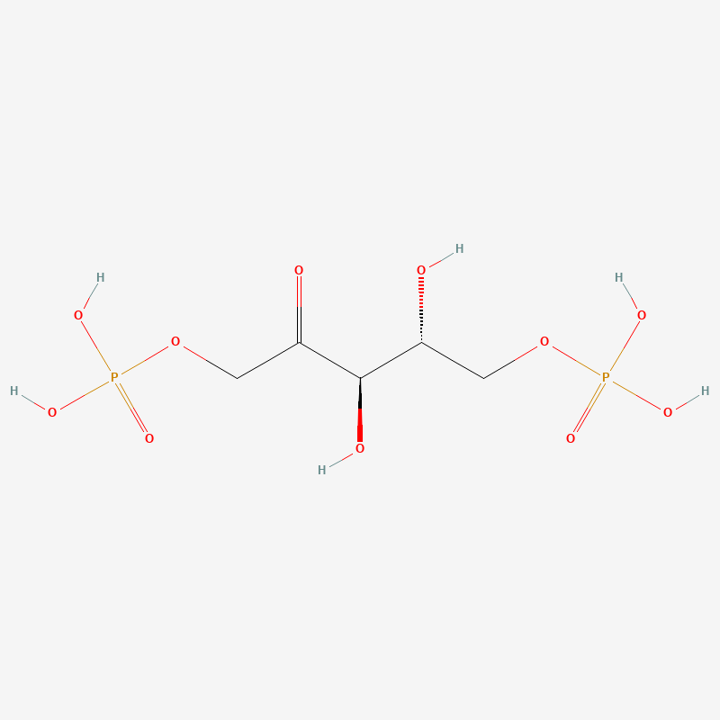
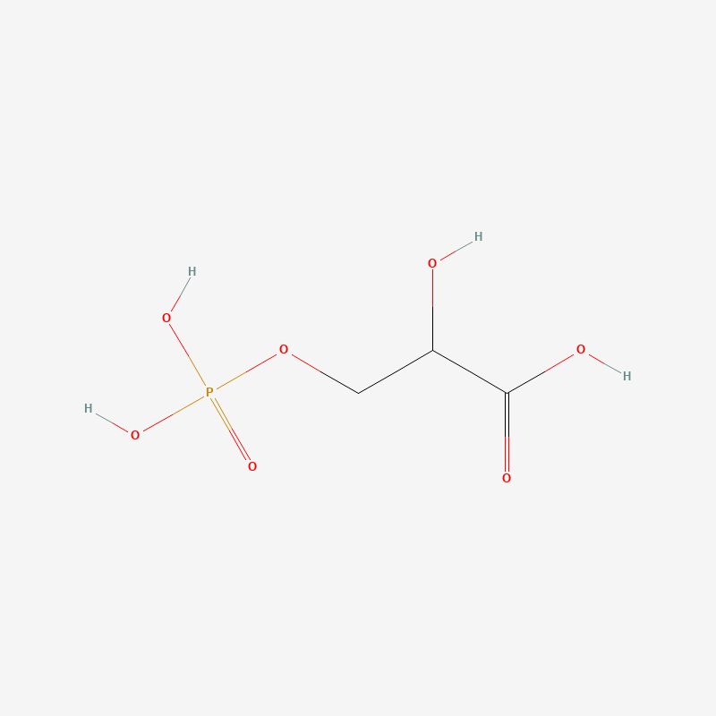
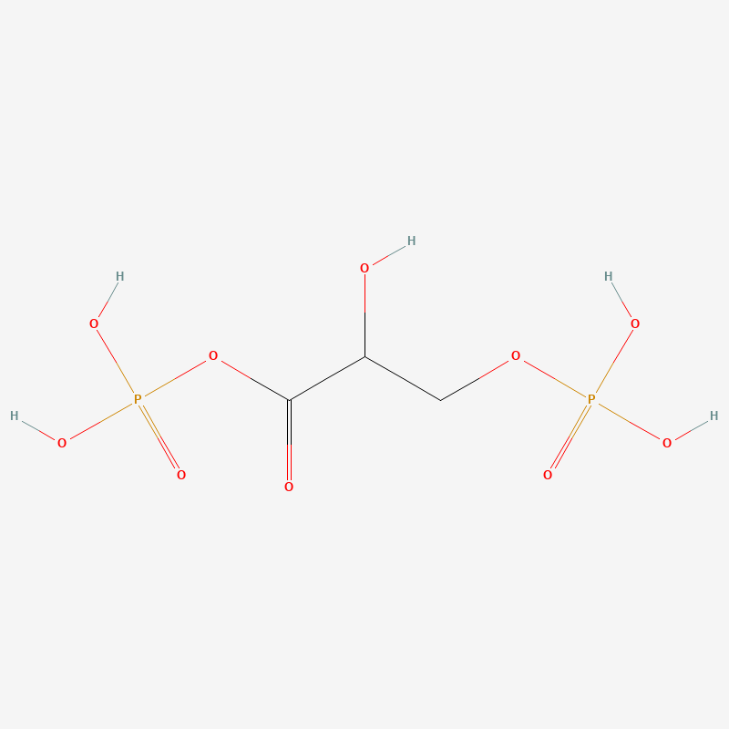
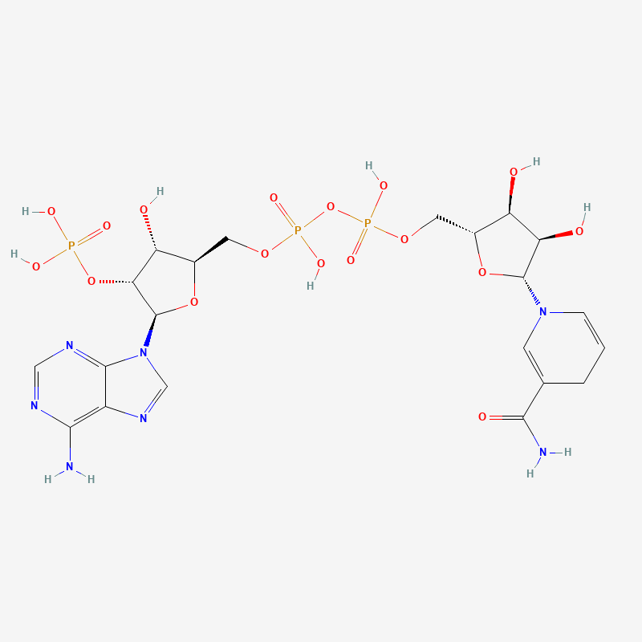
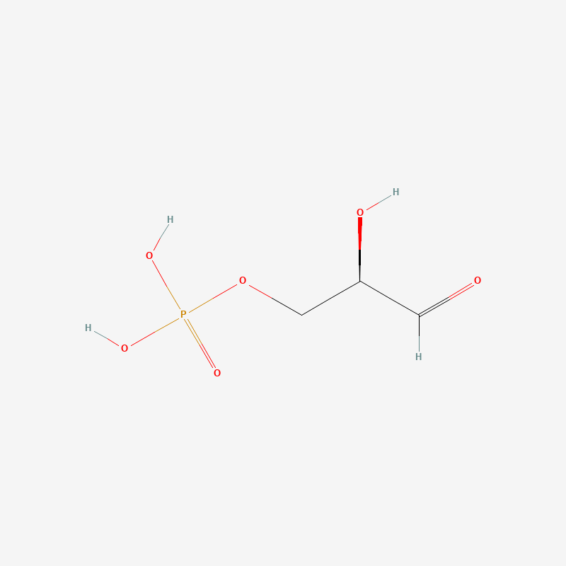
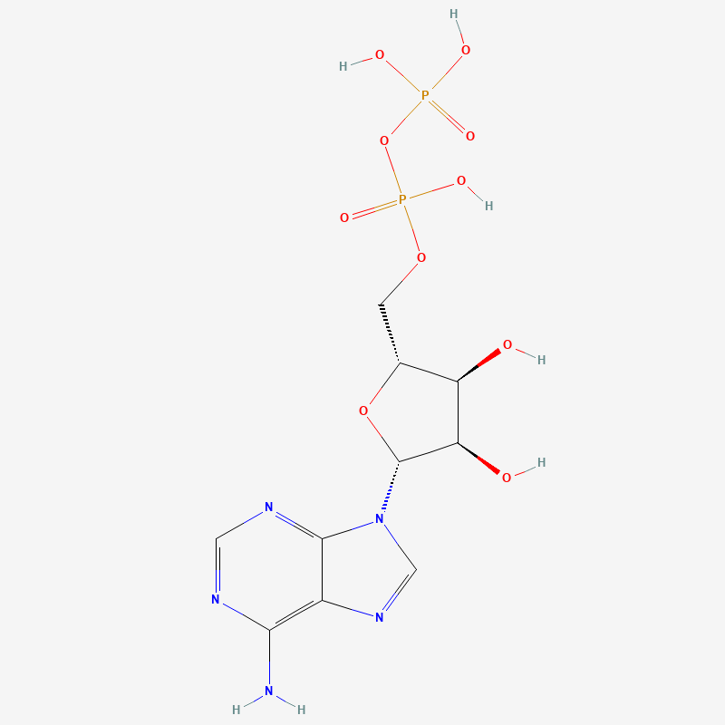
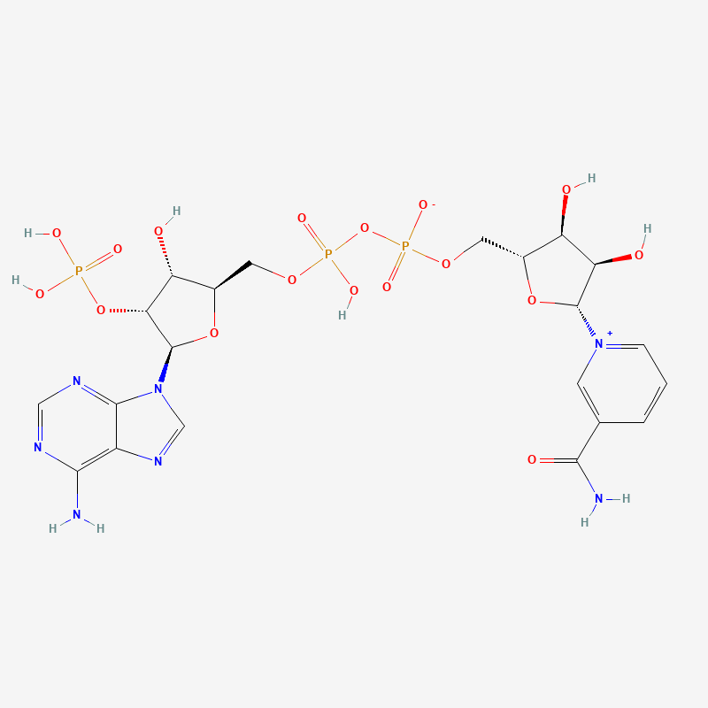
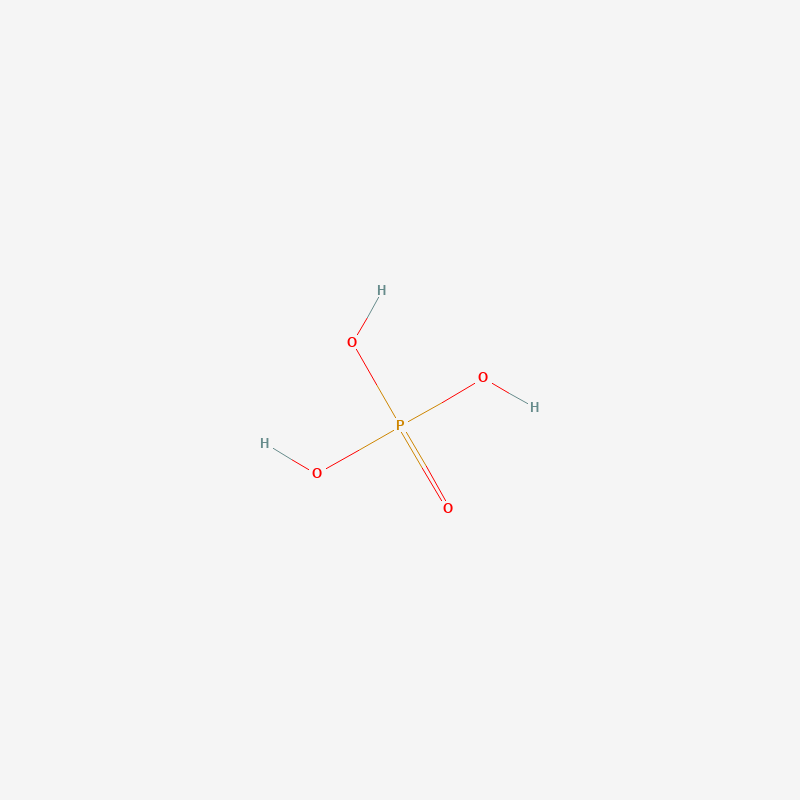

# 卡尔文循环分子结构示意图

卡尔文循环（Calvin Cycle）是光合作用中的暗反应阶段，将CO₂固定并还原为有机物。该循环可分为三个阶段：碳固定、还原和RuBP再生。

---

## 阶段一：碳固定（Carbon Fixation）

### 1. CO₂（二氧化碳）

**英文名称**：
- 简称：CO₂
- 全称：Carbon Dioxide

**中文名称**：二氧化碳

**命名来源**：
- **英文**：Carbon（碳）+ Di-（二）+ Oxide（氧化物），表示一个碳原子与两个氧原子结合的氧化物。
- **中文**：二氧化碳直译自英文，"二氧化"表示含有两个氧原子。

**特征描述**：
- 分子式：CO₂
- 线性分子结构（O=C=O）
- 大气中的主要温室气体
- 光合作用的碳源
- 在常温常压下为气体

**分子结构**：

---

### 2. RuBP（核酮糖-1,5-二磷酸）

**英文名称**：
- 简称：RuBP
- 全称：Ribulose 1,5-bisphosphate（或 Ribulose 1,5-diphosphate）

**中文名称**：核酮糖-1,5-二磷酸

**命名来源**：
- **英文**：Ribulose（核酮糖，一种五碳酮糖）+ 1,5-bisphosphate（1,5-二磷酸，表示在1号和5号碳上连接磷酸基团）。
- **中文**：核酮糖指含有酮基的五碳糖，"1,5-二磷酸"表示磷酸基团的位置。

**特征描述**：
- 分子式：C₅H₁₂O₁₁P₂
- 五碳酮糖的二磷酸酯
- CO₂的受体分子
- 由RuBisCO酶催化与CO₂结合
- 卡尔文循环的关键起始底物

**分子结构**：

---

### 3. 3-PGA（3-磷酸甘油酸）

**英文名称**：
- 简称：3-PGA（或 3-phosphoglycerate, 3PG）
- 全称：3-Phosphoglyceric acid / Glycerate 3-phosphate

**中文名称**：3-磷酸甘油酸

**命名来源**：
- **英文**：3-Phospho-（3号位磷酸基）+ glyceric acid（甘油酸，三碳羟基酸）。
- **中文**：甘油酸是甘油氧化后的产物，"3-磷酸"表示磷酸基团在第3号碳位置。

**特征描述**：
- 分子式：C₃H₇O₇P
- 三碳有机酸的磷酸酯
- 碳固定的第一个稳定产物
- 每固定1个CO₂产生2分子3-PGA
- 碳固定阶段的产物

**分子结构**：

---

## 阶段二：还原（Reduction）

### 4. ATP（三磷酸腺苷）

**英文名称**：
- 简称：ATP
- 全称：Adenosine Triphosphate

**中文名称**：三磷酸腺苷

**命名来源**：
- **英文**：Adenosine（腺苷，由腺嘌呤与核糖组成）+ Tri-（三）+ phosphate（磷酸），表示含有三个磷酸基团的腺苷。
- **中文**：腺苷上连接三个磷酸基团。

**特征描述**：
- 分子式：C₁₀H₁₆N₅O₁₃P₃
- 细胞的"能量货币"
- 含有高能磷酸键（~P）
- 在还原阶段提供磷酸化能量
- 每固定3个CO₂需要9个ATP（6个用于还原，3个用于再生）

**分子结构**：

---

### 5. 1,3-BPG（1,3-二磷酸甘油酸）

**英文名称**：
- 简称：1,3-BPG（或 1,3-bisphosphoglycerate, 1,3-DPG）
- 全称：1,3-Bisphosphoglyceric acid

**中文名称**：1,3-二磷酸甘油酸

**命名来源**：
- **英文**：1,3-Bisphosphoglyceric acid，表示甘油酸在1号和3号碳上都连有磷酸基团。
- **中文**：在甘油酸的1号和3号位置各有一个磷酸基团。

**特征描述**：
- 分子式：C₃H₈O₁₀P₂
- 高能中间产物
- 含有酰基磷酸键（高能键）
- 由3-PGA经ATP磷酸化形成
- 过渡到G3P的中间体

**分子结构**：

---

### 6. NADPH（还原型辅酶II）

**英文名称**：
- 简称：NADPH
- 全称：Nicotinamide Adenine Dinucleotide Phosphate (reduced form)

**中文名称**：还原型烟酰胺腺嘌呤二核苷酸磷酸（还原型辅酶II）

**命名来源**：
- **英文**：Nicotinamide（烟酰胺）+ Adenine（腺嘌呤）+ Dinucleotide（二核苷酸）+ Phosphate（磷酸），H表示氢（还原型）。
- **中文**：因含有烟酰胺、腺嘌呤和磷酸基团而得名，"还原型"表示携带氢原子。

**特征描述**：
- 分子式：C₂₁H₃₀N₇O₁₇P₃
- 还原力的载体
- 提供电子和氢离子
- 光反应的产物，暗反应的还原剂
- 每固定3个CO₂需要6个NADPH

**分子结构**：

---

### 7. G3P（甘油醛-3-磷酸）

**英文名称**：
- 简称：G3P（或 GAP, GADP, PGAL, TP）
- 全称：Glyceraldehyde 3-phosphate / Triose phosphate

**中文名称**：甘油醛-3-磷酸（磷酸丙糖）

**命名来源**：
- **英文**：Glyceraldehyde（甘油醛，三碳醛糖）+ 3-phosphate（3号位磷酸）。
- **中文**：甘油醛是甘油的醛类衍生物，"3-磷酸"表示磷酸基团位置。

**特征描述**：
- 分子式：C₃H₇O₆P
- 三碳醛糖磷酸酯
- 卡尔文循环的直接产物
- 部分输出用于合成葡萄糖和其他有机物
- 大部分用于RuBP再生
- 每固定3个CO₂产生6个G3P，净输出1个G3P

**分子结构**：

---

### 8. ADP（二磷酸腺苷）

**英文名称**：
- 简称：ADP
- 全称：Adenosine Diphosphate

**中文名称**：二磷酸腺苷

**命名来源**：
- **英文**：Adenosine（腺苷）+ Di-（二）+ phosphate（磷酸），表示含有两个磷酸基团的腺苷。
- **中文**：腺苷上连接两个磷酸基团。

**特征描述**：
- 分子式：C₁₀H₁₅N₅O₁₀P₂
- ATP水解后的产物
- 可在光反应中重新磷酸化为ATP
- 能量转换的中间状态

**分子结构**：

---

### 9. NADP⁺（氧化型辅酶II）

**英文名称**：
- 简称：NADP⁺
- 全称：Nicotinamide Adenine Dinucleotide Phosphate (oxidized form)

**中文名称**：氧化型烟酰胺腺嘌呤二核苷酸磷酸（氧化型辅酶II）

**命名来源**：
- **英文**：与NADPH相同，但⁺表示氧化态（失去氢原子）。
- **中文**："氧化型"表示不携带氢原子的状态。

**特征描述**：
- 分子式：C₂₁H₂₉N₇O₁₇P₃
- NADPH的氧化形式
- 在还原反应中接受电子后生成
- 返回光反应重新被还原

**分子结构**：

---

### 10. Pi（无机磷酸）

**英文名称**：
- 简称：Pi（或 Phosphate）
- 全称：Inorganic Phosphate

**中文名称**：无机磷酸（磷酸根）

**命名来源**：
- **英文**：Inorganic（无机的）+ Phosphate（磷酸盐），Pi中i代表inorganic。
- **中文**：相对于有机磷酸酯，这是游离的磷酸根离子。

**特征描述**：
- 分子式：H₃PO₄（酸形式）或 HPO₄²⁻、H₂PO₄⁻（盐形式）
- ATP水解的产物之一
- 细胞内磷酸储备形式
- 参与能量代谢和信号传导

**分子结构**：

---

## 阶段三：RuBP再生（Regeneration of RuBP）

在RuBP再生阶段，5个G3P分子（15个碳）通过一系列复杂的重排反应，重新生成3个RuBP分子（15个碳），消耗3个ATP。这个过程涉及多种中间糖磷酸化合物，但在坎贝尔生物学的学习中，通常只需要掌握：

- **输入物质**：5个G3P，3个ATP
- **输出物质**：3个RuBP，3个ADP，3个Pi

---

*本学习笔记基于《坎贝尔生物学》第十章光合作用内容整理*
