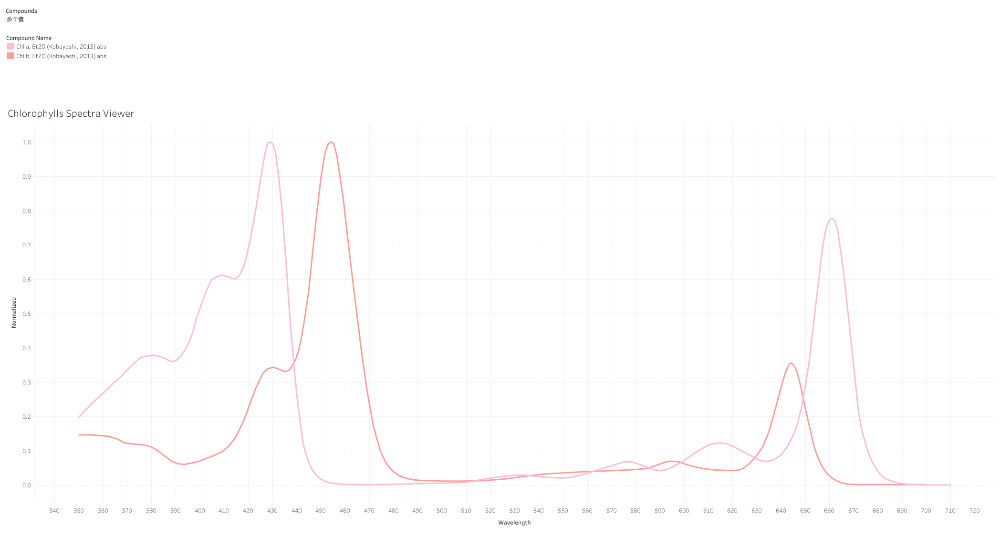
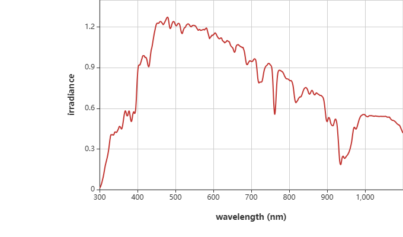
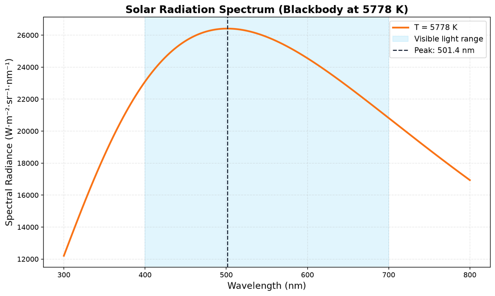

## 叶绿素

常见绿色植物主要含有叶绿素a和叶绿素b，它们是高等植物光合作用的核心色素。

| 名称    | 蓝光区吸收峰 | 红光区吸收峰 | 特征                                        |
| ------- | ------------ | ------------ | ------------------------------------------- |
| 叶绿素a | ~429nm       | ~661nm       | 所有进行产氧光合作用的生物都必须拥有叶绿素a |
| 叶绿素b | ~454nm       | ~644nm       | 辅助叶绿素a，扩展光捕获范围                 |

两者都在蓝光（430-450 nm）和红光（640-680 nm）区域强烈吸收，而对绿光（500-600 nm）吸收很少——这就是为什么植物看起来是绿色的。

以下是叶绿素a和叶绿素b的吸收光谱示意图（纵轴是归一化后的值，而不是绝对数值）。



图片来源：https://public.tableau.com/shared/ZSNQ8Z4MC?:display_count=n&:origin=viz_share_link

## 可见光光谱

众所周知，人眼可见光的光谱范围通常为380nm到700nm。

联系叶绿素的吸收光谱，我提出这样的疑问：**为什么叶绿素的吸收光谱范围刚好也处在可见光光谱的范围内？**

为什么叶绿素不吸收380nm以内或700nm以外波长的光子能量（为什么叶子不是白色的呢），或者为什么人眼的可见光谱落在叶绿素的吸收光谱范围。

## 地表附近的太阳光光谱分布图



图片来源：https://www.photochemcad.com/solar-spectra/golden-1400-july-22-2003-mostly-sunny-nrel-srrl

地表附近的太阳光光谱最强的范围居然和叶绿素吸收光谱和人眼可见光谱如此的重叠，据此可以做出如下推测：生命在漫长的演化岁月中，为了适应太阳辐射，不约而同地去利用太阳光最充沛、最高能的波长范围的光能。

## 补充：大气层的过滤作用

众所周知，大气层吸收了太阳光中对人体有害的那一部分光。臭氧层挡住了绝大部分致命的高能紫外线，水蒸气、二氧化碳等气体吸收大量的红外线。

我曾一度以为大气层外的太阳光光谱是平坦的均匀分布。但实际上，太阳光再从太阳发射出去之后，就已经基本具备了类型钟形曲线的基本轮廓。这可以从普朗克黑体辐射公式来做一个定量的理解。

### 普朗克黑体辐射公式

$$
B_{\lambda}(\lambda, T) = \frac{2 h c^2}{\lambda^5}\cdot\frac{1}{e^{\frac{h c}{\lambda k T}}- 1}
$$

**其中：**

- $B_\lambda$ = 光谱辐射亮度（单位：W·m⁻²·sr⁻¹·nm⁻¹）
- $\lambda$ = 波长（变量，300-800（nm）
- $T$ = 太阳表面温度 = 5778 K（已知值）
- $h$ = 普朗克常数 = 6.626 × 10⁻³⁴ J·s（已知值）
- $c$ = 光速 = 2.998 × 10⁸ m/s（已知值）
- $k$ = 玻尔兹曼常数 = 1.381 × 10⁻²³ J/K（已知值）

使用 `matplotlib` 画图：

```python
python3 << 'EOF'
import numpy as np
import matplotlib.pyplot as plt

# Physical constants
h = 6.626e-34  # Planck constant (J·s)
c = 2.998e8    # Speed of light (m/s)
k = 1.381e-23  # Boltzmann constant (J/K)
T = 5778       # Sun surface temperature (K)

# Wavelength range: 300 to 800 nm
wavelength_nm = np.linspace(300, 800, 500)
wavelength_m = wavelength_nm * 1e-9  # Convert to meters

# Planck's law for spectral radiance
def planck_law(lam, T):
    """
    Calculate spectral radiance using Planck's law
    lam: wavelength in meters
    T: temperature in Kelvin
    Returns: spectral radiance in W·m⁻²·sr⁻¹·m⁻¹
    """
    numerator = 2 * h * c**2 / lam**5
    denominator = np.exp((h * c) / (lam * k * T)) - 1
    return numerator / denominator

# Calculate spectral radiance
B_lambda = planck_law(wavelength_m, T)

# Convert to W·m⁻²·sr⁻¹·nm⁻¹ for better scale
B_lambda_nm = B_lambda * 1e-9

# Find peak wavelength
peak_idx = np.argmax(B_lambda_nm)
peak_wavelength = wavelength_nm[peak_idx]

# Create the plot
plt.figure(figsize=(10, 6))
plt.plot(wavelength_nm, B_lambda_nm, color='#F97316', linewidth=2.5, label=f'T = {T} K')

# Mark visible light range (400-700 nm)
plt.axvspan(400, 700, alpha=0.15, color='#38BDF8', label='Visible light range')

# Mark peak
plt.axvline(peak_wavelength, color='#1E293B', linestyle='--', linewidth=1.5, 
            label=f'Peak: {peak_wavelength:.1f} nm')

# Labels and title
plt.xlabel('Wavelength (nm)', fontsize=13)
plt.ylabel('Spectral Radiance (W·m⁻²·sr⁻¹·nm⁻¹)', fontsize=13)
plt.title('Solar Radiation Spectrum (Blackbody at 5778 K)', fontsize=15, fontweight='bold')
plt.legend(fontsize=11)
plt.grid(alpha=0.3, linestyle='--')

# Save figure
plt.tight_layout()
plt.savefig('/mnt/data/solar_spectrum.png', dpi=150, bbox_inches='tight')
print(f"Peak wavelength: {peak_wavelength:.1f} nm")
print("Figure saved to /mnt/data/solar_spectrum.png")
plt.show()
EOF
```



根据普朗克黑体辐射公式可知，太阳光辐射本身已经具有明显的钟形分布特征，绝对不是平均分布的。