# 柠檬酸循环（Citric Acid Cycle / Krebs Cycle）学习笔记

## 0. 前置概念：辅酶的黑盒模型

学习柠檬酸循环之前，先把几个反复出现的辅酶抽象成"黑盒"：只看输入输出是什么，不纠结每次具体机制细节，方便追踪整条通路的物质和能量流向。

**辅酶A / 乙酰辅酶A（CoA / Acetyl-CoA）**

黑盒功能：传递酰基（acyl group）。末端硫醇 -SH 形成高能硫酯键接住某个酰基，变成"酰基-CoA"；把酰基转移给下一个受体后，自己变回游离的 CoA-SH。

最初的思路是把这个黑盒说成"传递乙酰基"，后来澄清：乙酰基（2碳）只是酰基家族里最常见的一个具体成员，不是这个黑盒唯一能装的东西。同一个循环里后面会出现琥珀酰辅酶A（succinyl-CoA），辅酶A 挂载的是琥珀酰基（4碳），机制完全一样。所以更准确的说法是——**输入 = 某个酰基 + CoA-SH，输出 = 酰基-CoA（或酰基转移完成后释放的 CoA-SH）**，乙酰基只是柠檬酸循环第一步用到的具体填空。

**NAD+ / NADH**

黑盒功能：传递电子。但比"传递电子"更精确一步——NAD+ 接收的不是孤立电子，而是一个**氢负离子（hydride，H⁻）**，即 2 个电子 + 1 个氢原子核一起，以一步转移的方式加到烟酰胺环的 C4 位上；同时反应中还会**额外释放 1 个游离的 H⁺**到溶液里（这个 H⁺ 不算在 NADH 结构里）。这个细节在后面数 ATP/NADH 账目、或对比 FAD/FADH2（一次接 2 个电子 + 2 个氢原子核，方式不同）时会有用。

**关于"黑盒可逆"与"具体反应可逆"的区分**

最初的想法是：这些黑盒的输入输出是可逆的。这个说法需要分两个层次看，不能一概而论：

- **黑盒机制本身**：确实可逆，而且这种可逆性正是这些辅酶能在全细胞代谢网络里反复被"复用"的原因。NAD+/NADH 这一对在不同反应里可以朝相反方向跑——糖酵解里 NAD+ 被还原成 NADH，糖异生走某些逆向反应时 NADH 又被氧化回 NAD+。CoA / 乙酰辅酶A 也是，脂肪酸 β-氧化不断切下乙酰辅酶A（消耗 CoA-SH 生成乙酰辅酶A 的方向），脂肪酸合成则反过来把酰基一节节接上去。
- **某个具体反应在特定通路里的方向**：由热力学（ΔG）决定，不一定可逆。例如柠檬酸循环第 1 步（乙酰辅酶A + 草酰乙酸 → 柠檬酸），CoA 的"接货/卸货"机制本身可逆，但这一步反应的 ΔG 约 -32 kJ/mol，强烈放能，在细胞里实际上几乎单向进行，不会轻易反着跑。

**结论**：黑盒的输入输出类型是双向通用的（这是辅酶能被整个代谢网络反复调用的原因），但某一次具体反应往哪个方向走、走多远，要看这次反应本身的能量情况，不能直接把"机制可逆"等同于"这一步反应可逆"。

---

## 0.5 当前学习视角与局限

**本笔记当前聚焦：结构追踪**

当前学习阶段以**分子结构变化**为主线，追踪碳骨架如何重排、官能团如何移位、哪些碳被脱羧、哪些位置被氧化/还原。目标是先建立"有哪些分子参与、它们如何转化"的完整地图。

**已知的不足：能量流动分析不够系统**

虽然个别步骤（如第1步、第4步）标注了ΔG或提到了能量储存，但整体缺少一条平行于结构变化的**能量流动主线**：
- 每一步氧化/脱羧释放多少自由能
- 这些能量如何驱动不可逆步骤
- NADH/FADH₂/GTP储存的能量如何在后续步骤兑现
- 哪些步骤是热力学驱动的（放能大），哪些步骤接近平衡（可逆）

此外，循环的**调控机制**（别构调控、共价修饰、底物/产物反馈）、**与其他代谢通路的连接**（氨基酸代谢、脂肪酸代谢的中间体出入口）也未展开。

**后续深化计划**：
- ✓ 完成全部8步的结构追踪
- ✓ 补充能量流动主线（从 ATP 兑现的角度）
- 整理调控节点（第1、3、4步为什么是关键调控点）
- 标注循环中间体与其他代谢通路的连接

这种"先结构、后能量、再调控"的顺序是有意选择，目的是避免需求膨胀、保持当前阶段的学习主线清晰。

---

## 一、反应步骤总览

柠檬酸循环共 8 步反应，发生在线粒体基质（mitochondrial matrix），是一个首尾相接的环形通路。最后一步（苹果酸→草酰乙酸）重新生成草酰乙酸，草酰乙酸再次接住下一个乙酰辅酶A，循环重新开始。

**循环结构的意义**：草酰乙酸本身不被"消耗"掉，它在循环里扮演"催化剂载体"的角色，每转一圈接住一个乙酰基、把它氧化掉，然后自己再生出来等下一个。细胞不需要每次都重新合成草酰乙酸，只要维持一定量的循环中间体就能持续运转。

**碳数变化主线**：4碳（草酰乙酸）+ 2碳（乙酰基）→ 6碳（柠檬酸、异柠檬酸）→ 5碳（α-酮戊二酸，第一次脱羧）→ 4碳（琥珀酰辅酶A 及后续，第二次脱羧）→ 4碳（草酰乙酸，回到起点）。

分子名称可点击跳转到下方"二、分子词汇表"对应条目查看结构图，步骤部分不重复贴图。

---

### 第 1 步：乙酰辅酶A + 草酰乙酸 → 柠檬酸

**反应式**：[乙酰辅酶A](#acetylcoa)（2碳）+ [草酰乙酸](#oaa)（4碳）+ H₂O → [柠檬酸](#citrate)（6碳）+ [辅酶A](#coa)

**类型**：缩合反应（condensation）

**机制**：乙酰辅酶A 的 2 碳乙酰基（CH₃-C(=O)-）从辅酶A 的硫醇（-SH）上脱离，跟草酰乙酸的酮基碳（C2 位）发生亲核进攻，两个分子"拼"在一起。随后水分子水解掉中间体，释放出辅酶A，同时在连接处形成 -OH 和 -COOH，最终生成柠檬酸。

乙酰辅酶A 的高能硫酯键在这一步被打开，释放的能量驱动缩合反应向前走，使反应几乎不可逆（ΔG 约 -32 kJ/mol）。这也是循环的**第一个调控点**——强烈放能、单向进行，是整个循环真正的"入口"。

**ATP/NADH/FADH₂ 变化**：无（只是分子重组，不产生或消耗能量载体）

**催化酶**：柠檬酸合酶（citrate synthase）

**碳数变化**：2碳（乙酰基）+ 4碳（草酰乙酸）= 6碳（柠檬酸）

**疑问与讨论记录：碳原子的具体去向**

- **乙酰辅酶A → 辅酶A 的变化**：CH₃-C(=O)-S-CoA → HS-CoA。乙酰基（CH₃-C(=O)-）整体转移到草酰乙酸上，成为柠檬酸的一部分；硫原子上失去乙酰基后，从溶液中获得一个 H⁺，重新变回 -SH 形式的辅酶A。

- **乙酰基在柠檬酸中的去向**：乙酰基的 CH₃ 碳与草酰乙酸的 C2（酮基碳）形成新的 C-C 键，变成 -CH₂-；乙酰基原来的羰基碳（接硫的那个 C=O）在辅酶A 水解离开后，从硫酯变成了游离的 -COOH。整个乙酰基 CH₃-C(=O)- 变成了 -CH₂-COOH，作为柠檬酸分子上的一条"臂"，挂在中心碳上。

- **草酰乙酸在柠檬酸中的去向**：草酰乙酸的 C2（酮基碳）被乙酰基的 CH₃ 碳进攻后，变成了柠檬酸的中心碳（季碳，带一个 -OH）；草酰乙酸的 C1、C3、C4 三个碳和它们上面的羧基都保留下来，成为柠檬酸上挂在中心碳周围的另外三条"臂"。

- **柠檬酸 6 个碳的来源**：2 个碳来自乙酰辅酶A 的乙酰基，4 个碳来自草酰乙酸的整个骨架，2 + 4 = 6。

> **术语解析**：
> - **酰基（acyl）**：R-C(=O)- 结构，通常与杂原子（O、N、S）相连。乙酰基（acetyl，CH₃-C(=O)-）是从乙酸（CH₃-COOH）去掉 -OH 后得到的酰基。
> - **硫酯（thioester）**：羰基碳（C=O）通过单键连接硫原子（-S-），硫再连接其他基团，通式 R-C(=O)-S-R'。类比普通酯 R-C(=O)-O-R'（氧连在羰基碳上），硫酯就是把氧换成硫。乙酰辅酶A 的结构 CH₃-C(=O)-S-CoA 即为硫酯。
> - **酯与羧酸的关系**：酯是羧酸的衍生物——羧基 R-C(=O)-OH 的 -OH 被 -O-R' 取代即得酯 R-C(=O)-O-R'。羧酸、酯、硫酯、酰胺、酰卤同属羧酸衍生物家族，共享羰基碳 R-C(=O)-，区别只在羰基碳连的是什么原子/基团。
> - **草酰乙酸的命名**：草酰-（oxalo-）指草酸（最简单的二羧酸，HOOC-COOH，2 碳）结构单元（两端各一个羧基）；-乙酸（-acetate）指中间类似乙酸的 2 碳片段（-CH₂-C(=O)-）。草酰乙酸 = 草酸结构 + 乙酸骨架 = 一个 4 碳二羧酸，中间碳带酮基。系统命名为"2-氧代丁二酸"。
> - **草酰乙酸的碳编号**（按 IUPAC 规则）：C1（羧基碳，-COOH）、C2（酮基碳，-C(=O)-）、C3（亚甲基碳，-CH₂-）、C4（另一个羧基碳，-COOH），结构 HOOC-C(=O)-CH₂-COOH。

---

### 第 2 步：柠檬酸 → 异柠檬酸

**反应式**：[柠檬酸](#citrate)（6碳）→ [顺乌头酸](#cisaconitate)（中间体，6碳）→ [异柠檬酸](#isocitrate)（6碳）

**类型**：异构化（isomerization），拆成脱水（dehydration）+ 加水（hydration）两步串联，整体效果是把 -OH 的位置挪了一下，分子式不变。

**机制**：柠檬酸中心碳（来自草酰乙酸 C2）上的 -OH 长在叔碳上，没有多余的 H 可供下一步氧化脱羧使用。乌头酸酶先催化脱水，中心碳与相邻碳间形成碳碳双键，生成顺乌头酸；再催化加水，-OH 加到双键另一侧的碳上，生成异柠檬酸——这个碳是仲碳，带一个 H，为第三步的氧化脱羧做好准备。顺乌头酸紧密结合在酶活性口袋里，通常不游离扩散出去。

**ATP/NADH/FADH₂ 变化**：无（纯结构重排，不涉及能量载体）

**催化酶**：乌头酸酶（aconitase），活性中心含铁硫簇（Fe-S cluster），负责识别羟基的立体化学位置。

**碳数变化**：6碳 → 6碳 → 6碳（不变，这一步是"搬家 -OH"，不是氧化还原或脱碳）

**疑问与讨论记录：OH 到底挪去了哪条臂**

- 柠檬酸中心碳上挂着四样东西：一个 -OH、一个直接相连的 -COOH（草酰乙酸原 C1）、一条 -CH₂-COOH 臂（草酰乙酸 C3-C4 来的）、另一条 -CH₂-COOH 臂（乙酰基来的，CH₃ 变成 CH₂，原羰基碳变成末端 COOH）。
- 最初的猜测：这两条 -CH₂-COOH 臂结构完全一样，OH 会不会挪到乙酰基那条臂上？
- 实际结论：乌头酸酶只对草酰乙酸来的那条臂操作，脱水加水后 OH 精确落回这条臂上（变成 -CH(OH)-COOH），乙酰基来的那条臂全程不变。
- 关键原因：中心碳虽然本身不是手性中心，但连接的四个基团在三维空间中的排布，让这两条"看起来相同"的臂在酶的活性口袋里并不等价——这就是潜手性（prochirality）。酶对三维结构极其敏感，能区分平面结构式上"对称"的两条臂。这一现象最早由 Alexander Ogston（1948）通过同位素标记实验揭示。

> **知识边界提示**：潜手性（prochirality）的完整解释涉及有机化学中的立体化学内容，超出了坎贝尔生物学 + 普通化学的范围。现阶段只需记住结论：**酶能区分表面结构相同、但三维空间排布不同的基团**，这也是酶催化高特异性的一个来源；机制细节留待以后学有机化学时再深入。

---

### 第 3 步：异柠檬酸 → α-酮戊二酸

**反应式**：[异柠檬酸](#isocitrate)（6碳）+ [NAD+](#nad) → [α-酮戊二酸](#akg)（5碳）+ CO₂ + [NADH](#nadh)

**类型**：氧化脱羧（oxidative decarboxylation），机制上是氧化在先、脱羧在后的两个子步骤，由同一个酶连续催化完成，中间体不释放，通常合并算作一步。

**机制**：

1. **氧化**：异柠檬酸上第 2 步新腾出来的仲碳（带 -OH、带 H）被氧化成酮基。NAD+ 从这个碳上摘走一个氢负离子（H⁻，即 2 个电子 + 1 个氢原子核），自己变成 NADH；反应中多出的 1 个 H⁺ 释放到溶液里（NAD+/NADH 黑盒机制，与丙酮酸氧化、柠檬酸循环其他步骤一致）。生成的中间体叫[**草酰琥珀酸（oxalosuccinate）**](#oxalosuccinate)，紧密结合在酶活性口袋里，几乎不游离扩散出去（类似第 2 步的顺乌头酸）。
2. **脱羧**：[草酰琥珀酸](#oxalosuccinate)恰好是一个 **β-酮酸**——酮基和某个羧基之间隔着一个碳（α位）。β-酮酸结构不稳定，这个羧基自发脱落，以 CO₂ 释放；脱羧后留下的碳负离子被旁边的酮基共轭稳定（烯醇中间体），随后质子化、酮式化，生成 α-酮戊二酸。

**催化酶**：异柠檬酸脱氢酶（isocitrate dehydrogenase）。是柠檬酸循环最重要的限速调控点（地位类似糖酵解的磷酸果糖激酶-1）：受 ADP、Ca²⁺ 激活，受 ATP、NADH 抑制，本质是细胞能量状态的传感器。

**ATP/NADH/FADH₂ 变化**：生成 1 个 NADH（每圈循环 3 个 NADH 中的第一个）

**碳数变化**：6碳（异柠檬酸）→ 5碳（α-酮戊二酸）+ 1碳（CO₂），循环**第一次脱羧**

**疑问与讨论记录：CO₂ 的碳来自哪里**

- **结论**：这一步脱掉的碳，是最初草酰乙酸的 C1（羧基碳），不是这一圈刚由乙酰辅酶A 带进来的碳，也不是草酰乙酸原 C4（经乌头酸酶处理、演变为异柠檬酸新羟基碳那一侧）。
- **推导依据**：柠檬酸中心碳上有一条"直接相连、没有 CH₂ 间隔"的 -COOH，对应草酰乙酸原 C1；乌头酸酶（第 2 步）只对草酰乙酸来的另一条 -CH₂-COOH 臂（C3-C4）动手，把 OH 从中心碳挪到那条臂上生成异柠檬酸，草酰乙酸 C1 那条臂全程未被触碰。到本步，新生成的酮基落在异柠檬酸新羟基碳上，中心碳是 α 位，草酰乙酸 C1 那条直连的 -COOH 恰好落在 β 位，符合 β-酮酸自发脱羧的结构条件，于是被脱去的正是这个碳。
- **历史佐证**：早期用 ¹⁴C 标记乙酰基做示踪实验时，本预期第一圈释放的 CO₂ 会带乙酰基标记，结果第一圈的两次脱羧（本步 + 第 4 步）释放的 CO₂ 都不带标记，标记碳要到第二圈才以 CO₂ 形式释放。这个反直觉结果正是靠 Ogston 揭示的潜手性机制解释：乌头酸酶专一处理草酰乙酸来的臂，导致新加入的乙酰基碳被"藏"在了不会被立即脱羧的位置上。
- **结论延伸**：乙酰基带进来的 2 个碳要等第 4 步（脱掉草酰乙酸另一来源的碳）之后才算真正稳定留在循环骨架里；第一圈释放的两个 CO₂ 都来自草酰乙酸的旧碳，乙酰基碳需再转一圈才会以 CO₂ 形式离开。

---

### 第 4 步：α-酮戊二酸 → 琥珀酰辅酶A

**反应式**：[α-酮戊二酸](#akg)（5碳）+ [NAD+](#nad) + [辅酶A](#coa) → [琥珀酰辅酶A](#succinylcoa)（4碳）+ CO₂ + [NADH](#nadh)

**类型**：氧化脱羧（oxidative decarboxylation），机制与第 3 步高度相似，由多亚基酶复合体催化，脱羧和氧化紧密结合，通常算作一步。

**机制**：

本步由 **α-酮戊二酸脱氢酶复合体**（α-ketoglutarate dehydrogenase complex）催化。这个酶复合体的结构和工作方式几乎是丙酮酸脱氢酶复合体的翻版，只是底物从 3 碳 α-酮酸（丙酮酸）换成 5 碳 α-酮酸（α-酮戊二酸）。分两个紧密连续的子步骤：

1. **脱羧**：α-酮戊二酸的一个羧基（β 位，远离酮基那端）以 CO₂ 形式脱落。α-酮酸结构（酮基紧邻羧基）使得脱羧相对容易。脱羧后生成一个 4 碳的中间体，暂时以酶-底物复合物形式结合在复合体上，不游离到溶液。

2. **氧化 + CoA 接入**：脱羧后的 4 碳片段被氧化，NAD+ 接收释放的电子（以氢负离子 H⁻ 形式）变成 NADH，同时释放一个 H⁺ 到溶液。氧化产生的能量驱动高能硫酯键形成——辅酶A 的 -SH 攻击氧化后的碳，把 4 碳的琥珀酰基（succinyl）挂到 CoA 上，生成琥珀酰辅酶A（-C(=O)-CH₂-CH₂-C(=O)-S-CoA）。这个硫酯键储存了脱羧释放的能量，将在下一步底物水平磷酸化中被利用。

**ATP/NADH/FADH₂ 变化**：生成 1 个 NADH（每圈循环 3 个 NADH 中的第二个）

**催化酶**：α-酮戊二酸脱氢酶复合体，是柠檬酸循环的**第二个重要调控点**——受产物抑制（NADH、琥珀酰辅酶A、ATP），受 Ca²⁺ 激活（肌肉收缩、神经信号的标志，提示细胞需要更多 ATP）。

**碳数变化**：5碳（α-酮戊二酸）→ 4碳（琥珀酰辅酶A）+ 1碳（CO₂），循环**第二次脱羧**

**疑问与讨论记录：脱掉的 CO₂ 的碳来自哪里**

- **结论**：这一步脱掉的碳，是原草酰乙酸的 C4（远离 C1 那端的羧基碳），对应两次脱羧分别带走了草酰乙酸的两个羧基碳 C1 和 C4。
- **推导依据**：第 3 步脱掉了草酰乙酸 C1（柠檬酸中心碳旁"直连"的那个 -COOH），剩下的 4 碳骨架（草酰乙酸的 C2-C3 + 乙酰基的 2 碳）形成 α-酮戊二酸。α-酮戊二酸的结构是一个 5 碳二羧酸，其中一端是乙酰基来源的 -COOH（原羰基碳），另一端是草酰乙酸 C4 来源的 -COOH；α-酮戊二酸本身的酮基在 α 位（第 2 号碳），紧邻 C1 那端的 -COOH，远端（β 位）是草酰乙酸 C4 来源的羧基。脱羧时，远端这个羧基自发脱落以 CO₂ 形式释放，正好是原草酰乙酸 C4。
- **关键事实**：乙酰基带进来的两个碳中，其中原羰基碳（现在在 α-酮戊二酸末端形成 -COOH）仍然保留，并会在后续步骤中继续参与循环；乙酰基的亚甲基碳（原 CH₃ 现在是 -CH₂- 接在新形成的酮基上）被保留在琥珀酰基骨架中。因此本步脱羧后，最初输入的乙酰基碳并未完全释放，而是被延后到后续步骤中逐步移位和释放。

---

### 第 5 步：琥珀酰辅酶A → 琥珀酸

**反应式**：[琥珀酰辅酶A](#succinylcoa)（4碳）+ [GDP](#gdp) + Pi → [琥珀酸](#succinate)（4碳）+ [辅酶A](#coa) + [GTP](#gtp)

**类型**：底物水平磷酸化（substrate-level phosphorylation）

**反应物**：
- 琥珀酰辅酶A（succinyl-CoA）：4碳，携带高能硫酯键
- GDP（二磷酸鸟苷）或 ADP（二磷酸腺苷）：作为磷酸基团的受体
- Pi：无机磷酸

**生成物**：
- 琥珀酸（succinate）：4碳，对称的二羧酸
- 辅酶A（CoA-SH）：游离的辅酶A
- GTP（三磷酸鸟苷）或 ATP（三磷酸腺苷）：新合成的高能磷酸键

**催化酶**：琥珀酰辅酶A 合成酶（succinyl-CoA synthetase）。该酶存在多个同工型，部分物种或组织偏好 GDP，部分偏好 ADP；两种反应都能进行，生成的 GTP 或 ATP 在能量地位上等价，可通过核苷二磷酸激酶相互转换。

**机制**（结构追踪视角）：

琥珀酰基（从硫酯键释放的 4 碳酰基）转移至磷酸基团受体，形成新的高能磷酸键，同时琥珀酸释放，辅酶A 游离。

**关键特性**：
- 这是柠檬酸循环中唯一的直接能量转换步骤，不依赖电子传递链
- 琥珀酰辅酶A 的高能硫酯键来自第 4 步的氧化脱羧释放的能量（能量储存在该硫酯键中）
- 本步释放该能量，驱动 GDP/ADP 磷酸化生成 GTP/ATP
- 反应是热力学有利的（放能），自发进行

**ATP/NADH/FADH₂ 变化**：生成 1 个 GTP 或 ATP（每圈循环 1 个）

**碳数变化**：4碳 → 4碳（无脱羧，纯粹的结构重组，琥珀酰基从硫酯键转移到磷酸），碳骨架完全保留

**疑问与讨论记录：为什么这一步能直接生成高能磷酸键**

- 琥珀酰辅酶A 是一个高能分子，其硫酯键的水解自由能约为 -33 kJ/mol，与 ATP 磷酸键水解的 -30.5 kJ/mol 处于同一量级
- GDP/ADP 到 GTP/ATP 的磷酸化需要 +30.5 kJ/mol
- 简单能量账目：琥珀酰硫酯键水解释放 -33 kJ/mol，用于 GDP/ADP 磷酸化吸能 +30.5 kJ/mol，净结果约 -2.5 kJ/mol，略微放能
- 因此整个反应是自发进行的。这也是为什么第 4 步把能量存进硫酯键而非直接释放：后续在本步进行兑现
- 当前学习阶段暂未展开详细的能量流动数据，仅记录结构变化。完整的能量流通路（包括第 4 步如何产生、第 5 步如何消耗高能硫酯键能量）将在笔记后期补充

---

### 第 6 步：琥珀酸 → 富马酸

**反应式**：[琥珀酸](#succinate)（4碳）+ [FAD](#fad) → [富马酸](#fumarate)（4碳）+ [FADH2](#fadh2)

**类型**：氧化脱氢（oxidative dehydrogenation），即脱氢反应——从分子上移除 2 个氢原子，形成一个碳碳双键。

**机制**（结构追踪视角）：

琥珀酸的碳骨架是对称的二羧酸：HOOC-CH2-CH2-COOH。中间两个亚甲基碳各带一个 H。

琥珀酸脱氢酶催化这两个碳各失去 1 个氢（总共移除 2 个 H 原子），两个碳之间从单键（C-C）变成双键（C=C），生成富马酸：

HOOC-CH2-CH2-COOH (琥珀酸) 移除 2 个 H 原子后变为 HOOC-CH=CH-COOH (富马酸)

这 2 个 H 原子被转移给 FAD，使 FAD 被还原为 FADH2。

**关键特性**：

1. **为什么用 FAD 而不是 NAD+**：
   - 这一步的酶（琥珀酸脱氢酶）直接镶嵌在线粒体内膜上，与电子传递链的复合体 II 构成一体
   - FAD 作为该酶的辅酶群也被固定在膜上，方便脱氢产生的电子直接交给链
   - 这是柠檬酸循环与电子传递链在空间上直接相连的唯一节点
   - NAD+ 则适合浮游于基质中、与浮游酶相结合的反应

2. **能量与 ATP 的计算**：
   - NADH 进入电子传递链时，驱动生成约 2.5 个 ATP
   - FADH2 进入链时，因为入链点更靠后（绕过复合体 I），驱动生成约 1.5 个 ATP
   - 这个差别会在循环的全局能量总账中体现

3. **反应方向**：
   - 比第 3、4 步放能少，更接近热力学平衡
   - 在正常条件下前进方向占主导，但有一定程度的逆向反应可能性

**ATP/NADH/FADH2 变化**：消耗 1 个 FAD，生成 1 个 FADH2（每圈循环 1 个，是循环中唯一的 FADH2 来源）

**碳数与结构变化**：
- 碳数：4碳 → 4碳（无脱羧，纯脱氢，碳骨架完整保留）
- 键型变化：C-C 单键 → C=C 双键，形成反式构型（trans-）
- 官能团变化：两条 -CH2- 合并为 =CH-，新增一个不饱和位点

**催化酶**：琥珀酸脱氢酶（succinate dehydrogenase），同时也是电子传递链复合体 II。这个酶既催化循环中的这一步，又直接充当电子传递链的入口——脱氢产生的电子立刻传向链的下游，不需要释放到溶液。

---

### 第 7 步：富马酸 → 苹果酸

**反应式**：[富马酸](#fumarate)（4碳）+ H₂O → [苹果酸](#malate)（4碳）

**类型**：水合反应（hydration）

**机制**（结构追踪视角）：

富马酸是一个 4 碳的不饱和二羧酸——中间两个碳之间有一条 C=C 双键（反式构型）。这一步直接往碳碳双键上加一分子水：

```
HOOC-CH=CH-COOH (富马酸)
      + H₂O
      ↓
HOOC-CH(OH)-CH₂-COOH (苹果酸)
```

一个新的 -OH 基团落在了某一条碳上，另一条碳获得一个 H（来自水分子的 H）。双键断开变回单键。

**酶的特异性——富马酸水合酶认立体异构体**

这里有个细节值得注意：富马酸有一个同分异构体叫**马来酸（maleic acid）**，它们都是 C₄H₄O₄，区别只在碳碳双键两端取代基的立体构型：

- **富马酸（fumarate）**：双键两端的羧基是**反式（trans）**排列
- **马来酸（maleate）**：双键两端的羧基是**顺式（cis）**排列

富马酸水合酶**只对富马酸（反式）有活性**，对马来酸（顺式）基本没有催化能力——尽管从化学角度两者都是不饱和的二羧酸，加水反应原理一样。这展示了**酶的立体特异性有多严格**：酶不仅认底物的分子式和官能团，还精确识别三维空间排布。

**ATP/NADH/FADH₂ 变化**：无

**碳数变化**：4 碳 → 4 碳（无脱碳，纯加水，碳骨架完全保留）

**关键特性**：
- 这一步是**非常接近热力学平衡**的反应（ΔG° ≈ 0 或略微放能），可以在体内正向或逆向进行
- 与第 3、4 步的大幅放能脱羧反应形成对比——本步推动力不强，甚至可能在某些代谢条件下被"推"着反向进行
- 生成的苹果酸带了一个新的 -OH 基团，**为第 8 步的最后氧化做好准备**

**催化酶**：富马酸水合酶（fumarase）

---

### 第 8 步：苹果酸 → 草酰乙酸

**反应式**：[苹果酸](#malate)（4碳）+ [NAD+](#nad) → [草酰乙酸](#oaa)（4碳）+ [NADH](#nadh)

**类型**：氧化脱氢（oxidative dehydrogenation），即脱氢反应——从分子上移除 2 个氢原子，在碳上形成一个酮基。

**机制**（结构追踪视角）：

苹果酸上有一个 -CH(OH)-CH₂- 片段（来自富马酸的水合产物）。这个片段里，带 -OH 的碳是**叔碳**（碳上连接 3 个其他碳/基团），旁边的碳是**亚甲基碳**（-CH₂-）。

苹果酸脱氢酶催化这两个碳各失去 1 个氢（总共移除 2 个 H 原子），带 -OH 的叔碳失去一个 H，亚甲基碳也失去一个 H，两个碳之间从单键（C-C）变成**双键（C=C）**，同时原来的 -OH 变成**酮基（C=O）**，生成草酰乙酸：

```
HOOC-CH(OH)-CH₂-COOH (苹果酸)
      移除 2 个 H 原子
      ↓
HOOC-C(=O)-CH₂-COOH (草酰乙酸)
```

这 2 个 H 原子被转移给 NAD+，使 NAD+ 被还原为 NADH。

**ATP/NADH/FADH₂ 变化**：生成 1 个 NADH（每圈循环 3 个 NADH 中的第三个）

**碳数变化**：4 碳 → 4 碳（无脱羧，纯脱氢，碳骨架完全保留）

**催化酶**：苹果酸脱氢酶（malate dehydrogenase）

**关键特性**：
- 本步生成的**草酰乙酸正好是循环的起点**——循环完成一圈，回到开始
- 生成的草酰乙酸可以再次与乙酰辅酶A 缩合，让循环持续转动
- 这一步与第 3 步（异柠檬酸 → α-酮戊二酸）类似，都是脱氢反应消耗 NAD+；但这次脱的氢是从一个叔碳（带 -OH）和一个亚甲基碳脱的，而非从一个仲碳脱氢形成新的酮基

---

### 8 步全景对比表

| 步骤 | 起点 → 终点 | 脱羧 | NADH | FADH₂ | GTP/ATP | 类型 |
|------|-----------|------|------|-------|---------|------|
| 1 | 草酰乙酸 + 乙酰CoA → 柠檬酸 | ✗ | ✗ | ✗ | ✗ | 缩合 |
| 2 | 柠檬酸 → 异柠檬酸 | ✗ | ✗ | ✗ | ✗ | 异构化 |
| 3 | 异柠檬酸 → α-酮戊二酸 | ✓ | ✓ | ✗ | ✗ | 氧化脱羧 |
| 4 | α-酮戊二酸 → 琥珀酰CoA | ✓ | ✓ | ✗ | ✗ | 氧化脱羧 |
| 5 | 琥珀酰CoA → 琥珀酸 | ✗ | ✗ | ✗ | ✓ | 底物磷酸化 |
| 6 | 琥珀酸 → 富马酸 | ✗ | ✗ | ✓ | ✗ | 脱氢 |
| 7 | 富马酸 → 苹果酸 | ✗ | ✗ | ✗ | ✗ | 水合 |
| 8 | 苹果酸 → 草酰乙酸 | ✗ | ✓ | ✗ | ✗ | 脱氢 |

**循环产出汇总**（每圈循环）：
- **脱羧次数**：2 次（第 3、4 步）→ 2 个 CO₂ 释放
- **NADH 产生**：3 个（第 3、4、8 步）
- **FADH₂ 产生**：1 个（第 6 步）
- **GTP/ATP 产生**：1 个（第 5 步）

---

## 能量流与账目：从 ATP 的角度看柠檬酸循环

本节重新审视柠檬酸循环，不从分子结构变化的角度，而是从**能量货币 ATP 的角度**：每一步产生或消耗什么形式的能量，最终这些能量如何被"兑现"成 ATP，细胞实际能从一个乙酰基的完全氧化中获得多少 ATP。

### 循环内部的直接产出（底物水平磷酸化）

**第 5 步：琥珀酰辅酶A → 琥珀酸**

这是循环内唯一直接生成高能磷酸键的步骤——不需要电子传递链的帮助，能量直接从化学键转移到 GTP 或 ATP：

| 产物 | 来自 | 直接转化 |
|------|------|----------|
| 1 GTP 或 1 ATP | 琥珀酰辅酶A 的高能硫酯键 | 可直接用于细胞代谢，或 GTP 通过核苷二磷酸激酶转换成 ATP |  

**能量账：+1 ATP（等价物）**

### 循环产生的还原剂（NADH 和 FADH₂）的兑现

虽然 NADH 和 FADH₂ 在循环里不直接产生 ATP，但它们携带的电子进入电子传递链后，驱动质子泵建立膜电位，最终由 ATP 合酶生成大量 ATP。这是循环能量的**真正来源**。

#### 第 3 步、第 4 步、第 8 步产生的 NADH

每个 NADH 进入电子传递链的**复合体 I**，经过链的三个质子泵（复合体 I、III、IV），驱动质子泵输出约 10 个 H⁺ 到膜间隙（理想情况下）。

标准生化计数：
- 1 个 NADH → 约 **2.5 个 ATP**（考虑 ATP 合酶的运转效率和各种生理损耗）
- 循环产生 3 个 NADH → 3 × 2.5 = **7.5 个 ATP**

#### 第 6 步产生的 FADH₂

FADH₂ 进入电子传递链的**复合体 II**，比复合体 I 靠后，只驱动质子泵输出约 6 个 H⁺（绕过了复合体 I）。

标准生化计数：
- 1 个 FADH₂ → 约 **1.5 个 ATP**
- 循环产生 1 个 FADH₂ → 1 × 1.5 = **1.5 个 ATP**

### 整个柠檬酸循环的 ATP 能量账

**一圈循环，一个乙酰基的完全氧化**：

| 能量来源 | 数量 | 兑现的 ATP | 小计 |
|---------|------|-----------|------|
| 直接产出（第 5 步）| 1 GTP/ATP | 1.0 ATP | 1.0 |
| 来自 NADH（第 3、4、8 步）| 3 NADH | 2.5 ATP/NADH | 7.5 |
| 来自 FADH₂（第 6 步）| 1 FADH₂ | 1.5 ATP/FADH₂ | 1.5 |
| **合计** | | | **~10 ATP** |

**说明**：
- "~10 ATP" 是理论上界，实际细胞中可能是 8~10 ATP，因为有膜运输损耗、质子泄漏等因素
- 这个数据是针对**一个乙酰基进入循环**的贡献计算的
- 如果按照葡萄糖→2 个丙酮酸→2 个乙酰基的链条，一个葡萄糖完全氧化时柠檬酸循环贡献约 20 ATP
- 加上糖酵解（直接产 2 ATP + 2 NADH 贡献 ~5 ATP）和丙酮酸脱羧（2 NADH 贡献 ~5 ATP），一个葡萄糖完全氧化理论产率约 32 ATP（加上电子传递链和其他贡献）

### 各种可能的实际情境

**为什么不是精确的整数？**

1. **P/O 比值的变化**：从 1 个还原剂驱动生成的 ATP 数量（P/O 比）因细胞类型、代谢状态、温度等而异
   - 传统估算：NADH P/O = 3, FADH₂ P/O = 2，得出约 15 ATP/葡萄糖
   - 现代修正：NADH P/O ≈ 2.5, FADH₂ P/O ≈ 1.5，得出约 10 ATP/乙酰基或 20~21 ATP/葡萄糖

2. **膜运输成本**：如果线粒体需要主动运入丙酮酸（丙酮酸载体需要 ATP 或质子交换），或运出 NADH（烷基-磷酸穿梭需要额外 ATP），实际产率会更低

3. **质子泄漏**：膜上不完全相容产生的质子泄漏，降低了膜电位，减少可用于 ATP 合酶的驱动力

4. **具体数值见教材**：坎贝尔教材中可能给出的是 ~10 ATP/葡萄糖（更保守）或 ~30~32 ATP/葡萄糖（包括糖酵解、丙酮酸脱羧、电子传递链的总和），具体取决于版本和对现代生化数据的更新

### 为什么柠檬酸循环如此关键

从这个 ATP 账目可以看出：
- 循环的直接产出只有 1 ATP（通过底物水平磷酸化）
- **真正的 ATP 来源是 NADH 和 FADH₂** → 占总产率的 ~90%
- 因此，循环本质上是一个**电子收集器**：氧化乙酰基，把电子装进还原剂（NADH、FADH₂），后续由电子传递链统一处理
- 如果没有电子传递链（或缺少终端电子受体 O₂），循环无法产生有意义的 ATP

---

## 新增辅酶黑盒：FAD/FADH2

**黑盒功能**：转移电子（2 个电子 + 2 个氢原子核）。

**输入 ↔ 输出**：

方向 - 输入 - 输出

氧化方向 - FAD + 2H（从底物移除的 2 个氢原子）- FADH2

还原方向 - FADH2 - FAD + 2H（释放给电子传递链）

**与 NAD+/NADH 黑盒的区别**（结构层面）：

- NAD+：转移 1 个 H⁻（2 个电子 + 1 个氢原子核），同时释放 1 个游离 H⁺ 到溶液
- FAD：转移 2 个 H（2 个电子 + 2 个氢原子核），不产生游离 H⁺
- 功能黑盒：都是"2 电子的中转站"，区别在氢原子数及释放游离质子与否
- 对结构追踪的影响：两者在琥珀酸脱氢时的结果完全相同——都是移除 2 个 H，形成 C=C 双键

**现阶段处理方式**：当作 NAD+/NADH、CoA 类似的黑盒，只关注"接收/释放 2 个 H"的输入输出，不纠结氢负离子 vs 中性氢的机制细节。

---

## 二、分子词汇表

本节列出柠檬酸循环全程涉及的所有分子，按其在循环中大致的登场顺序排列（乙酰辅酶A 和草酰乙酸作为起点）。每个分子的"在循环中的位置"暂做概括性描述；随着反应步骤逐步展开，会补上具体步骤的跳转链接。

其中 ATP、ADP、辅酶A、乙酰辅酶A、NAD+、NADH 六个分子在糖酵解或丙酮酸氧化学习笔记中已有完整条目（命名解析等不重复），此处沿用相同结构图重新登记，只标注在柠檬酸循环中的新角色。其余分子为本笔记新增。

结构图均为 800×800 PNG，存放在本文件同级目录下。

### 目录（点击跳转）

1. [乙酰辅酶A（Acetyl-CoA）](#acetylcoa)
2. [草酰乙酸（Oxaloacetate）](#oaa)
3. [柠檬酸（Citrate）](#citrate)
4. [辅酶A（CoA）](#coa)
5. [顺乌头酸（cis-Aconitate）](#cisaconitate)
6. [异柠檬酸（Isocitrate）](#isocitrate)
7. [草酰琥珀酸（Oxalosuccinate）](#oxalosuccinate)
8. [烟酰胺腺嘌呤二核苷酸·氧化型（NAD+）](#nad)
9. [α-酮戊二酸（α-Ketoglutarate）](#akg)
10. [烟酰胺腺嘌呤二核苷酸·还原型（NADH）](#nadh)
11. [琥珀酰辅酶A（Succinyl-CoA）](#succinylcoa)
12. [二磷酸鸟苷（GDP）](#gdp)
13. [三磷酸鸟苷（GTP）](#gtp)
14. [琥珀酸（Succinate）](#succinate)
15. [黄素腺嘌呤二核苷酸·氧化型（FAD）](#fad)
16. [黄素腺嘌呤二核苷酸·还原型（FADH2）](#fadh2)
17. [富马酸（Fumarate）](#fumarate)
18. [苹果酸（Malate）](#malate)
19. [三磷酸腺苷（ATP）](#atp)
20. [二磷酸腺苷（ADP）](#adp)

---

### 1. 乙酰辅酶A（Acetyl-CoA） <a id="acetylcoa"></a>

- **英文全称**：Acetyl coenzyme A
- **中文全称**：乙酰辅酶A
- **命名解析**：详见丙酮酸氧化学习笔记，此处不重复。
- **在柠檬酸循环中的位置**：循环的起点原料之一，携带丙酮酸氧化而来的 2 碳乙酰基，与草酰乙酸缩合，是循环真正的"燃料输入口"。
- PubChem CID：444493


---

### 2. 草酰乙酸（Oxaloacetate） <a id="oaa"></a>

- **英文全称**：Oxaloacetic acid（阴离子形式称 Oxaloacetate）
- **英文简写**：OAA
- **中文全称**：草酰乙酸
- **命名解析**：Oxalo- 指草酸相关的二羧酸结构，-acetate 指乙酸骨架；分子是一个 4 碳二羧酸，中间碳带一个酮基。碳编号（IUPAC）：C1（羧基）、C2（酮基）、C3（亚甲基）、C4（羧基），即 HOOC-C(=O)-CH₂-COOH。系统名"2-氧代丁二酸"。
- **在柠檬酸循环中的位置**：循环的起点原料之一（4 碳受体），也是循环转一圈后重新生成的终点产物，负责接住下一个乙酰辅酶A，让循环持续运转。第 1 步中其 C2 酮基碳被乙酰基进攻，成为柠檬酸的中心碳。
- PubChem CID：970

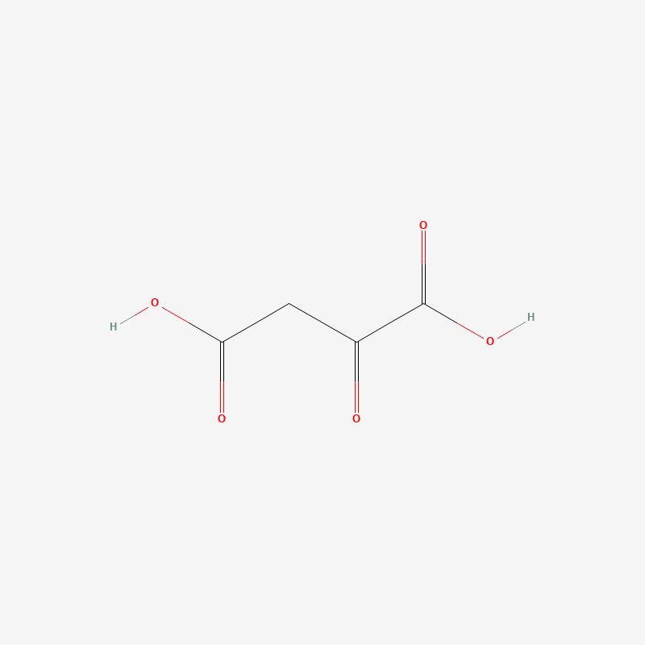

---

### 3. 柠檬酸（Citrate） <a id="citrate"></a>

- **英文全称**：Citric acid（阴离子形式称 Citrate）
- **中文全称**：柠檬酸
- **命名解析**：因存在于柠檬等柑橘类水果中而得名，是整个循环的命名来源（Citric Acid Cycle）。结构上是一个 6 碳三羧酸，带 3 个羧基，中心碳为带 -OH 的季碳。
- **在柠檬酸循环中的位置**：乙酰辅酶A 与草酰乙酸缩合后的产物（第 1 步产物），是循环中第一个 6 碳中间体。6 个碳中 2 个来自乙酰基、4 个来自草酰乙酸。
- PubChem CID：311

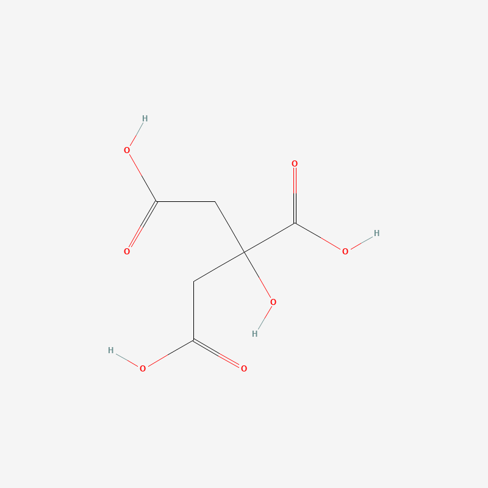

---

### 4. 辅酶A（CoA） <a id="coa"></a>

- **英文全称**：Coenzyme A
- **中文全称**：辅酶A
- **命名解析**：详见丙酮酸氧化学习笔记，此处不重复。核心活性位点是末端硫醇基团（-SH）。
- **在柠檬酸循环中的位置**：第 1 步中乙酰辅酶A 缩合形成柠檬酸时被释放出来（乙酰基离开后硫上补一个 H⁺，变回 -SH）；之后在循环中段（α-酮戊二酸→琥珀酰辅酶A 那一步）会再次被消耗。
- PubChem CID：87642

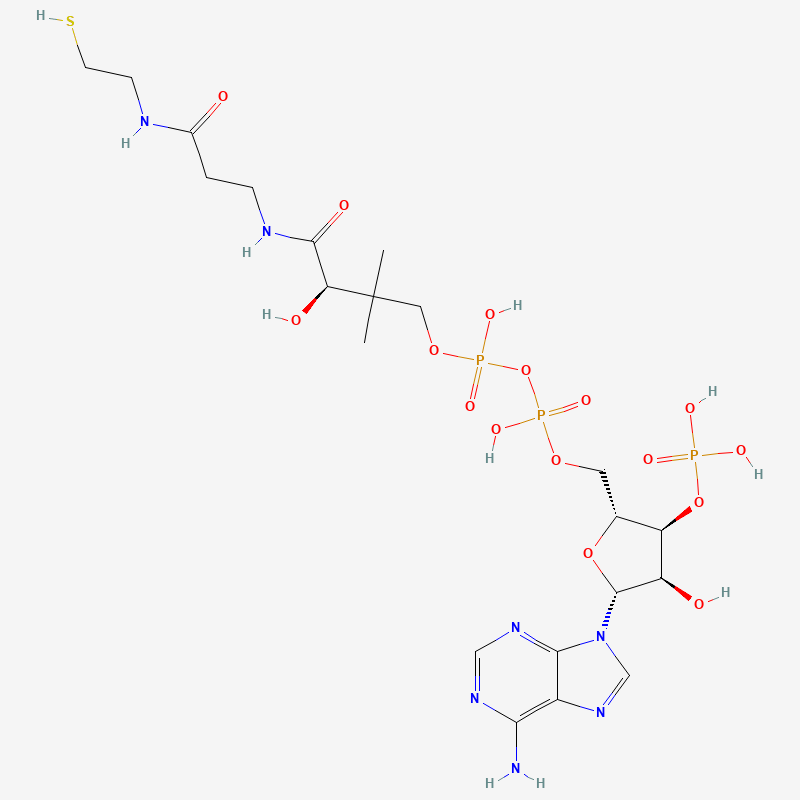

---

### 5. 顺乌头酸（cis-Aconitate） <a id="cisaconitate"></a>

- **英文全称**：cis-Aconitic acid（阴离子形式称 cis-Aconitate）
- **中文全称**：顺乌头酸
- **命名解析**：因最初从乌头属植物（Aconitum）中分离得到而得名，"cis-" 表示分子中碳碳双键两侧取代基的空间排布方式。是一个 6 碳三羧酸，比柠檬酸/异柠檬酸少一个水分子。
- **在柠檬酸循环中的位置**：柠檬酸转化为异柠檬酸过程中的中间产物（脱水又加水的两步反应之间），本身不稳定，通常不单独在教材图中重点标注，但在酶催化机制层面是真实存在的中间体。
- PubChem CID：643757

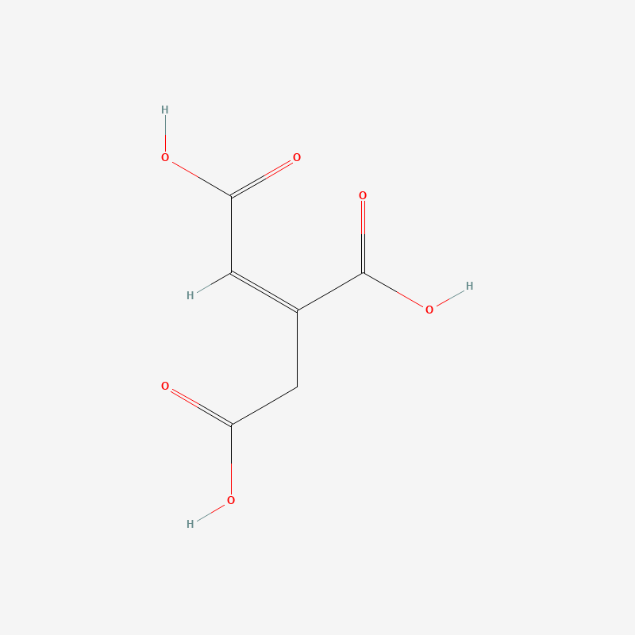

---

### 6. 异柠檬酸（Isocitrate） <a id="isocitrate"></a>

- **英文全称**：Isocitric acid（阴离子形式称 Isocitrate）
- **中文全称**：异柠檬酸
- **命名解析**：柠檬酸的结构同分异构体（iso- 表示"异构的"），-OH 基团的位置与柠檬酸不同，这个位置变化是后续氧化脱羧反应能够发生的关键。
- **在柠檬酸循环中的位置**：柠檬酸经异构化（通过顺乌头酸中间体）而来的产物，随后被氧化脱羧，是循环中最后一个 6 碳分子。
- PubChem CID：1198

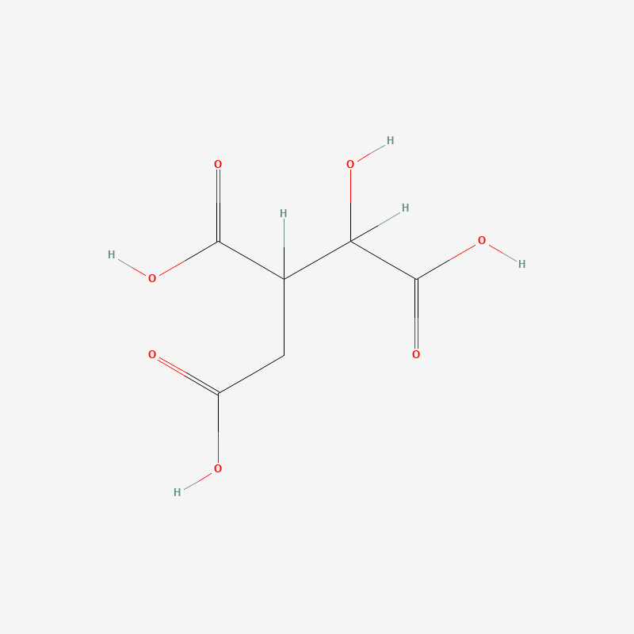

---

### 7. 草酰琥珀酸（Oxalosuccinate） <a id="oxalosuccinate"></a>

- **英文全称**：Oxalosuccinic acid（阴离子形式称 Oxalosuccinate）
- **中文全称**：草酰琥珀酸
- **命名解析**：结构上可看作琥珀酸骨架上多接了一个草酸式的酮基-羧基单元，与草酰乙酸的命名逻辑类似（草酰- + 对应酸的骨架名）。是一个 6 碳三羧酸，带一个酮基，属于 β-酮酸。
- **在柠檬酸循环中的位置**：第 3 步（异柠檬酸→α-酮戊二酸）中氧化生成、脱羧消耗的瞬态中间体，紧密结合在异柠檬酸脱氢酶活性口袋里，通常不游离扩散，教材图示常直接省略这一分子，把第 3 步画成一步完成。它的 β-酮酸结构是紧接着自发脱羧的结构基础。
- PubChem CID：972

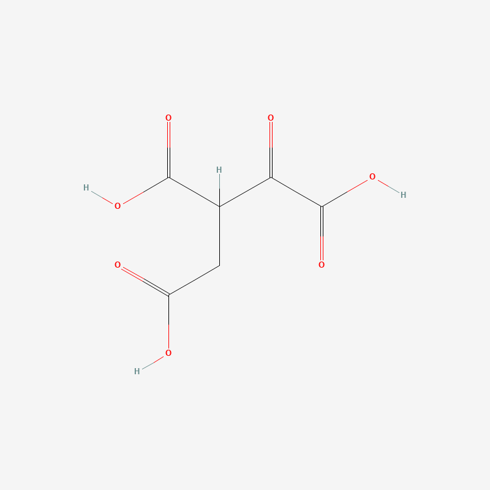

---

### 8. 烟酰胺腺嘌呤二核苷酸·氧化型（NAD+） <a id="nad"></a>

- **英文全称**：Nicotinamide adenine dinucleotide
- **中文全称**：烟酰胺腺嘌呤二核苷酸（氧化型）
- **命名解析**：详见糖酵解学习笔记，此处不重复。
- **在柠檬酸循环中的位置**：循环中最主要的电子受体，在异柠檬酸→α-酮戊二酸、α-酮戊二酸→琥珀酰辅酶A、苹果酸→草酰乙酸三处被消耗，各生成一个 NADH（每圈循环共 3 个 NADH）。
- PubChem CID：925

.png)

---

### 9. α-酮戊二酸（α-Ketoglutarate） <a id="akg"></a>

- **英文全称**：α-Ketoglutaric acid（阴离子形式称 α-Ketoglutarate，也写作 2-Oxoglutarate）
- **英文简写**：α-KG
- **中文全称**：α-酮戊二酸
- **命名解析**：戊二酸（glutaric acid）是一个 5 碳二羧酸骨架，α- 位（第 2 号碳，紧邻一个羧基）带一个酮基。这是循环中第一个从 6 碳变为 5 碳的分子，对应第一次脱羧释放 CO₂。
- **在柠檬酸循环中的位置**：异柠檬酸氧化脱羧后的产物，随后本身也会被氧化脱羧变为琥珀酰辅酶A，是循环中唯一的 5 碳中间体。也是氨基酸代谢（如谷氨酸）与循环相连的重要节点分子。
- PubChem CID：51

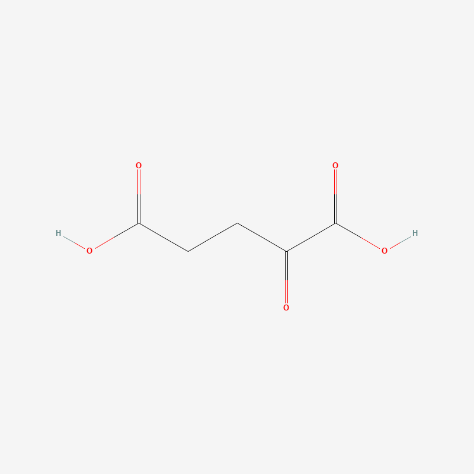

---

### 10. 烟酰胺腺嘌呤二核苷酸·还原型（NADH） <a id="nadh"></a>

- **英文全称**：Nicotinamide adenine dinucleotide + Hydrogen
- **中文全称**：烟酰胺腺嘌呤二核苷酸（还原型）
- **命名解析**：详见糖酵解学习笔记，此处不重复。
- **在柠檬酸循环中的位置**：NAD+ 接收电子后的产物，每圈循环共生成 3 个（分别在异柠檬酸→α-酮戊二酸、α-酮戊二酸→琥珀酰辅酶A、苹果酸→草酰乙酸三处），后续进入电子传递链。
- PubChem CID：439153

.png)

---

### 11. 琥珀酰辅酶A（Succinyl-CoA） <a id="succinylcoa"></a>

- **英文全称**：Succinyl coenzyme A
- **中文全称**：琥珀酰辅酶A
- **命名解析**：辅酶A 的硫醇基团与琥珀酰基（succinyl，来自琥珀酸去掉一个 -OH 后的酰基形式）通过硫酯键连接而成，命名逻辑与乙酰辅酶A 一致，只是挂载的酰基骨架从 2 碳（乙酰基）换成了 4 碳的琥珀酰基。
- **在柠檬酸循环中的位置**：α-酮戊二酸氧化脱羧后的产物（第二次脱羧释放 CO₂，循环至此已从 6 碳降到 4 碳），随后其高能硫酯键被用于底物水平磷酸化生成 GTP（或 ATP）。
- PubChem CID：92133

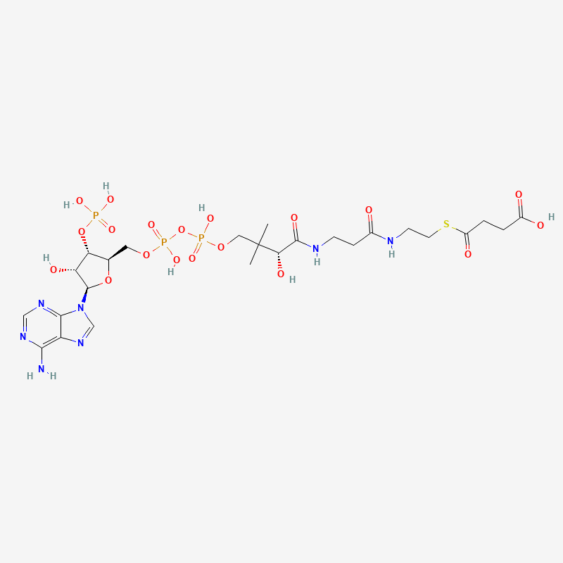

---

### 12. 二磷酸鸟苷（GDP） <a id="gdp"></a>

- **英文全称**：Guanosine diphosphate
- **英文简写**：GDP
- **中文全称**：二磷酸鸟苷
- **命名解析**：结构和命名逻辑与 ADP 完全类似，只是核糖上连接的含氮碱基从腺嘌呤（adenine）换成了鸟嘌呤（guanine）。
- **在柠檬酸循环中的位置**：琥珀酰辅酶A 转化为琥珀酸这一步的磷酸基团接受者，接受磷酸后变为 GTP。部分物种/组织中这一步直接使用 ADP 生成 ATP，两种情况都存在，取决于琥珀酰辅酶A 合成酶的同工型。
- PubChem CID：135398619

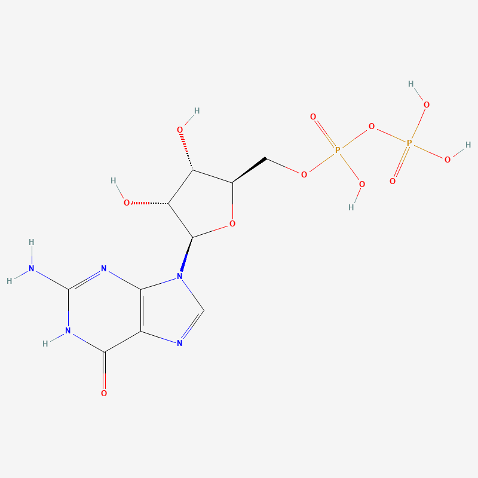

---

### 13. 三磷酸鸟苷（GTP） <a id="gtp"></a>

- **英文全称**：Guanosine triphosphate
- **英文简写**：GTP
- **中文全称**：三磷酸鸟苷
- **命名解析**：结构和命名逻辑与 ATP 完全类似，只是含氮碱基是鸟嘌呤而非腺嘌呤。细胞内 GTP 可以通过核苷二磷酸激酶（nucleoside diphosphate kinase）把磷酸基团转给 ADP，生成 ATP，两者能量地位等价。
- **在柠檬酸循环中的位置**：琥珀酰辅酶A→琥珀酸这一步的产物之一（底物水平磷酸化），坎贝尔教材通常直接简化描述为生成 ATP，具体是 GTP 还是 ATP 因物种/组织而异，此处两种分子都收录以覆盖这个差异。
- PubChem CID：135398633

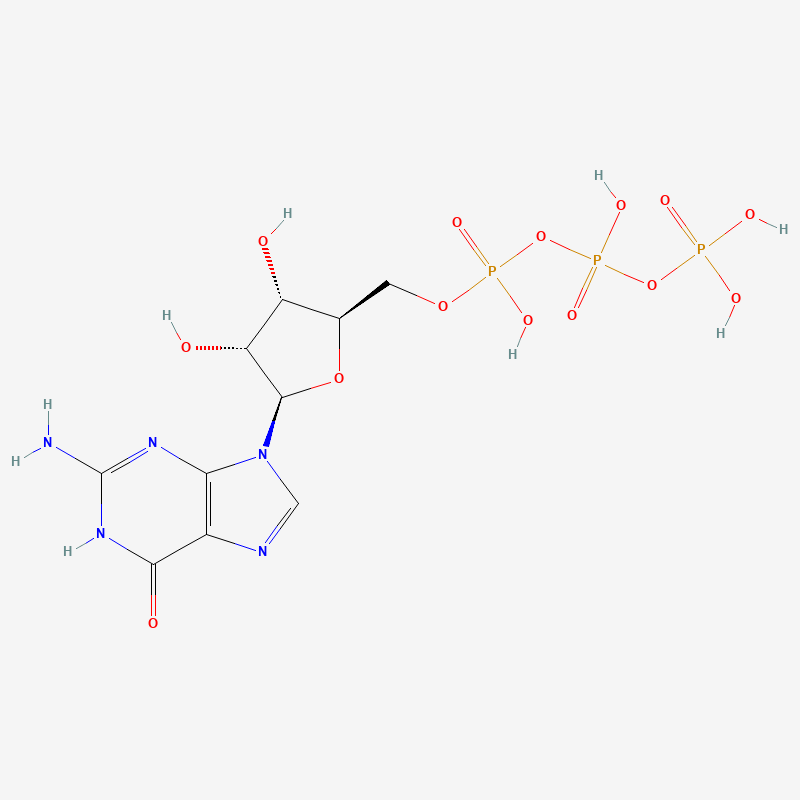

---

### 14. 琥珀酸（Succinate） <a id="succinate"></a>

- **英文全称**：Succinic acid（阴离子形式称 Succinate）
- **中文全称**：琥珀酸
- **命名解析**：因最初从琥珀（succinum，琥珀的拉丁文）中分离得到而得名。是一个对称的 4 碳二羧酸，不带酮基或羟基，结构上是循环中最简单的分子之一。
- **在柠檬酸循环中的位置**：琥珀酰辅酶A 释放高能硫酯键后的产物，随后被氧化（脱氢）生成富马酸，这一步的电子受体是 FAD 而不是 NAD+。
- PubChem CID：1110

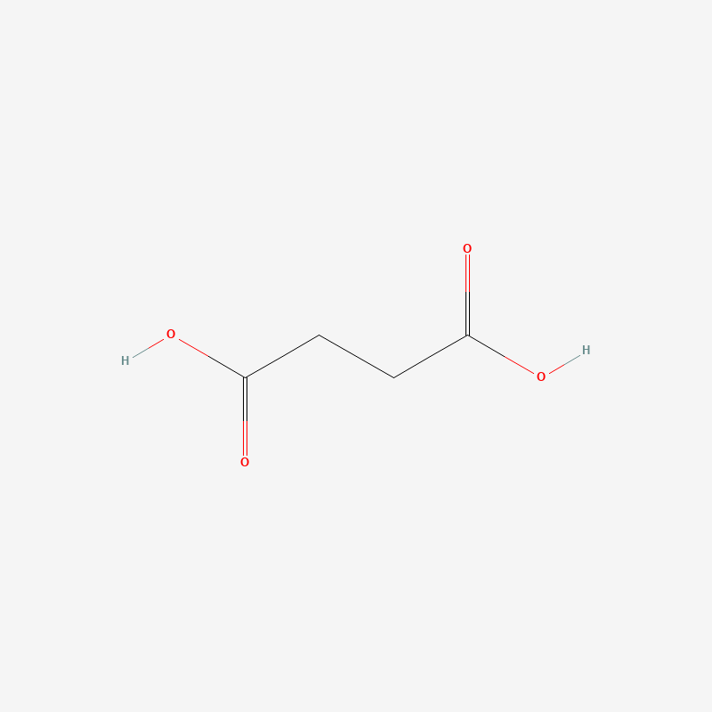

---

### 15. 黄素腺嘌呤二核苷酸·氧化型（FAD） <a id="fad"></a>

- **英文全称**：Flavin adenine dinucleotide
- **英文简写**：FAD
- **中文全称**：黄素腺嘌呤二核苷酸（氧化型）
- **命名解析**：Flavin（黄素）得名于拉丁语 "flavus"（黄色），来自维生素 B2（riboflavin，核黄素）；结构逻辑与 NAD+ 类似（都是二核苷酸电子载体），但"干活"的一端是黄素环而不是烟酰胺环，且 FAD 接受电子时是两步各接 1 个电子/氢（经过 FADH 半还原中间态），一次性净转移 2 个电子和 2 个氢原子核，与 NAD+/NADH 只转移 1 个氢核（+2 电子）的方式不同。
- **在柠檬酸循环中的位置**：循环中唯一使用的电子受体（除 NAD+ 外），专门负责接收琥珀酸→富马酸这一步释放的电子，生成 FADH2。这一步的酶（琥珀酸脱氢酶）直接嵌在线粒体内膜上，是柠檬酸循环与电子传递链在空间上直接相连的节点。
- PubChem CID：643975

.png)

---

### 16. 黄素腺嘌呤二核苷酸·还原型（FADH2） <a id="fadh2"></a>

- **英文全称**：Flavin adenine dinucleotide + 2 Hydrogen
- **英文简写**：FADH2
- **中文全称**：黄素腺嘌呤二核苷酸（还原型）
- **命名解析**：FAD 接收 2 个电子和 2 个氢原子核后的还原态，"2" 明确标出接收的氢原子数（区别于 NADH 只标一个 H，因为转移机制不同，见 FAD 条目）。
- **在柠檬酸循环中的位置**：琥珀酸→富马酸这一步的产物，每圈循环生成 1 个（比 NADH 少，因为循环里只有这一步用 FAD）。携带的电子进入电子传递链时，交给链上的位置比 NADH 稍靠后，实际能驱动生成的 ATP 略少于 NADH 携带的电子。
- PubChem CID：446013

.png)

---

### 17. 富马酸（Fumarate） <a id="fumarate"></a>

- **英文全称**：Fumaric acid（阴离子形式称 Fumarate）
- **中文全称**：富马酸
- **命名解析**：因最初从烟草属植物 Fumaria（烟堇）中分离得到而得名。是琥珀酸脱去 2 个氢后形成的不饱和二羧酸（碳碳双键为反式/trans 构型）。
- **在柠檬酸循环中的位置**：琥珀酸氧化（脱氢）后的产物，随后加水生成苹果酸。
- PubChem CID：444972

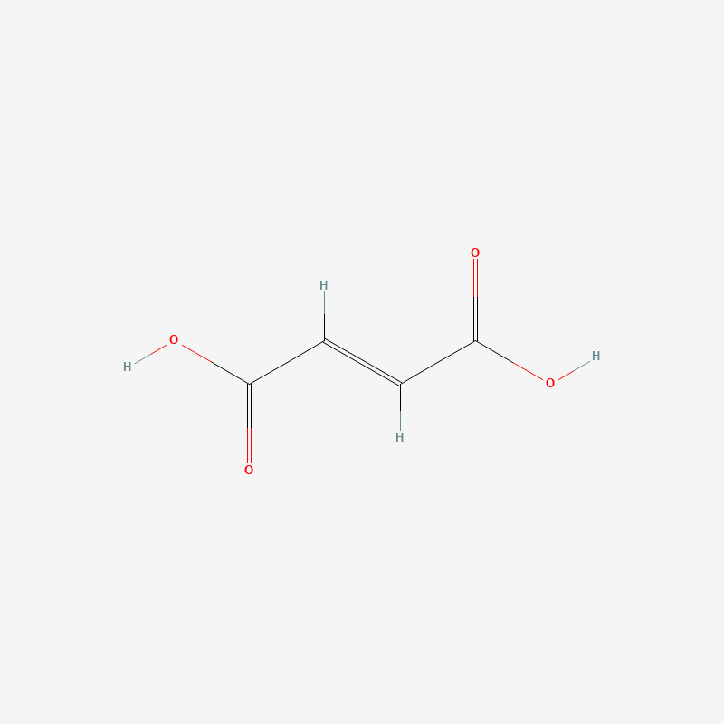

---

### 18. 苹果酸（Malate） <a id="malate"></a>

- **英文全称**：Malic acid（阴离子形式称 Malate）
- **中文全称**：苹果酸
- **命名解析**：因存在于未成熟苹果中而得名（malum 是苹果的拉丁文）。是富马酸的碳碳双键加水后的产物，带一个新的 -OH 基团。
- **在柠檬酸循环中的位置**：富马酸水合后的产物，是循环最后一个中间体，随后被氧化生成草酰乙酸，回到循环起点。
- PubChem CID：525

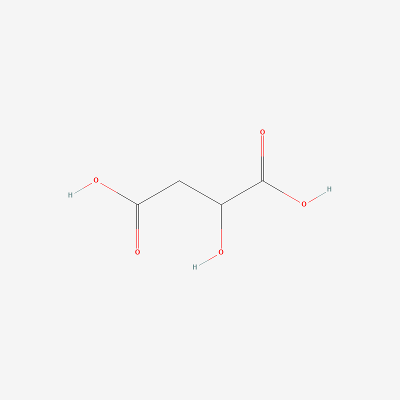

---

### 19. 三磷酸腺苷（ATP） <a id="atp"></a>

- **英文全称**：Adenosine triphosphate
- **中文全称**：三磷酸腺苷
- **命名解析**：详见糖酵解学习笔记，此处不重复。
- **在柠檬酸循环中的位置**：琥珀酰辅酶A→琥珀酸这一步在部分物种/组织中直接生成 ATP（而非 GTP），具体取决于当地表达的琥珀酰辅酶A 合成酶同工型；即便生成的是 GTP，也可以通过核苷二磷酸激酶迅速转换为 ATP，功能上等价。
- PubChem CID：5957

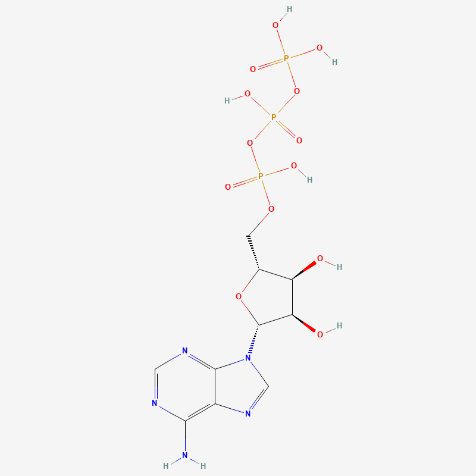

---

### 20. 二磷酸腺苷（ADP） <a id="adp"></a>

- **英文全称**：Adenosine diphosphate
- **中文全称**：二磷酸腺苷
- **命名解析**：详见糖酵解学习笔记，此处不重复。
- **在柠檬酸循环中的位置**：与 ATP 对应的反应物，在使用 ADP 直接生成 ATP 的组织/物种中，这一步的反应物是 ADP 而非 GDP。
- PubChem CID：6022


