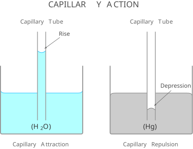

# 注林定律

## 毛细现象

水具有以下四种涌现特性：

- 内聚力与附着力（Cohesion and Adhesion）
- 调节温度的能力（Moderation of Temperature）
- 结冰时体积膨胀（Expansion upon Freezing）
- 生命的万能溶剂（Versatility as a Solvent）

内聚力与附着力带来毛细现象，液体在细管或空隙中因表面张力和附着力作用而上升或下降的物理现象。

## 数学表达式

注林定律描述毛细管内液体因表面张力作用而上升或下降高度的物理规律，有英国科学家 James Jurin 于 18 世纪确立。

其数学表达式为：
$$
h = \frac{2 \gamma \cos\theta}{\rho g r}
$$
其中：

- $h$ : 液面高度
- $\gamma$ : 液体表面张力
- $\theta$ : 接触角
- $\rho$ : 液体密度
- $g$ : 重力加速度
- $r$ : 毛细管半径

## 给定数据

|        20°C        |   水   |    汞    |
| :----------------: | :----: | :------: |
| 液体表面张力 (N/m) | 0.0727 |  0.4756  |
|     接触角 (°)     |   0    |   140    |
|  液体密度 (kg/m³)  | 998.22 | 13545.88 |

水在极净玻璃上的接触角接近 0°，附着力 >> 内聚力。

汞在玻璃上的接触角约为 140°，内聚力 >> 附着力。


毛细管半径 r = 0.5 mm

重力加速度 g = 9.8 m/s²

## 计算高度

引入 `numpy` 与 `pint` 依赖库，声明共同变量。

```python
import numpy as np

from pint import UnitRegistry
ureg = UnitRegistry()
Q_ = ureg.Quantity

r = Q_(0.5, ureg.mm)
g = Q_(9.8, ureg.m / ureg.s**2)
```

计算水的液面高度：

```python
surface_tension_w = Q_(0.0727, ureg.N / ureg.m)
theta_w = 0
pho_w = Q_(998.22, ureg.kg / ureg.m**3)

h_w = 2 * surface_tension_w * np.cos(theta_w) / pho_w / g / r
print(f"水的液面高度为 {h_w.to(ureg.mm):.1f}.")
```

```txt
水的液面高度为 29.7 millimeter.
```

计算汞的液面高度：

```python
surface_tension_m = Q_(0.4756, ureg.N / ureg.m)
theta_m = np.deg2rad(140)
pho_m = Q_(13545.88, ureg.kg / ureg.m**3)

h_m = 2 * surface_tension_m * np.cos(theta_m) / pho_m / g / r
print(f"汞的液面高度为 {h_m.to(ureg.mm):.1f}.")
```

```txt
汞的液面高度为 -11.0 millimeter.
```

## Tikz 示意图

### kroki 生图



### tex 代码

```tex
\documentclass[tikz, border=15pt]{standalone}
\usepackage{amsmath}
\usetikzlibrary{calc}

\begin{document}
\begin{tikzpicture}[>=latex, font=\sffamily]

    % ==========================================
    % 1. 左侧水池、液面与毛细管
    % ==========================================
    % 水体填充 (含毛细管内上升水柱，高度 2.97)
    \fill[cyan!30] (-7, -3) -- (-1, -3) -- (-1, 0.3) 
                   .. controls (-1, 0) and (-1.2, 0) .. (-1.4, 0) 
                   -- (-3.7, 0) -- (-3.7, 3.1) parabola bend (-4.0, 2.97) (-4.3, 3.1)
                   -- (-4.3, 0) -- (-6.6, 0) 
                   .. controls (-6.8, 0) and (-7, 0) .. (-7, 0.3) 
                   -- cycle;

    % 水面线 (凹面)
    \draw[cyan!70!blue, thick] (-7, 0.3) .. controls (-7, 0) and (-6.8, 0) .. (-6.6, 0) 
                               -- (-4.3, 0);
    \draw[cyan!70!blue, thick] (-3.7, 0) -- (-1.4, 0) .. controls (-1.2, 0) and (-1, 0) .. (-1, 0.3);
    \draw[cyan!70!blue, thick] (-4.3, 3.1) parabola bend (-4.0, 2.97) (-3.7, 3.1);

    % 左侧玻璃池子
    \draw[gray!80, line width=2pt, rounded corners=3pt] (-7, 2) -- (-7, -3) -- (-1, -3) -- (-1, 2);

    % 左侧毛细管 (底部 -2.0，顶部 4.5)
    \draw[gray!80, line width=1.5pt] (-4.3, 4.5) -- (-4.3, -2.0);
    \draw[gray!80, line width=1.5pt] (-3.7, 4.5) -- (-3.7, -2.0);

    % 文本标签与标注
    \node[font=\Large\bfseries, text=black!80] at (-4, -2.5) {($\text{H}_2\text{O}$)};
    \node[font=\large\bfseries, text=black!70] (rise) at (-2.3, 4.35) {Rise};
    \draw[gray!80!black, thick, -latex] (rise) -- (-3.8, 3.25);
    \node[font=\large\bfseries, text=black!60] at (-4, -3.8) {Capillary Attraction};
    \node[font=\large\bfseries, text=black!60, align=center] (wtube) at (-4, 5.2) {Capillary Tube};


    % ==========================================
    % 2. 右侧汞池、液面与毛细管
    % ==========================================
    % 汞体填充 (含毛细管内下降汞柱，高度 -1.10)
    \fill[gray!40] (1, -3) -- (7, -3) -- (7, -0.3) 
                   .. controls (7, 0) and (6.8, 0) .. (6.6, 0) 
                   -- (4.3, 0) -- (4.3, -1.25) parabola bend (4.0, -1.10) (3.7, -1.25)
                   -- (3.7, 0) -- (1.4, 0) 
                   .. controls (1.2, 0) and (1, 0) .. (1, -0.3) 
                   -- cycle;

    % 汞面线 (凸面)
    \draw[gray!80!black, thick] (1, -0.3) .. controls (1, 0) and (1.2, 0) .. (1.4, 0) 
                                -- (3.7, 0);
    \draw[gray!80!black, thick] (4.3, 0) -- (6.6, 0) .. controls (6.8, 0) and (7, 0) .. (7, -0.3);
    \draw[gray!80!black, thick] (3.7, -1.25) parabola bend (4.0, -1.10) (4.3, -1.25);

    % 右侧玻璃池子
    \draw[gray!80, line width=2pt, rounded corners=3pt] (1, 2) -- (1, -3) -- (7, -3) -- (7, 2);

    % 右侧毛细管 (底部 -2.0，顶部 4.5)
    \draw[gray!80, line width=1.5pt] (3.7, 4.5) -- (3.7, -2.0);
    \draw[gray!80, line width=1.5pt] (4.3, 4.5) -- (4.3, -2.0);

    % 文本标签与标注
    \node[font=\Large\bfseries, text=black!80] at (4, -2.5) {(Hg)};
    \node[font=\large\bfseries, text=black!70] (depress) at (5.8, 0.5) {Depression};
    \draw[gray!80!black, thick, -latex] (depress) -- (4.2, -0.95);
    \node[font=\large\bfseries, text=black!60] at (4, -3.8) {Capillary Repulsion};
    \node[font=\large\bfseries, text=black!60, align=center] (mtube) at (4, 5.2) {Capillary Tube};


    % ==========================================
    % 3. 全局标题
    % ==========================================
    \node[font=\LARGE\bfseries, text=black!70] at (0, 6.5) {CAPILLARY ACTION};

\end{tikzpicture}
\end{document}
```


