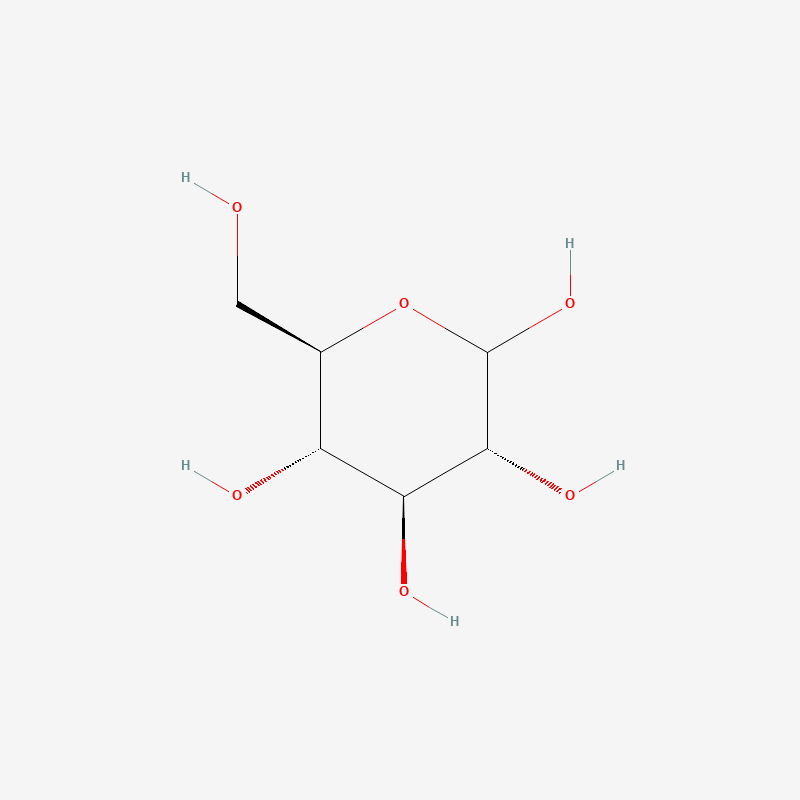
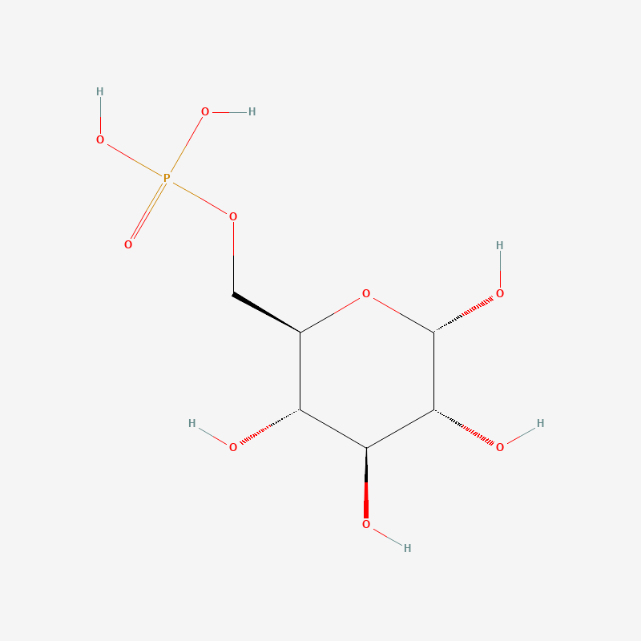
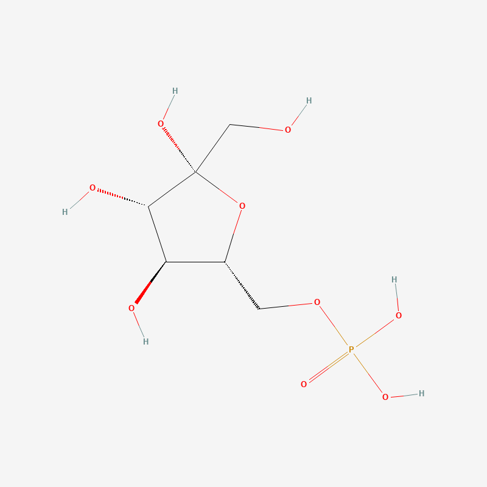
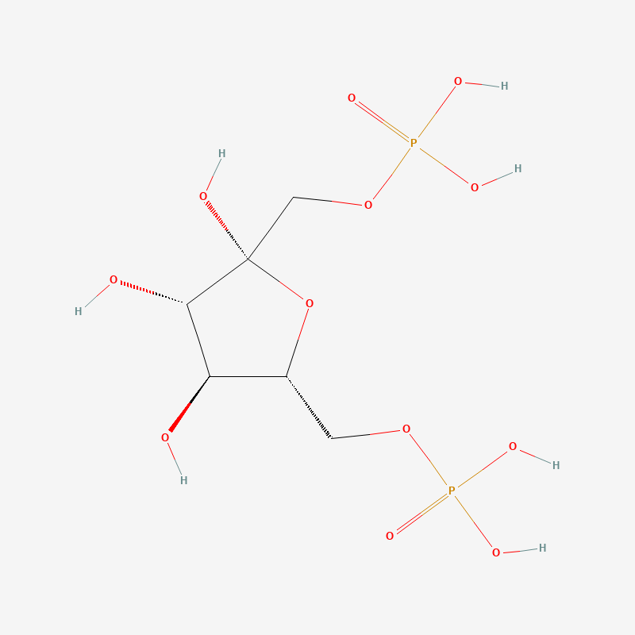
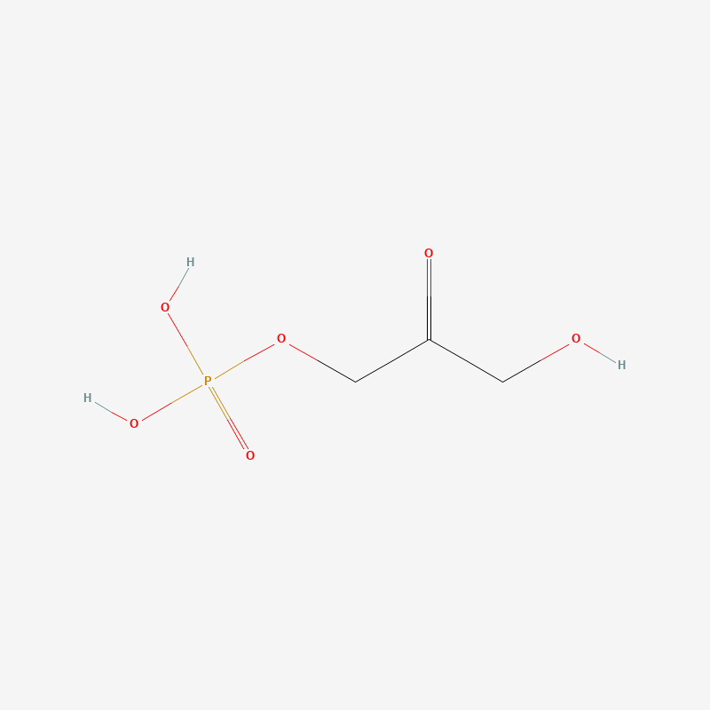
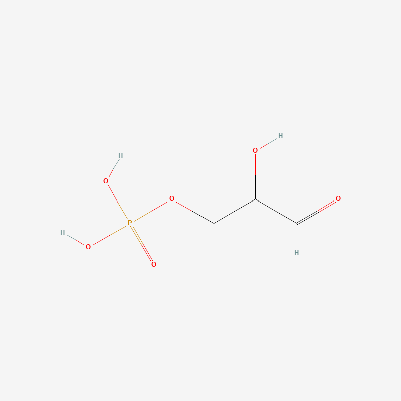
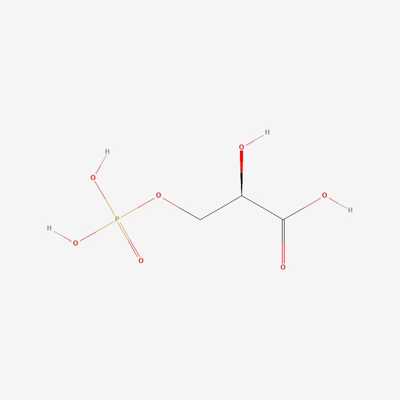
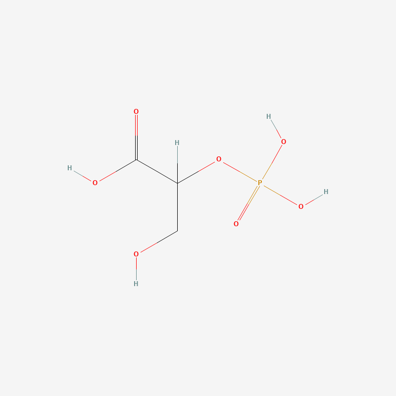
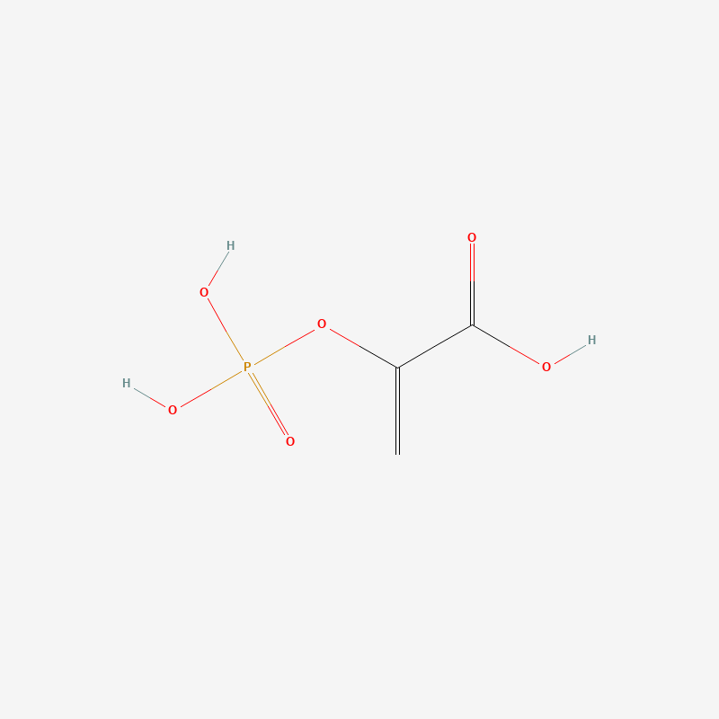

# 糖酵解（Glycolysis）学习笔记

## 一、反应步骤总览

糖酵解共 10 步，发生在细胞质中，1 个葡萄糖分子最终净产生 2 个 ATP、2 个 NADH 和 2 个丙酮酸。以下按顺序整理每一步的反应式、机制，以及讨论过程中出现的疑问和易混点。分子名称可点击跳转到下方"二、分子词汇表"对应条目查看结构图，步骤部分不重复贴图。

---

### 第 1 步：葡萄糖 → 葡萄糖-6-磷酸（G6P）

**反应式**：[葡萄糖](#葡萄糖) + [ATP](#atp) → [G6P](#g6p) + [ADP](#adp)

**类型**：磷酸转移

**机制**：ATP 的一个磷酸基团转移到葡萄糖第 6 号碳上。磷酸基团带负电荷，让分子难以穿过细胞膜，相当于把葡萄糖"锁"在细胞里，同时活化分子为后续反应做准备。

**ATP/NADH 变化**：消耗 1 个 ATP

**验证过的细节**：曾手动核对过原子配平——左边（C6H12O6 + ATP）与右边（G6P + ADP）的 C、H、N、O、P 原子数完全一致，两边配平。这类磷酸转移反应因为只是基团整体搬家，天然就是配平的。生物学讨论一般不要求手动配平，但能核对是好习惯，遇到氧化还原反应（如第 6 步）配平会更复杂，那时这个习惯更有用。

---

### 第 2 步：G6P → 果糖-6-磷酸（F6P）

**反应式**：[G6P](#g6p) → [F6P](#f6p)

**类型**：异构化

**机制**：分子式不变（C6H13O9P），醛糖骨架（葡萄糖，羰基在 1 号碳）重排为酮糖骨架（果糖，羰基在 2 号碳），磷酸基团始终留在 6 号碳不动。为第 4 步的对称裂解做准备。

**ATP/NADH 变化**：无

**易混点**：环状结构对比图上看，容易误以为只是"环上的氧换了个连接的碳"。实际机制分三步：①先开环变回开链形式 ②开链状态下羰基真正从 1 号碳移动到 2 号碳（经过一个叫 cis-enediol 的中间体）③重新环化时改用 2 号碳的羰基和 5 号碳的氧形成新环，环成员少了一个碳，环从 6 元（吡喃糖）变成 5 元（呋喃糖）。中间体细节不必深究。

---

### 第 3 步：F6P → 果糖-1,6-二磷酸（FBP）

**反应式**：[F6P](#f6p) + [ATP](#atp) → [FBP](#fbp) + [ADP](#adp)

**类型**：磷酸转移

**机制**：又消耗 1 个 ATP，把磷酸基团加在果糖的第 1 号碳上。两个磷酸基团（1 号、6 号碳）分别位于分子两端，为第 4 步的对称裂解做准备。

**ATP/NADH 变化**：消耗 1 个 ATP（累计消耗 2 个）

**思考记录：FBP 的结构对称性**：观察 FBP 的环状结构图后提出一个思想实验——如果去掉 2 号碳上多出的那个 -OH（不考虑手性），环的拓扑连接方式会变成左右对称。验证后确认：2 号碳比 5 号碳多一个 -OH，是因为 2 号碳是环化时形成的半缩酮碳（原本是酮基，环化后多了一个 -OH 和一个环氧键）。这个"去掉 OH 后拓扑对称"的判断在二维连接关系上是对的；但严格考虑 3D 立体构型（各碳的手性排列）时，实际的 D-果糖构型并不满足镜面对称，只是拓扑图上对称，这一点需要区分。

---

### 第 4 步：FBP → 磷酸二羟丙酮（DHAP） + 甘油醛-3-磷酸（G3P）

**反应式**：[FBP](#fbp) → [DHAP](#dhap) + [G3P](#g3p)

**类型**：裂解

**机制**：酶把六碳分子从 3 号碳和 4 号碳之间切断，得到两个三碳分子：DHAP（带 1-3 号碳，酮基在中间碳）和 G3P（带 4-6 号碳，醛基在末端碳）。两个磷酸基团正好一边一个。

**ATP/NADH 变化**：无。到此为止"能量投入阶段"结束，累计消耗 2 个 ATP，尚无产出。

**记忆锚点**：DHAP 和 G3P 互为同分异构体（都是 C3H7O6P），区别只在羰基位置——DHAP 的"A"对应 Acetone（丙酮），羰基在中间碳；G3P 的名字对应 Glycerol（甘油）+ aldehyde（醛），羰基在末端碳。后续步骤的酶只能识别 G3P，所以 DHAP 必须先转化。

---

### 第 5 步：DHAP → G3P

**反应式**：[DHAP](#dhap) ⇌ [G3P](#g3p)

**类型**：异构化（可逆）

**机制**：中间碳的酮基重排为末端碳的醛基，分子式不变。不消耗 ATP（只是分子内部原子重排，没有新键形成或断裂，能量差很小），但需要酶（磷酸丙糖异构酶，triose phosphate isomerase, TPI）催化以降低活化能。

**ATP/NADH 变化**：无

**讨论记录：勒夏特列原理的作用**：这个反应本身可逆，单独看平衡可能偏向 DHAP。但第 6 步的酶持续消耗 G3P，导致 G3P 浓度一直被压低，根据勒夏特列原理，平衡不断被打破、不断补充，最终几乎所有 DHAP 都转化成 G3P。**这是糖酵解里一个通用模式：可逆的异构化步骤（第 2、5、8 步）本身不主动推动反应方向，而是被下游不可逆步骤"拽"着走**，真正的单向驱动力集中在少数强放能步骤（第 1、3、10 步）。这个模式后续在柠檬酸循环、卡尔文循环中也会出现。

---

### 第 6 步：G3P → 1,3-二磷酸甘油酸（1,3-BPG）

**反应式**：[G3P](#g3p) + [NAD+](#nad) + [Pi](#pi) → [1,3-BPG](#13bpg) + [NADH](#nadh) + H⁺

**类型**：氧化还原 + 磷酸转移（同时发生）

**机制**：G3P 醛基碳（-CHO）上的 C-H 键断裂，2 个电子 + 1 个氢核（打包成氢化物离子 H⁻）转移给 NAD+，生成 NADH；同一个碳被氧化后，无机磷酸（Pi）通过其中一个氧原子进攻这个碳，形成新的高能酰基磷酸键（-C(=O)-O-PO₃H₂，结构类似 -COOH 但把 -OH 换成了磷酸），产物即 1,3-BPG。氧化释放的能量没有以热散失，而是直接"焊"进这个高能键里（能量耦合）。

**ATP/NADH 变化**：产生 2 个 NADH（每个 G3P 各 1 个，无 ATP 产出）

> **重点标注：NAD+/NADH 在糖酵解全程中只在这一步出现**。糖酵解其余 9 步都不涉及电子转移，不需要 NAD+/NADH 参与。这两个分子结构复杂（见词汇表条目），但在糖酵解这一章，只需要记住"第 6 步登场一次，负责搬走 G3P 醛基上的电子"这一件事，不需要在这里深入理解它们在电子传递链中的完整作用，那是后续线粒体/氧化磷酸化章节的内容。

**疑问与讨论记录**：

- *H⁻ 转移与电负性的关系*：C 电负性比 H 略高，静止状态下电子云偏向 C，容易让人误以为反应中电子会"跑向"H+ 这一侧。但实际反应方向由整个体系的能量出路决定，不是由静态电负性决定：G3P 醛基氧的孤对电子"推"进来重新形成更稳固的 C=O，把 C-H 键上的一对电子连同氢原子核一起挤出去，形成氢化物离子 H⁻（1 个质子 + 2 个电子，净电荷 -1），转移给天生带 +1 电荷、可以稳定接纳这团电子的 NAD+（中和后变成中性 NADH）。
  > **知识边界提示**：这里涉及"共轭稳定化"的概念，说明为什么 NAD+ 的环状结构能稳定接纳多余电子，这属于有机化学中共振结构的内容，超出了普通化学和坎贝尔生物学前八章的知识范围。现阶段只需记住结论——反应会生成 NADH，方向由能量出路决定，不必强行理解电负性和反应方向之间为何"看似矛盾"。

- *反应式里多出的 H⁺ 是哪来的*：不是 C-H 键拆分出的"另一半"（C-H 键的质子和电子是打包一起转移给 NAD+ 的，不会分开）。这个额外的 H⁺ 来自另一条独立支线——磷酸基团在形成新键时，自身释放了一个质子到溶液中。反应式里的两个"H"其实来自两个不同来源，不是同一个 C-H 键拆成两份。

- *产物结构核对（-CHO → 酰基磷酸 → -COOH 的转化链）*：氧化 + 磷酸化之后，G3P 的醛基（-CHO）先变成 1,3-BPG 里的酰基磷酸/混合酸酐结构（-C(=O)-O-PO₃H₂），下一步（第 7 步）磷酸基团转移给 ADP 后，才变成普通羧酸（-COOH）。曾担心磷酸的 4 个氧 + 醛基原有 1 个氧结合后氧原子数不对，核对后确认：醛基原有的那个氧留在原地继续当 C=O 的氧，磷酸自带的 4 个氧一起加入，两边合计一直是 5 个氧，物质守恒，没有凭空增减。
  > **知识边界提示**：完整的酶催化机制（涉及酶上半胱氨酸残基先与 G3P 形成共价中间体，再发生氢化物转移和磷酸取代）属于生物化学课程内容，坎贝尔生物学不要求掌握，此处不必深究。

- *磷酸为什么通过氧进攻碳，而不是直接形成 C-P 键*：磷酸中的磷原子已被 4 个氧原子包围（四面体结构），没有空位或孤对电子主动进攻；真正主动进攻的是磷酸上带孤对电子的氧原子。**通用规律：生物体内的磷酸化几乎永远通过氧原子搭桥形成 C-O-P，不会直接形成 C-P 键**，这个规律可以套用到之前和之后所有磷酸化步骤（第 1、3、7、9、10 步）。

---

### 第 7 步：1,3-BPG → 3-磷酸甘油酸（3-PG）

**反应式**：[1,3-BPG](#13bpg) + [ADP](#adp) → [3-PG](#3pg) + [ATP](#atp)

**类型**：底物水平磷酸化（substrate-level phosphorylation）

**机制**：第 6 步形成的高能酰基磷酸键直接把磷酸基团转移给 ADP，生成 ATP。因为该键本身能量高于 ATP 的磷酸键，转移方向在热力学上是顺的，不需要额外驱动。1 号碳的磷酸基团离开后，分子变回普通羧酸（-COOH），即 3-PG。

**ATP/NADH 变化**：产生 2 个 ATP（第一次产出，恰好抵消第 1、3 步消耗的 2 个 ATP，净 ATP 暂时为 0）

**跨章节连接点**：这种"直接转移磷酸基团给 ADP"的方式叫底物水平磷酸化，区别于后续章节（氧化磷酸化）中依赖电子传递链和质子梯度间接生成 ATP 的方式。糖酵解全程只用底物水平磷酸化（第 7、10 步），不涉及电子传递链。

---

### 第 8 步：3-PG → 2-磷酸甘油酸（2-PG）

**反应式**：[3-PG](#3pg) → [2-PG](#2pg)

**类型**：异构化（可逆）

**机制**：磷酸基团从第 3 号碳挪到第 2 号碳（中间碳），分子式不变，为第 9 步的脱水反应做结构准备。

**ATP/NADH 变化**：无

**讨论记录**：与第 5 步逻辑相同——反应本身可逆，但第 9 步持续消耗 2-PG，根据勒夏特列原理把平衡向 2-PG 方向拉动。属于前面提到的"可逆步骤被下游拽着走"的通用模式，不再重复展开。

---

### 第 9 步：2-PG → 磷酸烯醇式丙酮酸（PEP）

**反应式**：[2-PG](#2pg) → [PEP](#pep) + H₂O

**类型**：脱水反应

**机制**：2 号碳失去其 -OH，3 号碳失去一个 H，两者结合成 H₂O，同时 2、3 号碳之间形成碳碳双键。磷酸基团本身在这一步没有发生变化，一直留在 2 号碳上；变化的是这个碳的化学环境——从单键碳（磷酸酯）变成双键碳的一部分（烯醇式磷酸），这个键因此成为生物体内已知能量最高的磷酸键之一。

**ATP/NADH 变化**：无

**疑问与讨论记录**：

- *脱水的具体原子来源*：曾提出"2 号碳给出 H，3 号碳给出 -OH"，实际核对后方向相反——**2 号碳失去的是它自身的 -OH，3 号碳失去的是一个 H**，磷酸基团始终挂在 2 号碳上没有参与脱水，只是脱水后所处的化学环境改变了。

- *磷酸酯键与烯醇式磷酸键的区别*：磷酸基团本身的化学式不变，区别在于它所连接的碳所处的环境——2-PG 中磷酸接在普通 sp3 单键碳上（相对稳定）；PEP 中磷酸接在 sp2 双键碳（烯醇结构）上，烯醇结构本身不稳定，"渴望"重排成更稳定的酮式结构。一旦磷酸基团被移走（第 10 步），这个重排会自发剧烈发生，释放大量能量，这也是为什么断裂这根键格外放能。
  > **知识边界提示**："为什么烯醇式结构不稳定、为什么这根键格外高能"涉及有机化学中的酮-烯醇互变异构（keto-enol tautomerism）和共振稳定化，这些概念通常要到有机化学课程才系统学习，超出了普通化学和坎贝尔生物学前八章的知识范围。现阶段只需记住功能性结论：**PEP 含有生物体内已知能量最高的磷酸键之一，断裂时释放的能量比 ATP 磷酸键还多，因此第 10 步能直接生成 ATP**，不必强行理解"高能"背后的化学机制。

- *这一步是否由勒夏特列原理驱动*：不完全是。勒夏特列原理描述的是可逆反应中，产物被移走导致平衡移动（适用于第 2、5、8 步这类异构化）。而第 9 步能顺利进行的真正原因，是第 10 步本身是一个强烈放能、几乎不可逆的反应（高能键断裂 + 烯醇自发重排成酮式），这属于**热力学上的强烈驱动力**，而非单纯的平衡移动。两者效果类似（下游消耗拉动上游），但机制描述不同，需要区分。

---

### 第 10 步：PEP → 丙酮酸（Pyruvate）

**反应式**：[PEP](#pep) + [ADP](#adp) → [丙酮酸](#pyruvate) + [ATP](#atp)

**类型**：底物水平磷酸化

**机制**：PEP 的高能烯醇式磷酸键断裂，磷酸基团转移给 ADP 生成 ATP。磷酸基团离开后，剩余的烯醇结构自发重排为更稳定的酮式结构，即丙酮酸（第 2 号碳为酮基，对应中文名"丙酮酸"：三个碳+酮基+羧酸）。这一步因释放能量大，几乎不可逆。

**ATP/NADH 变化**：产生 2 个 ATP（第二次产出）

---

## 糖酵解全程能量账本

| 项目 | 数量 |
|---|---|
| 投入 ATP（第 1、3 步） | −2 |
| 产出 ATP（第 7、10 步） | +4 |
| **净 ATP** | **+2** |
| 产出 NADH（第 6 步） | +2 |
| 起点 | 1 个葡萄糖（6 碳） |
| 终点 | 2 个丙酮酸（各 3 碳） |

1 个葡萄糖经过糖酵解 10 步，净产生 2 个 ATP 和 2 个 NADH，最终变成 2 个丙酮酸。这 2 个丙酮酸的后续去向取决于是否有氧：有氧条件下进入丙酮酸氧化和柠檬酸循环，无氧条件下进入发酵反应（发酵的核心目的是再生 NAD+，让糖酵解能持续运转，而不是额外产能）。

---

## 二、分子词汇表

本节按糖酵解 10 步反应中分子**首次出现的顺序**整理，每个分子只出现一次完整条目（含结构图）。同一分子在后续步骤中再次出现时，请通过下面的目录或文内跳转回到对应条目，不重复贴图。

结构图均为 800×800 PNG，来源于 PubChem（CID 已在条目中标注），存放在本文件同级目录下。

### 目录（点击跳转）

1. [葡萄糖](#葡萄糖)
2. [三磷酸腺苷（ATP）](#atp)
3. [二磷酸腺苷（ADP）](#adp)
4. [葡萄糖-6-磷酸（G6P）](#g6p)
5. [果糖-6-磷酸（F6P）](#f6p)
6. [果糖-1,6-二磷酸（FBP）](#fbp)
7. [磷酸二羟丙酮（DHAP）](#dhap)
8. [甘油醛-3-磷酸（G3P）](#g3p)
9. [烟酰胺腺嘌呤二核苷酸·氧化型（NAD+）](#nad)
10. [烟酰胺腺嘌呤二核苷酸·还原型（NADH）](#nadh)
11. [无机磷酸（Pi）](#pi)
12. [1,3-二磷酸甘油酸（1,3-BPG）](#13bpg)
13. [3-磷酸甘油酸（3-PG）](#3pg)
14. [2-磷酸甘油酸（2-PG）](#2pg)
15. [磷酸烯醇式丙酮酸（PEP）](#pep)
16. [丙酮酸（Pyruvate）](#pyruvate)

---

### 1. 葡萄糖 

- **英文全称**：Glucose
- **英文简写**：Glc
- **中文全称**：葡萄糖
- **中文简写**：无固定简写
- **命名解析**：词根来自希腊语 "glykys"（甜的），加上糖类通用后缀 "-ose"。中文"葡萄糖"的命名与葡萄等水果中富含这种糖有关，具体翻译定名的历史细节需要核实。
- **在糖酵解中的位置**：整个途径的起点（第 1 步的反应物），一个 6 碳分子。
- PubChem CID：5793

---

### 2. 三磷酸腺苷（ATP） 

- **英文全称**：Adenosine triphosphate
- **英文简写**：ATP
- **中文全称**：三磷酸腺苷
- **中文简写**：中文语境通常直接用英文简写 ATP
- **命名解析**：Adenosine（腺苷）= Adenine（腺嘌呤，最初从动物腺体组织中分离得到，故得名）+ 核糖（ribose）组成的核苷；Triphosphate 指核糖上连接的 3 个磷酸基团。
- **在糖酵解中的位置**：第 1 步、第 3 步作为反应物被消耗（各 1 个）；第 7 步、第 10 步作为产物生成（各 1 个，因为每个葡萄糖对应 2 个三碳分子走完这两步，实际各生成 2 个）。
- PubChem CID：5957

---

### 3. 二磷酸腺苷（ADP） 

- **英文全称**：Adenosine diphosphate
- **英文简写**：ADP
- **中文全称**：二磷酸腺苷
- **中文简写**：中文语境通常直接用英文简写 ADP
- **命名解析**：结构和命名逻辑与 [三磷酸腺苷（ATP）](#atp) 完全一致，只是少了一个磷酸基团（di- 表示两个）。ATP 释放一个磷酸基团给其他分子后，剩下的部分就是 ADP。
- **在糖酵解中的位置**：第 1 步、第 3 步生成（磷酸基团转移给了葡萄糖/果糖骨架）；第 7 步、第 10 步作为反应物被消耗，重新变回 ATP。
- PubChem CID：6022

---

### 4. 葡萄糖-6-磷酸（G6P） 

- **英文全称**：Glucose-6-phosphate
- **英文简写**：G6P
- **中文全称**：葡萄糖-6-磷酸
- **中文简写**：G6P（中文通常沿用英文简写）
- **命名解析**：系统命名，直接说明结构——葡萄糖骨架的第 6 号碳上连接了一个磷酸基团。
- **在糖酵解中的位置**：第 1 步的产物（[葡萄糖](#葡萄糖) + [ATP](#atp) → G6P + [ADP](#adp)），第 2 步的反应物。
- PubChem CID：439284

---

### 5. 果糖-6-磷酸（F6P） 

- **英文全称**：Fructose-6-phosphate
- **英文简写**：F6P
- **中文全称**：果糖-6-磷酸
- **中文简写**：F6P
- **命名解析**：系统命名——果糖骨架第 6 号碳上的磷酸基团。这一步只是把醛糖骨架（葡萄糖）异构化成酮糖骨架（果糖），磷酸基团位置不变，历史上也被称为 Neuberg ester。
- **在糖酵解中的位置**：第 2 步的产物（[G6P](#g6p) → F6P，异构化反应），第 3 步的反应物。
- PubChem CID：440641

---

### 6. 果糖-1,6-二磷酸（FBP） 

- **英文全称**：Fructose-1,6-bisphosphate
- **英文简写**：FBP（也写作 F1,6BP 或旧称 FDP / Fructose-1,6-diphosphate）
- **中文全称**：果糖-1,6-二磷酸
- **中文简写**：FBP
- **命名解析**：果糖骨架的第 1 号碳和第 6 号碳分别各带一个磷酸基团。注意用词是 "bis-phosphate" 而不是 "di-phosphate"——bis- 表示两个磷酸基团分别独立连接在两个不同的碳上，di- 通常指同一个位置连着两个相连的磷酸（如二磷酸腺苷里两个磷酸相连）。历史上也称 Harden-Young ester。
- **在糖酵解中的位置**：第 3 步的产物（[F6P](#f6p) + [ATP](#atp) → FBP + [ADP](#adp)），第 4 步被从中间切开的反应物。
- PubChem CID：10267

---

### 7. 磷酸二羟丙酮（DHAP） 

- **英文全称**：Dihydroxyacetone phosphate
- **英文简写**：DHAP
- **中文全称**：磷酸二羟丙酮
- **中文简写**：DHAP
- **命名解析**：以丙酮（acetone，CH3-C(=O)-CH3，羰基天生在中间碳）为骨架，两端的 -CH3 换成 -CH2OH（二羟基，dihydroxy），再磷酸化一端的 -CH2OH。记忆锚点：DHAP 的"酮"字对应丙酮骨架，羰基在**中间碳**。
- **在糖酵解中的位置**：第 4 步果糖-1,6-二磷酸从中间裂解后的两个三碳产物之一（另一个是 [G3P](#g3p)），随后在第 5 步被异构化为 G3P 继续参与后续步骤。
- PubChem CID：668

---

### 8. 甘油醛-3-磷酸（G3P） 

- **英文全称**：Glyceraldehyde-3-phosphate
- **英文简写**：G3P（文献中也可能写作 GA3P、GAP、G3P、PGAL 等）
- **中文全称**：甘油醛-3-磷酸
- **中文简写**：G3P
- **命名解析**：以甘油（glycerol，三个碳都带 -OH 的直链骨架）为基础，第 1 号碳（末端碳）被氧化成醛基（aldehyde），第 3 号碳（另一端）带一个磷酸基团。记忆锚点：G3P 的"醛"对应甘油骨架氧化后的**末端碳**羰基，正好和 DHAP 的中间碳羰基相反。
- **在糖酵解中的位置**：第 4 步裂解产物之一，第 5 步 DHAP 转化的目标产物，第 6 步的反应物（每个葡萄糖净得 2 个 G3P 进入这一步）。
- PubChem CID：729

---

### 9. 烟酰胺腺嘌呤二核苷酸·氧化型（NAD+） 

- **英文全称**：Nicotinamide adenine dinucleotide
- **英文简写**：NAD+（"+" 表示氧化态，带正电的吡啶环）
- **中文全称**：烟酰胺腺嘌呤二核苷酸（氧化型）
- **中文简写**：NAD+（中文语境通常直接用英文简写）
- **命名解析**：Nicotinamide（烟酰胺，来自维生素 B3/烟酸）负责接收/释放电子，是"干活"的一端；Adenine（腺嘌呤）是识别用的"把手"；Dinucleotide（二核苷酸）说明结构上是两个核苷酸通过磷酸基团连接而成。
- **在糖酵解中的位置**：**全程只在第 6 步出现一次**，作为电子受体被消耗，接收从 G3P 醛基碳上剥离的 2 个电子和 1 个氢核，生成 [NADH](#nadh)。
- PubChem CID：925

.png)

---

### 10. 烟酰胺腺嘌呤二核苷酸·还原型（NADH） 

- **英文全称**：Nicotinamide adenine dinucleotide + Hydrogen
- **英文简写**：NADH（"H" 表示携带了氢，代表接收了电子后的还原态）
- **中文全称**：烟酰胺腺嘌呤二核苷酸（还原型）
- **中文简写**：NADH
- **命名解析**：结构和命名逻辑参见 [NAD+](#nad)，唯一区别是烟酰胺环上多接收了 1 个氢原子核 + 2 个电子（等价于一个氢化物离子 H⁻ 的转移）。
- **在糖酵解中的位置**：第 6 步的产物，携带着从 G3P 剥离下来的电子，后续会进入线粒体的电子传递链（或在无氧条件下用于发酵，把电子还给丙酮酸）。糖酵解本章只需记住它在第 6 步生成这一件事，电子传递链中的完整作用留待后续章节。
- PubChem CID：439153

.png)

---

### 11. 无机磷酸（Pi） 

- **英文全称**：Inorganic phosphate
- **英文简写**：Pi（"i" 表示 inorganic，无机，区别于已经连接在有机分子上的磷酸酯）
- **中文全称**：无机磷酸
- **中文简写**：Pi
- **命名解析**：细胞内游离存在、未连接到任何有机分子上的磷酸基团，在生理 pH 下主要以 HPO4²⁻ 和 H2PO4⁻ 的混合形式存在，细胞质中储量丰富，是持续流通的"基础物资"。图中结构展示的是磷酸（phosphoric acid，H3PO4）的骨架。
- **在糖酵解中的位置**：第 6 步的反应物，通过其中一个氧原子进攻被氧化的 G3P 碳，生成高能酰基磷酸键。
- PubChem CID：1061

---

### 12. 1,3-二磷酸甘油酸（1,3-BPG） 

- **英文全称**：1,3-Bisphosphoglycerate
- **英文简写**：1,3-BPG
- **中文全称**：1,3-二磷酸甘油酸
- **中文简写**：1,3-BPG
- **命名解析**：以甘油酸（glycerate，甘油骨架氧化成羧酸后的形式）为基础，第 1 号碳和第 3 号碳分别带一个磷酸基团（bis- 表示两个磷酸独立连接在不同碳上，用法同 [FBP](#fbp)）。第 1 号碳上的磷酸并非普通磷酸酯，而是高能的酰基磷酸（混合酸酐）结构。
- **在糖酵解中的位置**：第 6 步的产物（[G3P](#g3p) 被氧化 + [Pi](#pi) 磷酸化后的产物，同时生成 [NADH](#nadh)），第 7 步的反应物。
- PubChem CID：683

---

### 13. 3-磷酸甘油酸（3-PG） 

- **英文全称**：3-Phosphoglycerate
- **英文简写**：3-PG（也写作 3-PGA）
- **中文全称**：3-磷酸甘油酸
- **中文简写**：3-PG
- **命名解析**：甘油酸骨架第 3 号碳带一个磷酸基团。这是 [1,3-BPG](#13bpg) 失去第 1 号碳上的高能磷酸基团（转给 ADP 生成 ATP）之后剩下的产物，第 1 号碳变回普通羧酸。
- **在糖酵解中的位置**：第 7 步的产物（1,3-BPG + [ADP](#adp) → 3-PG + [ATP](#atp)，第一次生成 ATP 的地方），第 8 步的反应物。
- PubChem CID：439183

---

### 14. 2-磷酸甘油酸（2-PG） 

- **英文全称**：2-Phosphoglycerate
- **英文简写**：2-PG
- **中文全称**：2-磷酸甘油酸
- **中文简写**：2-PG
- **命名解析**：与 [3-PG](#3pg) 是同分异构体，磷酸基团从第 3 号碳挪到了第 2 号碳（中间碳），这一步是纯粹的结构重排，为下一步的脱水反应做准备。
- **在糖酵解中的位置**：第 8 步的产物（3-PG 异构化而来），第 9 步的反应物。
- PubChem CID：59

---

### 15. 磷酸烯醇式丙酮酸（PEP） 

- **英文全称**：Phosphoenolpyruvate
- **英文简写**：PEP
- **中文全称**：磷酸烯醇式丙酮酸
- **中文简写**：PEP
- **命名解析**：Enol（烯醇）指碳碳双键上连着一个 -OH 的结构（是酮的另一种互变异构形式）；这个分子是丙酮酸的烯醇式，磷酸基团接在烯醇碳上。这个磷酸键是生物体内已知能量最高的磷酸键之一，具体的"为什么高能"涉及有机化学的互变异构和共振稳定化，超出当前知识范围，只需记住功能性结论。
- **在糖酵解中的位置**：第 9 步的产物（[2-PG](#2pg) 脱水生成），第 10 步的反应物。
- PubChem CID：1005

---

### 16. 丙酮酸（Pyruvate） 

- **英文全称**：Pyruvic acid（阴离子形式称 Pyruvate）
- **英文简写**：无固定简写
- **中文全称**：丙酮酸
- **中文简写**：无固定简写
- **命名解析**：英文名称来源存在多种说法，一种常见说法是与酒石酸干馏（pyrolysis）制取有关，"pyro-" 对应"火/热解"，具体历史细节需要核实。中文"丙酮酸"是直接的结构意译：三个碳（丙）+ 酮基（酮）+ 羧酸（酸）。
- **在糖酵解中的位置**：第 10 步的产物（[PEP](#pep) + [ADP](#adp) → 丙酮酸 + [ATP](#atp)，第二次生成 ATP），是糖酵解的终点产物，每个葡萄糖净生成 2 个丙酮酸，后续进入柠檬酸循环（有氧）或发酵（无氧）。
- PubChem CID：107735（阴离子形式）/ 1060（酸式，本笔记图片对应此形式）

