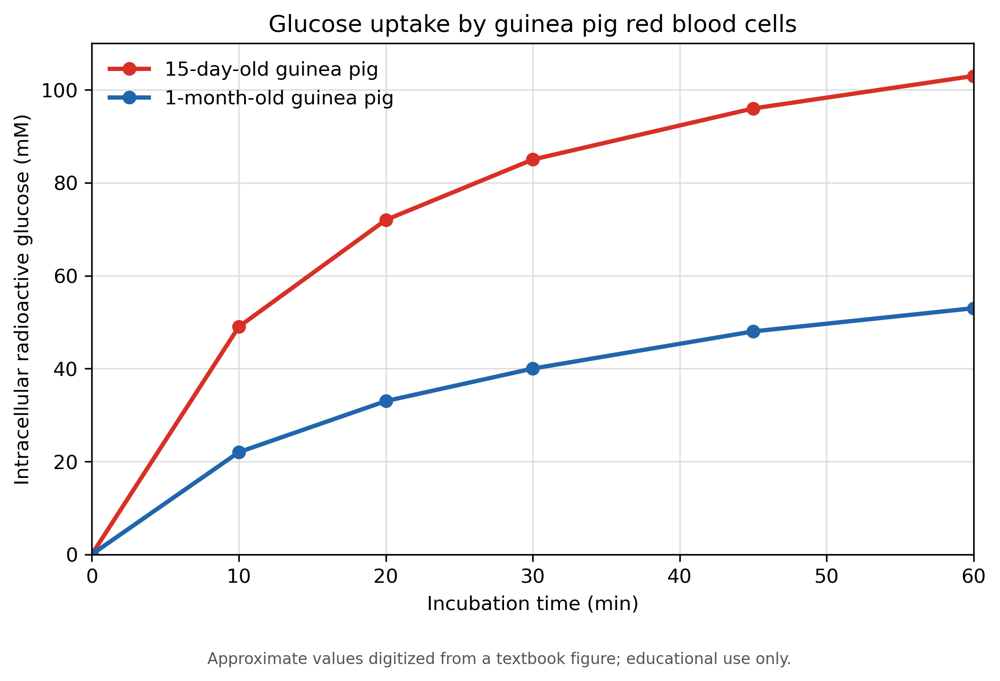

# 豚鼠年龄与红细胞葡萄糖摄取的关系

**一项基于教材图表数据的教学性再分析**

**作者：**［填写姓名］  
**日期：**［填写日期］

> **教学与数据声明：**本文用于学习实验论文的基本写法。作者并未亲自实施该实验。实验条件和数据来自《坎贝尔生物学》第七章所示练习；表中数值由教材散点图人工估读，不是原始实验记录。本文不应作为独立、真实的实验研究发表或引用。

## 摘要

本研究考察豚鼠年龄是否与红细胞摄取葡萄糖的能力有关。教材所述实验将15日龄和1月龄豚鼠的红细胞置于含300 mM放射性葡萄糖的溶液中，在25°C、pH 7.4条件下孵育，并在不同时间测量细胞内放射性葡萄糖浓度。本文从教材散点图人工估读数据并进行描述性再分析。两组红细胞内的放射性葡萄糖浓度均随时间增加，但15日龄组在所有非零时间点均高于1月龄组。最初10 min内，两组浓度的平均增加速率分别约为4.9 mM/min和2.2 mM/min。结果提示，在该实验条件下，15日龄豚鼠红细胞表现出更强的葡萄糖摄取能力。这一差异可能与细胞膜上葡萄糖转运蛋白的数量或活性有关，但现有数据不能确定其分子机制。由于数据来自图像估读，且缺少生物学重复、误差范围和统计检验，结论仅适用于教学性分析。

**关键词：**红细胞；葡萄糖转运；易化扩散；豚鼠；年龄；散点图

## 1. 前言

细胞膜的磷脂双分子层具有疏水性，葡萄糖等亲水性分子不能自由、高效地穿过膜。葡萄糖进入红细胞主要依赖膜转运蛋白介导的易化扩散，其净转运速率可受到膜两侧浓度差、转运蛋白数量及转运蛋白活性等因素影响。

动物在发育过程中，细胞膜的组成和功能可能发生变化。因此，本研究关注的问题是：**豚鼠的年龄是否与红细胞摄取葡萄糖的能力有关？**

根据教材图表中的初步趋势，本文提出以下假说：

> 15日龄豚鼠红细胞膜上的功能性葡萄糖转运蛋白数量更多或总活性更高，因此其葡萄糖摄取速率高于1月龄豚鼠红细胞。

## 2. 材料与方法

### 2.1 教材所述实验设计

根据教材说明，研究人员分别取得一只15日龄豚鼠和一只1月龄豚鼠的红细胞，并将其置于含300 mM放射性葡萄糖的溶液中。孵育条件为25°C、pH 7.4。研究人员每隔10 min或15 min取出细胞样品，测量红细胞内放射性葡萄糖的浓度。

实验中的主要变量如下：

- 自变量：孵育时间；比较因素为豚鼠年龄。
- 因变量：红细胞内放射性葡萄糖浓度。
- 控制条件：细胞外葡萄糖浓度、温度和pH等。

### 2.2 数据取得与整理

本文没有使用原始实验记录。两个年龄组的数据均由教材散点图人工估读，保留为近似整数。估读时间点为0、10、20、30、45和60 min。由于原图没有提供误差条、重复测量值或完整样本信息，本文仅进行描述性比较，不计算标准差、置信区间或统计显著性。

### 2.3 数据分析

本文比较了相同时间点两个年龄组的细胞内葡萄糖浓度，并使用下式计算指定时间区间内浓度的平均增加速率：

```text
平均增加速率 =（区间末浓度 - 区间初浓度）/ 时间间隔
```

该数值用于近似描述曲线在相应区间内的斜率。由于细胞内浓度还可能受到流出、代谢及其他过程影响，本文将其称为“浓度平均增加速率”，不把它等同于经过独立验证的单向膜转运速率。

## 3. 结果

### 3.1 细胞内放射性葡萄糖浓度

**表1. 根据教材散点图人工估读的细胞内放射性葡萄糖浓度**

| 孵育时间（min） | 15日龄组（mM） | 1月龄组（mM） |
| --------------: | -------------: | ------------: |
|               0 |              0 |             0 |
|              10 |             49 |            22 |
|              20 |             72 |            33 |
|              30 |             85 |            40 |
|              45 |             96 |            48 |
|              60 |            103 |            53 |

两组红细胞内的放射性葡萄糖浓度均随孵育时间增加。在所有非零时间点，15日龄组的浓度均高于1月龄组。60 min时，15日龄组约为103 mM，1月龄组约为53 mM，两组相差约50 mM。

图1根据表1中的估读数据绘制；数据来自教材散点图，仅用于教学性分析。



**图1. 不同年龄豚鼠红细胞内放射性葡萄糖浓度随孵育时间的变化。** 数据由教材散点图人工估读，仅用于教学性分析；连线用于帮助观察趋势，不表示经过模型拟合的连续函数。

### 3.2 浓度增加速率

在最初10 min内，15日龄组的浓度平均增加速率约为：

```text
(49 mM - 0 mM) / 10 min = 4.9 mM/min
```

1月龄组的浓度平均增加速率约为：

```text
(22 mM - 0 mM) / 10 min = 2.2 mM/min
```

因此，15日龄组最初10 min的浓度平均增加速率约为1月龄组的2.2倍。此后两条曲线的斜率均逐渐减小，说明两组细胞内放射性葡萄糖浓度的增加均随时间趋缓。

## 4. 讨论

本次再分析显示，15日龄豚鼠红细胞在相同孵育时间内积累了更多放射性葡萄糖，并在实验早期表现出更大的曲线斜率。该结果支持年龄与豚鼠红细胞葡萄糖摄取表现有关，也与本文提出的假说一致：15日龄组可能具有更多功能性葡萄糖转运蛋白，或其转运蛋白总活性更高。

不过，“与假说一致”不等于“证明了假说”。本实验只测量了细胞内放射性葡萄糖浓度，没有直接测量转运蛋白的数量、结构、亲和力或活性。因此，现有数据不能区分以下解释：15日龄组的转运蛋白数量更多、单个转运蛋白活性更高，或两个年龄组在其他细胞特征上存在差异。

两条曲线随时间逐渐变平，表明细胞内葡萄糖浓度的净增加速度下降。这可能与膜两侧葡萄糖浓度差减小、转运逐渐接近平衡或细胞内相关过程有关。然而，当前实验并未分别测量这些因素，因此不能仅凭曲线形状确定具体原因。

本分析还存在若干重要限制。第一，数值来自教材图像的人工估读，可能存在读图误差。第二，教材描述显示每个年龄组的细胞可能仅取自一只豚鼠；如果确实如此，个体与年龄效应无法分离，结果不能可靠推广到整个年龄群体。第三，图中没有误差条和独立重复数据，因此无法评价组内变异，也不能进行可靠的显著性检验。第四，细胞内浓度的变化不是对单向膜转运速率的直接测量。

后续实验应从每个年龄组选择多只豚鼠作为独立生物学重复，在相同条件下测量早期葡萄糖摄取速率。同时，可使用针对葡萄糖转运蛋白的抗体，通过Western blot或流式细胞术测量每个年龄组红细胞膜上的转运蛋白含量。如果15日龄组同时表现出更高的转运蛋白含量和更高的初始摄取速率，将为假说提供更直接的支持。

## 5. 结论

基于教材图表的估读数据，15日龄豚鼠红细胞在本实验条件下表现出比1月龄豚鼠红细胞更高的葡萄糖摄取水平和更大的早期浓度增加速率。该结果提示红细胞的葡萄糖转运能力可能随豚鼠发育而变化，但不能确定这种差异是否由转运蛋白数量或活性造成。由于缺少原始数据、独立重复和统计分析，本研究结论应视为教学性、描述性的初步结论。

## 数据可用性

本文使用的数据列于表1，均由教材散点图人工估读。本文没有获得原始实验数据。生成图1的完整代码已列于结果部分。

## 参考文献

1. Kondo T, Beutler E. Developmental changes in glucose transport of guinea pig erythrocytes. *Journal of Clinical Investigation*. 1980;65:1-4.
2. Urry LA, Cain ML, Wasserman SA, Minorsky PV, Orr RB. *Campbell Biology*. ［请根据所用教材版本补充版次、出版社、年份和页码］。

> **提交前说明：**参考文献2不能凭截图准确确定版本信息。正式提交时，应按照你实际使用的《坎贝尔生物学》版本补全书目信息；不要保留方括号中的占位文字。