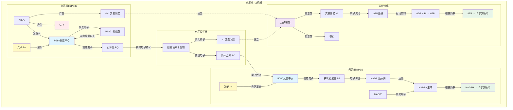
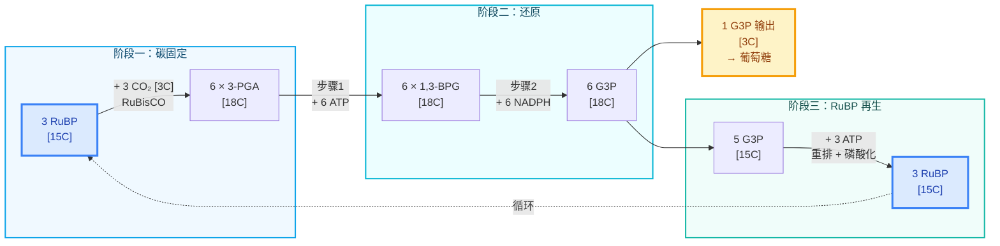

# 光合作用

## 光反应



### 太阳光光谱分布

[太阳光光谱分布](../思考/太阳光光谱分布.md) — 叶绿素吸收光谱与地表太阳光能量分布。

## 卡尔文循环

**阶段一：碳固定**

```
RuBP (5C) + CO₂ → 2 × 3-PGA (3C)
```

**阶段二：还原**

步骤一：磷酸化
```
3-PGA + ATP → 1,3-BPG + ADP
```

步骤二：还原
```
1,3-BPG + NADPH + H⁺ → G3P + NADP⁺ + Pi
```

**阶段三：RuBP 再生**
```
5 G3P (15C) + 3 ATP → 3 RuBP (15C) + 3 ADP + 3 Pi
```



### 分子结构平面图

[卡尔文循环分子结构示意图](../思考/卡尔文循环分子结构示意图.md) — 循环中各中间物的分子结构与命名。

