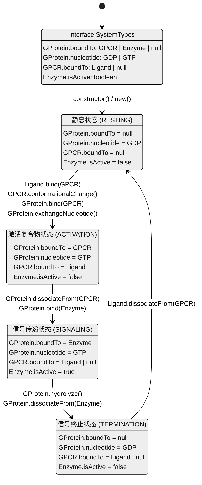
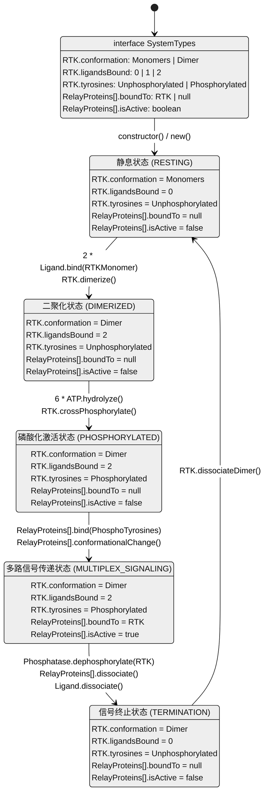
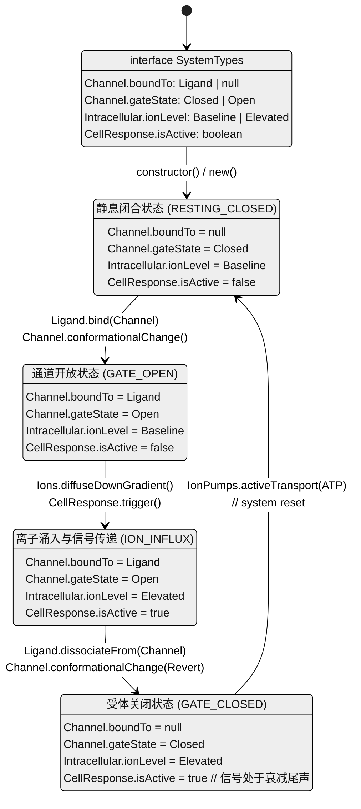
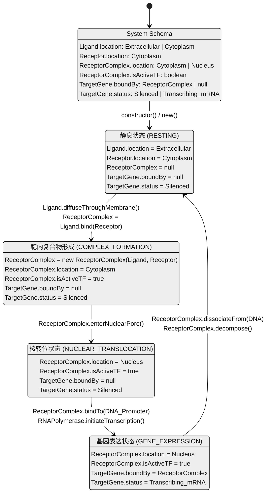
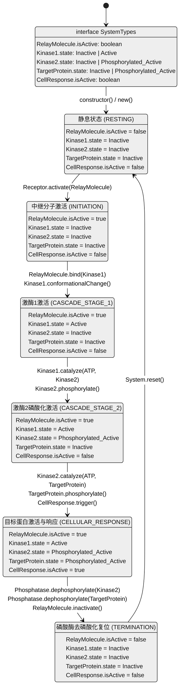

# 细胞通讯

## 计算机网络隐喻

| **计算机网络 (TCP/IP / OSI)**                  | **细胞通讯阶段 (坎贝尔 Ch.11)**                     | **网络/硬件元件隐喻**                    | **细胞生物学实体**                           | **隐喻深度解析**                                             |
| ---------------------------------------------- | --------------------------------------------------- | ---------------------------------------- | -------------------------------------------- | ------------------------------------------------------------ |
| **物理层 / 数据链路层** (传输介质与寻址)       | 信号传递 (Signaling)                                | 网线、无线电波、MAC 地址                 | 细胞外液、血液循环、信号分子 (配体 Ligand)   | 信号分子（如内分泌激素）就像在公网（血液）中泛洪广播的数据包。只有拥有正确 MAC 地址（受体）的节点才会接收它。 |
| **网络层 / 传输层接口** (端口绑定与握手)       | 接收 (Reception)                                    | 路由器端口、防火墙规则 (Port / Firewall) | 细胞膜受体 (GPCR, RTK, 离子通道)             | 特异性配对： 就像 HTTP 请求只找 80 端口，特定配体只与特定受体结合。配体不进入细胞（不越过防火墙），只触发端口状态改变（受体构象改变）。 |
| **网络层 (内部路由)** (数据包解析与局域网广播) | 转导：第二信使 (Transduction: 2nd Messengers)       | 交换机 (Switch)、局域网多播 (Multicast)  | cAMP, $Ca^{2+}$, $IP_3$, DAG                 | 受体被激活后，生成第二信使。这相当于边缘路由器收到公网数据包后，在内网生成无数个多播帧，迅速在局域网（细胞质）内扩散。 |
| **传输层 / 会话层** (流量控制、中继放大)       | 转导：激酶级联 (Transduction: Kinase Cascade)       | 信号放大器、多级代理 (Proxy)、负载均衡   | 蛋白激酶级联反应 (磷酸化与去磷酸化)          | 放大效应 (Amplification)： 一个网络包触发内网的“广播风暴”。一层激酶激活下一层，信号呈指数级放大。底层的 G蛋白就像网络交换机的控制芯片。 |
| **表示层** (数据格式化、资源整合)              | 转导：网络优化 (Transduction: Optimization) | 网络集线器 (Hub)、数据总线、网关         | 脚手架蛋白 (Scaffolding Proteins)            | 脚手架蛋白将多个相关的激酶物理上绑定在一起。这就像把多台独立的服务器集成到一个刀片机箱中，极大提高了内部数据交换的速度和效率。 |
| **应用层** (执行特定软件或脚本)                | 响应 (Response)                                     | 运行特定软件 (App)、更新数据库、系统重置 | 细胞质酶活性改变、细胞骨架重排、基因表达转录 | 执行终端任务： 信号最终抵达目标终端。改变酶活性类似于运行一个前台软件（快）；激活转录因子改变基因表达，类似于下载并安装新的系统补丁（慢但持久）。 |
| **连接释放与协议重置** (FIN/ACK, TTL超时)      | 信号终止 (Termination)                              | 结束进程 (Kill PID)、清除缓存、TTL 过期  | 磷酸二酯酶 (降解cAMP)、蛋白磷酸酶、受体内吞  | 防止网络拥塞： 就像 TCP 必须有挥手断开机制，磷酸酶移除磷酸基团以“关闭”激酶。如果没有这些机制，细胞就会像遭受 DDoS 攻击一样失控（如霍乱或癌症）。 |

## 受体

### 质膜受体

#### G蛋白偶联受体

G蛋白偶联受体（GPCRs，G protein-coupled receptors）

#### 受体酪氨酸激酶

受体酪氨酸激酶（RTKs，Receptor tyrosine kinases）

#### 离子通道受体

离子通道受体（Ion channel receptors）

### 胞内受体

## 磷酸化级联反应

Phosphorylation Cascade

## 第二信使

### 核心概念

- 定义：存在于细胞内的非蛋白质小分子或离子（多为水溶性）。
- 作用：在细胞内部传递来自膜受体的信号（第一信使），并通过大量生成或释放，实现信号的指数级放大。

###  经典代表一：cAMP（环磷酸腺苷）

- 生成：G蛋白激活膜上的腺苷酸环化酶，该酶消耗ATP大量制造cAMP。
- 执行：cAMP主要负责结合并激活蛋白激酶A（PKA），进而启动磷酸化级联反应。
- 终止：细胞内的磷酸二酯酶会迅速将cAMP降解为普通的AMP，从而关闭信号。

### 经典代表二：钙离子（Ca2+）与 IP3

- 特点：细胞中最广泛的第二信使。平时被主动泵入内质网储存，造就了极高的浓度差。
- 上游触发：受体（GPCR或RTK）激活磷脂酶C（PLC），PLC将膜磷脂剪切为 DAG 和 IP3（这俩也是第二信使）。
- 释放：IP3 作为钥匙扩散到内质网，打开上面的IP3门控钙离子通道。
- 响应：钙离子顺着浓度梯度如洪水般涌入细胞质，结合并激活各种特定蛋白，引发肌肉收缩、细胞分裂等最终反应。

## 细胞响应

###  响应的两个主要位置

- 核响应：发生在细胞核内。处于信号通路末端的分子通常充当转录因子，负责开启或关闭特定基因的表达，从而控制合成新的蛋白质。
- 质响应：发生在细胞质中。通常是调节已有蛋白质的活性，比如直接控制某种代谢酶的开启，或者引起细胞骨架的重排从而改变细胞形状。

### 响应的四个调控特征

- 信号放大：通过酶的级联反应，微小的初始信号在每一步都能被成倍放大。
- 响应特异性：不同的细胞拥有不同的受体和内部蛋白质集合。因此，同一个信号分子作用于不同细胞，会产生完全不同的反应（例如肾上腺素让心肌细胞收缩，却让肝细胞分解糖原）。
- 信号传导效率：细胞内存在支架蛋白，它们像物理插线板一样，把同一条通路里的几个关键激酶绑定在一起，避免它们在细胞质里盲目碰撞，极大提高了传导速度。
- 信号终止：任何正常的信号通路都必须具备快速复位的机制（如配体脱落、磷酸酶去磷酸化、降解第二信使），只有及时终止，细胞才能准备好接收下一次信号。

## 细胞凋亡

Apoptosis

细胞的主动死亡和细胞分裂一样，对生物体的生存至关重要。
