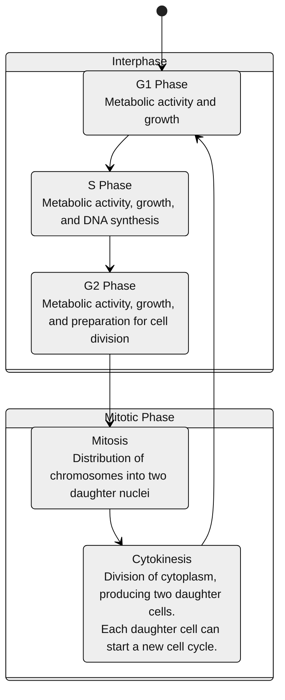

# 细胞周期

## 总览

## 有丝分裂

有丝分裂分为五个时期：前期、前中期、中期、后期和末期。

**动物细胞有丝分裂过程：**

1. G2期
   1. 核膜包围着细胞核。
   2. 细胞核含有一个或多个核仁
   3. 两个中心体已由单个中心体复制而成。中心体是动物细胞中组织纺锤体微管的区域。每个中心体含有两个中心粒。
   4. 在S期完成复制的染色体，由于尚未凝缩，此时无法在显微镜下观察到单个染色体的形态。
2. 前期
   1. 染色质纤维进一步螺旋化、折叠，凝缩成在光学显微镜下清晰可辨的离散染色体。
   2. 核仁消失。
   3. 每条复制的染色体表现为两条相同的姐妹染色单体，它们在着丝粒处相连，并通常沿着整条臂由黏连蛋白连接，从而形成姐妹染色单体黏连。
   4. 有丝分裂纺锤体（因其形状而得名）开始形成。它由中心体和从中心体延伸出的微管组成。从中心体延伸出的较短微管的辐射状态排列称为星体。
   5. 中心体相互远离，部分由它们之间身长的微管推动。
3. 前中期
   1. 核膜解体。
   2. 从每个中心体延伸出的微管现在可以侵入核区。
   3. 染色体变得更加凝缩。
   4. 一种特化的蛋白质结构——动粒，现已形成于每条染色单体的着丝粒处（因此，每条染色体有两个动粒）。
   5. 一些微管附着到动粒上，成为“动粒微管”，这些微管将染色体来回牵拉。
   6. 非动粒微管与来自纺锤体另一极的微管相互作用，使细胞伸长。
4. 中期
   1. 中心体现在已位于细胞的两极。
   2. 所有染色体都已排列在赤道板上，这是一个与纺锤体两极等距的平面。染色体的着丝粒位于赤道板上。
   3. 对于每一条染色体，姐妹染色单体的动粒分别与来自相反两极的动粒微管相连。
5. 后期
   1. 后期是有丝分裂中最短的阶段，通常仅持续几分钟。
   2. 后期开始于黏连蛋白被切割。这使得每对姐妹染色单体突然分开。每条染色单体由此成为一条独立的染色体。
   3. 两条新的子染色体开始向细胞的两极移动，其动粒微管随之缩短。由于这些微管附着在着丝粒区域，着丝粒被拉向前方，领先于染色体臂，移动速率约为 1 μm/min。
   4. 随着非动粒微管的延长，细胞逐渐伸长。
   5. 到后期结束时，细胞的两端拥有完全相同且完整的染色体组合。
6. 末期
   1. 此时细胞内形成两个子细胞核。核膜由母细胞核膜的碎片以及内膜系统的其它部分重新生成。
   2. 核仁重新出现。
   3. 染色体的凝缩程度降低。
   4. 所有残留的纺锤体微管均发生解聚。
   5. 有丝分裂，即一个细胞核分裂为两个遗传上完全相同的细胞核的过程，至此完成。
7. 胞质分裂
   1. 在末期的后半段，细胞质的分裂通常已在进行中，因此两个子细胞在有丝分裂结束后不久即出现。
   2. 在动物细胞中，胞质分裂通过形成分裂沟将细胞一分为二。
