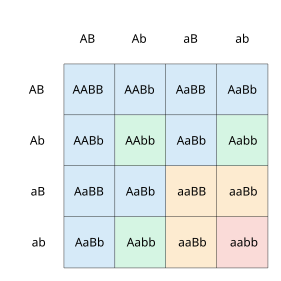
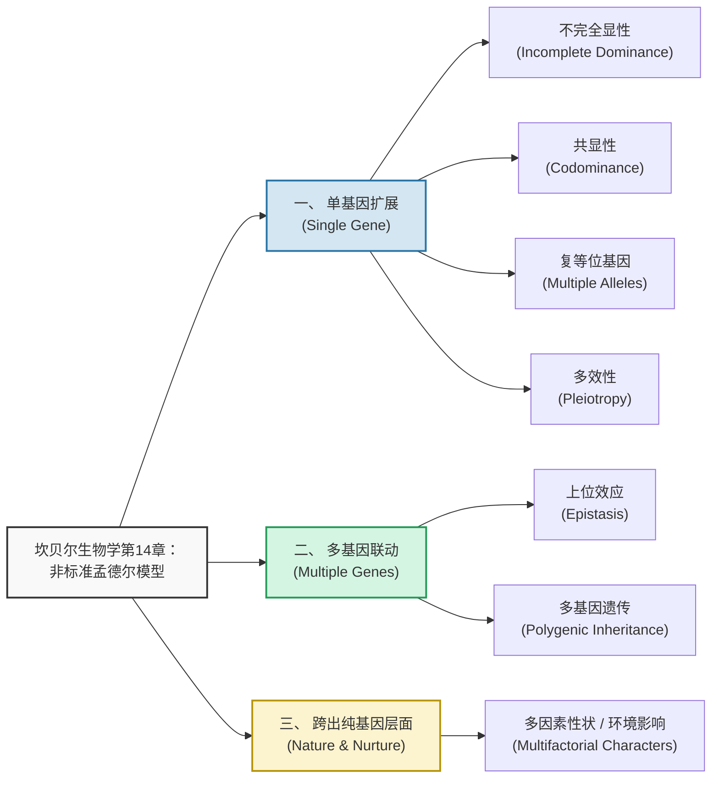
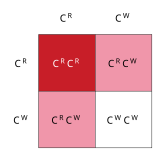
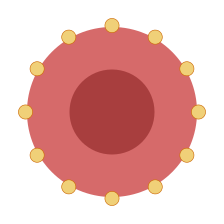
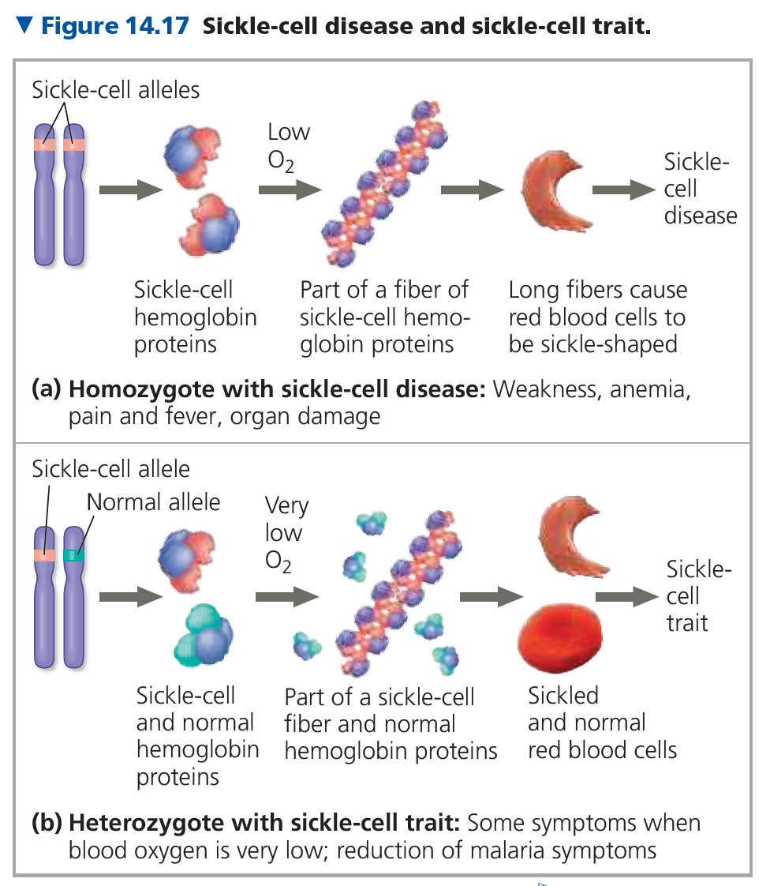
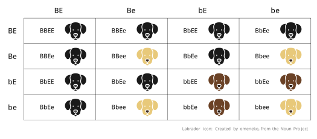
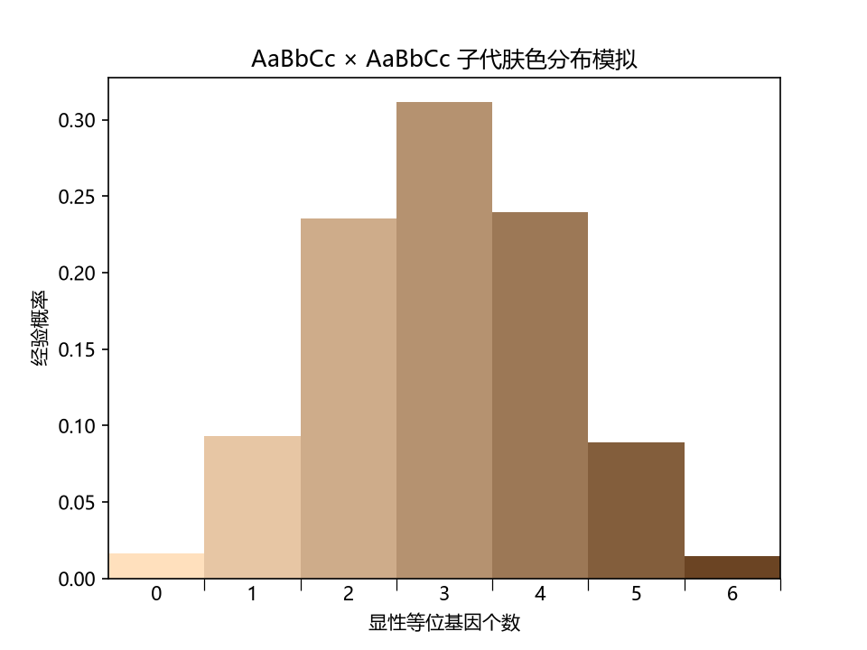
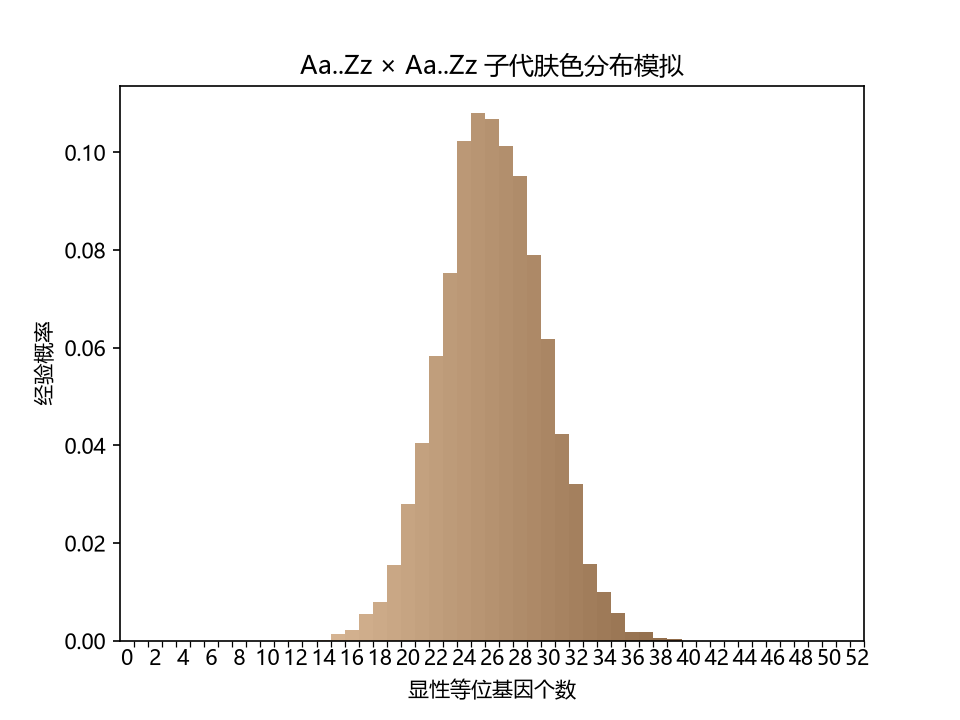
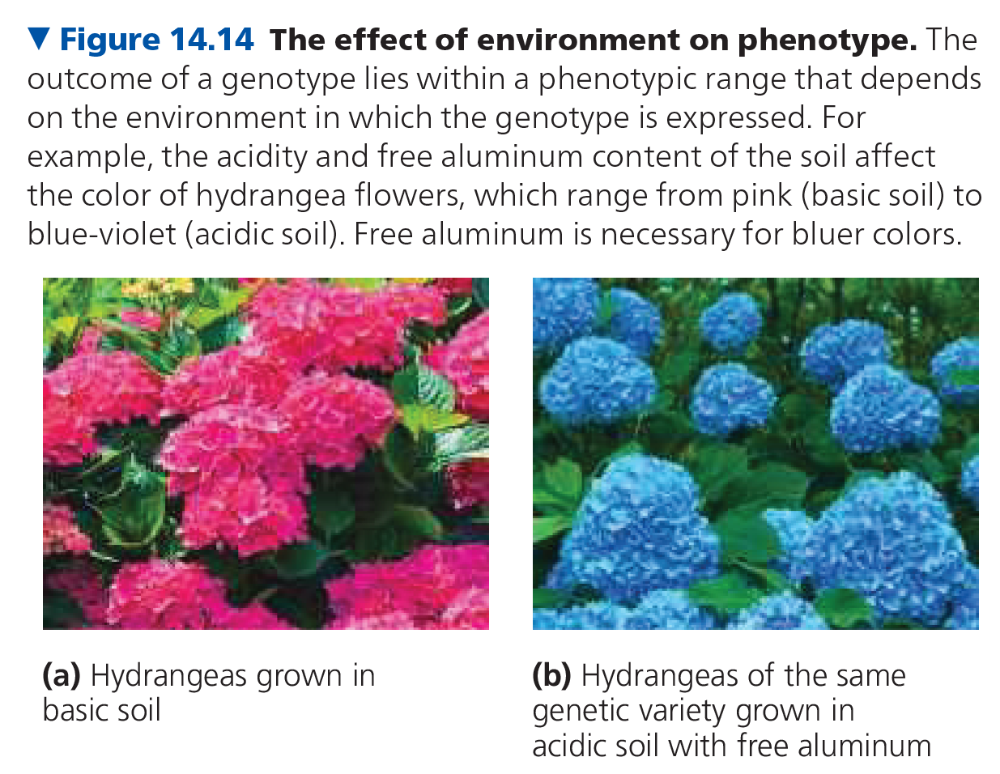

# 孟德尔与基因概念

## 构成孟德尔模型的四个相关概念

1. Alternative versions of genes account for variations in inherited characters.
2. For each character, an organism inherits two copies (that is, two alleles) of a gene, one from each parent.
3. If the two alleles at a locus differ, then one, the dominant allele, determines the organism's appearance; the other, the recessive allele, has no noticeable effect on the organism's appearance.
4. The two alleles for a heritable character segregate (separate from each other) during gamete formation and end up in different gametes.

----

1. 基因的不同变体（等位基因）决定了遗传性状的多样性。
2. 对于每一个遗传性状，生物体会从双亲处各遗传一个基因拷贝（即两个等位基因）。
3. 当同一基因座上的两个等位基因不同时，决定生物体表现型的是显性等位基因，而隐性等位基因对表现型没有明显影响。
4. 在配子形成过程中，控制同一遗传性状的两个等位基因会彼此分离，并分别进入不同的配子中。

## Punnett Square

庞特图

### Aa x Aa

3:1

### AaBb x AaBb

9:3:3:1

## 非孟德尔模型

### 不完全显性

金鱼草的花色。

### 共显性 & 复等位基因

|        基因型        |      红细胞及表面碳水化合物      | 表现型 |
| :------------------: | :------------------------------: | :----: |
| $I^A I^A$ 或 $I^A i$ |    |   A    |
| $I^B I^B$ 或 $I^B i$ |    |   B    |
|      $I^A I^B$       |  |   AB   |
|        $i i$         |    |   O    |

### 多效性

镰刀型细胞贫血症。

### 上位性

拉布拉多毛色。

### 多基因遗传

人类肤色。

> 用于生成图片的 python 源码保存在 png 的 meta 之中。

**三基因座**

**二十六基因座**

### 多因素性状 / 环境影响

绣球花。

