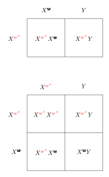

# 遗传的染色体基础

## 摩尔根果蝇实验

- 红眼等位基因 $X^{w^+}$ （显性）
- 白眼等位基因 $X^w$ （隐性）

## 性别的染色体基础

| **系统类型**   | **雌性染色体 / 状态**     | **雄性染色体 / 状态**      | **性别决定关键**               | **代表生物**                              |
| -------------- | ------------------------- | -------------------------- | ------------------------------ | ----------------------------------------- |
| **XY 系统**    | XX (同型)                 | XY (异型)                  | 父亲的精子 (携带 X 还是 Y)     | 人类、绝大多数哺乳动物、果蝇              |
| **ZW 系统**    | ZW (异型)                 | ZZ (同型)                  | 母亲的卵子 (携带 Z 还是 W)     | 鸟类、部分爬行动物、鳞翅目昆虫 (蝴蝶、蛾) |
| **X0 系统**    | XX (双数)                 | X0 (单数)                  | 父亲的精子 (是否携带 X 染色体) | 直翅目昆虫 (蝗虫、蟋蟀、蟑螂)             |
| **单倍二倍体** | 2n (二倍体，由受精卵发育) | n (单倍体，由未受精卵发育) | 卵子是否经过受精               | 膜翅目昆虫 (蜜蜂、蚂蚁、黄蜂)             |

## X 连锁基因的遗传

控制某个特定性状或疾病的基因，物理位置坐落在 X 染色体上。

- 该基因仅存在于 X 染色体上，Y 染色体上没有能与之配对的等位基因。
- 遗传路线受到生殖细胞减数分裂的严格限制。父亲只能把 Y 传给儿子、把 X 传给女儿。
- 由于男女拥有 X 染色体的数量不同，导致同一个基因在家族中传代时，男性和女性表现出该性状（或患病）的几率截然不同（例如隐性遗传中“男多女少”，显性遗传中“女多男少”）。

## 雌性哺乳动物中的 X 染色体失活

雌性哺乳动物在早期胚胎发育阶段，体细胞内两条 X 染色体中的一条会随机且永久地失去转录活性的现象。

这一机制的核心目的是为了实现**剂量补偿**。由于雌性哺乳动物有两条 X 染色体（XX），而雄性只有一条（XY），为了防止雌性产生双倍的 X 染色体基因编码蛋白，雌性细胞必须“关闭”其中一条。这条失活的染色体会高浓度缩成一团沉默的染色质，在显微镜下观察被称为**巴氏小体**。

经典案例：[三花貓好養嗎？個性、優缺點、常見疾病與照顧重點一次完整看懂](https://litomon.com/blog/calicocats/)

## 基因连锁

位于同一条染色体上、且物理距离相近的两个或多个基因，在减数分裂产生生殖细胞时倾向于“绑定”在一起，作为一个整体遗传给后代的现象。

- 打破孟德尔定律：孟德尔著名的“自由组合定律”指出，不同形状的遗传是互不干扰、随机组合的。但该定律的隐藏前提是：这些基因必须位于**不同的染色体**上，或是**物理距离相距甚远**。当基因位于同一条染色体上发生连锁时，它们就无法再自由组合了。
- 物理距离决定连锁强度：两个连锁基因靠得越近，它们在遗传时“打包”在一起的概率就越高。
- 交叉互换（解绑机制）：连锁基因并非绝对无法分开。在细胞分裂早期，成对的染色体之间偶尔会发生片段的**交叉互换**。如果这种呼唤恰巧发生在两个连锁基因之间，它们就会被拆散。物理距离越远，被“剪开”的概率就越大。

## 基因重组

子代产生了与双亲表型不同的新组合（重组型）。

1. 非连锁基因的重组（自由组合）：
   - 位于不同的染色体上的基因，在减数第一次分裂后期，由于非同源染色体的自由组合而发生重组。
   - 重组概率最高为 50%。
2. 连锁基因的重组（互换）：
   -  位于同一条染色体上的连锁基因，理论上应该永远一起遗传。但实际上，子代中仍会出现少量的重组型。
   -  这是因为在减数第一次分裂前期，同源染色体的非姐妹染色单体之间发生了交叉互换，打断了原有的连锁关系。

### 重组频率

指在遗传杂交实验中，子代中出现重组型个体（表型组合与两个亲本都不同的个体）所占的比例。

它是衡量两个基因在同一条染色体上“距离”元进的关键指标。

计算公式：
$$
\text{重组频率} = \frac{重组型子代总数}{子代总数} \times 100\%
$$
重组频率反映了基因之间的物理距离：

- 距离越近：两个基因在减数分裂时发生交叉互换的概率就越低，重组频率越小（趋于 0%），它们表现出强烈的连锁。
- 距离越远：他们之间发生交叉互换的概率就越高，重组频率越大。
- 上限 50%：当两个基因在同一条染色体上距离非常遥远时，它们发生多次交叉互换的概率极高，此时它们的重组频率最高可达 50%。这在遗传学结果上，与它们位于两条不同的染色体上（完全自由组合）是无法区分的。

## 染色体异常

对染色体异常导致疾病的认知，是随着细胞遗传学技术（如显微镜、染色技术）的进步而逐步确立的。在 1956 年人类拥有 46 条染色体的标准数量被最终确认之前，医学界无法准确将特定疾病与染色体异常联系起来。

- 1959 年，首次确认数目异常致病（唐氏综合征）：法国遗传学家 Jérôme Lejeune 等人发现，唐氏综合征患者的细胞中多出了一条微小的染色体（即第 21 号染色体有 3 条，称为 21 三体）。这是人类历史上**第一次**将特定的常染色体数目异常与具体的遗传疾病联系起来。
- 1959 年，性染色体数目异常的发现：几乎在同一时期，科学家发现了性染色体异常导致的疾病：Charles Ford 团队发现特纳综合征（Turner syndrome）患者缺失一条 X 染色体（45,X0）；Patricia Jacobs 发现克氏综合征（Klinefelter syndrome）男性多出一条 X 染色体（47,XXY）。这证明了性染色体不仅决定性别，其数量异常也会导致发育障碍。
- 1960 年，其他严重的三体综合征被确认：随着技术的普及，医学界迅速发现了其他常染色体异常疾病，如 Edwards 发现的 18 三体综合征（爱德华氏综合征）和 Patau 发现的 13 三体综合征（帕陶氏综合征）。
- 1960~1973 年，首次将结构异常与癌症相连（费城染色体）：1960 年，Peter Nowell 和 David Hungerford 在慢性髓细胞白血病（CML）患者体内发现了一条异常短小的染色体（后被称为“费城染色体”）。1973 年，Janet Rowley 证实这实际上是 9 号和 22 号染色体之间发生了**易位（结构改变）**。这是人类首次证明染色体结构突变可以直接导致癌症。
- 1970 年代之后，显带技术与微缺失综合征：显带技术（如 G 显带）的出现，让科学家能看清染色体上的横纹结构。借此，医学界发现了许多因染色体**片段缺失**导致的疾病，如猫叫综合征（5 号染色体短臂缺失）和威廉姆斯综合征。进入 21 世纪后，基因芯片和荧光原位杂交（FISH）技术进一步将认知推进到微小的拷贝数变异（CNV）层面。

## 孟德尔遗传学例外

### 基因组印记

一种表观遗传学现象，指同一个基因的表达与否，严格取决于它遗传自父方还是母方。在印记基因中，来自双亲的等位基因只有一个能正常工作，另一个则被“打上印记”并被细胞强行关闭。

- 化学修饰（如 DNA 甲基化）：生物体在形成生殖细胞（精子或卵子）时，会通过甲基化等方式，给特定的基因加上“锁”，使其无法转录表达。
- DNA 序列不变：这种改变完全不影响 DNA 本身的遗传密码（A、T、C、G 序列），仅仅改变了基因的“开关”状态。
- 代代重置：这种印记不是永久的。在每一代个体产生的新的生殖细胞时，旧的印记会被擦除，并根据个体自身的性别重新建立新的印记。

| **特征**       | **孟德尔遗传定律**                                 | **基因组印记**                                       |
| -------------- | -------------------------------------------------- | ---------------------------------------------------- |
| **基因表达**   | 来自父母双方的等位基因地位平等，通常共同发挥作用。 | **“单亲表达”**：仅表达父源，或仅表达母源的等位基因。 |
| **正反交结果** | 无论特定等位基因来自父亲还是母亲，后代性状相同。   | 基因的亲本来源不同，会导致后代表现出截然不同的性状。 |
| **变异本质**   | 依赖于DNA序列本身的突变、分离或重组。              | 依赖于表观遗传修饰，DNA序列本身未发生改变。          |

### 细胞器基因的遗传

又称细胞质遗传或核外遗传，是指由存在于线粒体和叶绿体中的 DNA 所控制的遗传现象。它完全打破了孟德尔定律中“父母双方各贡献一半基因”的均等原则，表现为严格的**母系遗传**。

- 卵细胞的绝对优势：在受精过程中，体积庞大的卵细胞为受精卵提供了几乎所有的细胞质及内部的细胞器（线粒体和叶绿体）。精子虽然也携带线粒体为其游动提供能量，但在受精后通常会破坏或丢弃，因此精子只贡献了细胞核。
- 随机分配机制：细胞器基因没有染色体那样的精细结构。在细胞分裂时，细胞质和其中的细胞器只是随即地、不均等地分配到子细胞中，因此不遵循减数分裂中的基因分离和自由组合定律。

| **特征**       | **孟德尔遗传（细胞核遗传）**         | **细胞器遗传（细胞质遗传）**                   |
| -------------- | ------------------------------------ | ---------------------------------------------- |
| **基因来源**   | 父方母方各占 50%                     | 几乎 100% 来自母方                             |
| **遗传规律**   | 有显隐性之分，遵循分离和自由组合定律 | 无显隐性关系，完全随机分配                     |
| **正反交结果** | 通常相同（性染色体除外）             | 截然不同（后代性状总是与母本一致）             |
| **系谱图特征** | 可隔代遗传，男女患病比例可能不同     | **母亲患病，子女全患病；父亲患病，子女全正常** |
