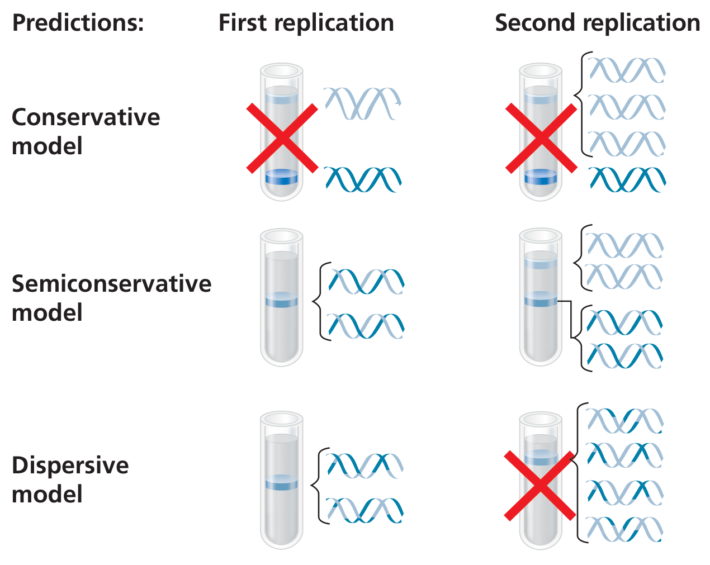
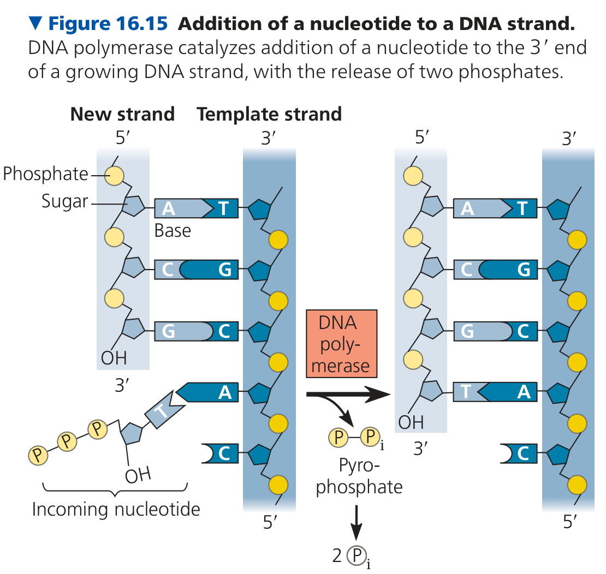
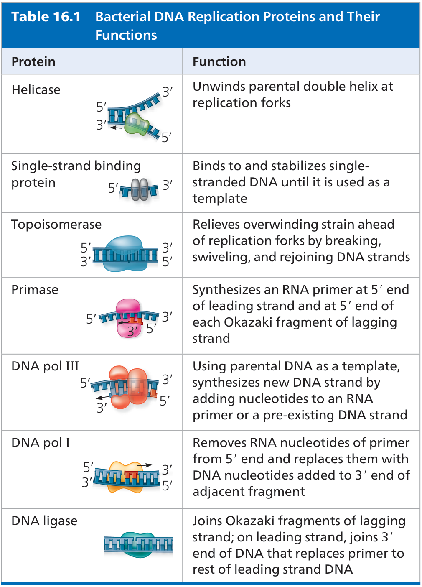
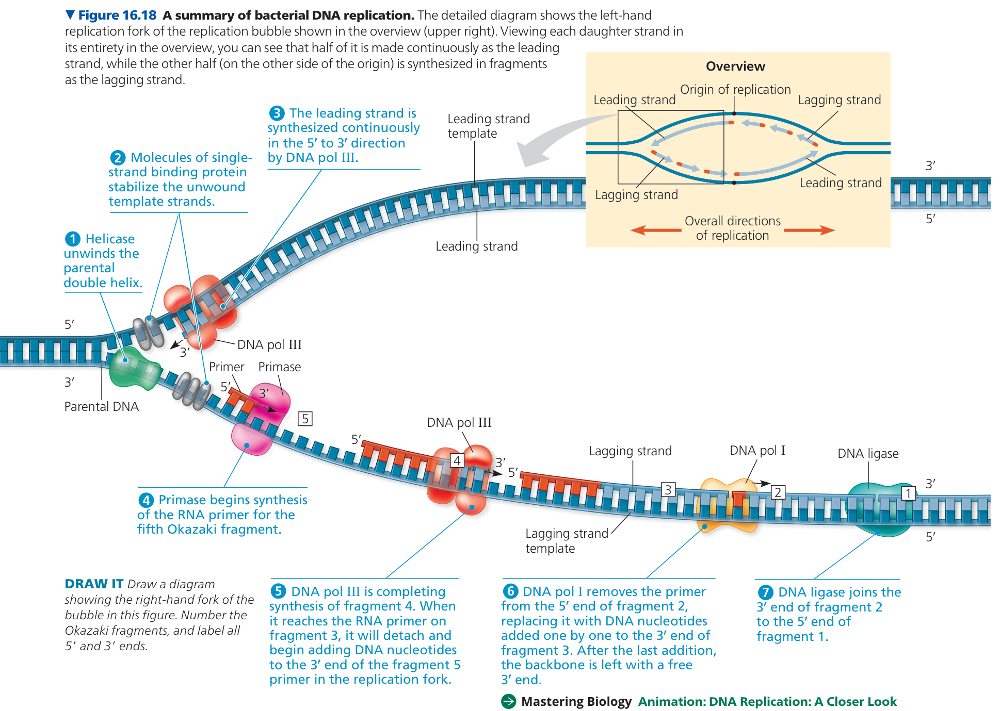
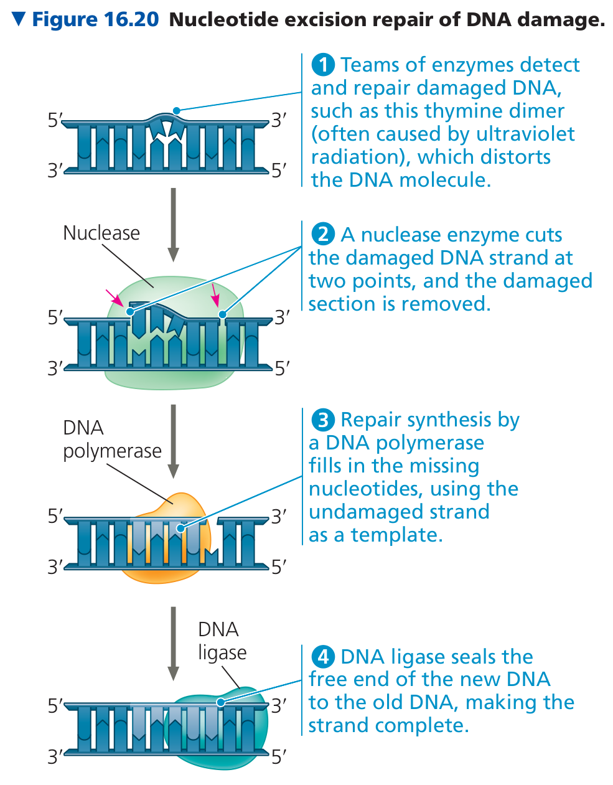
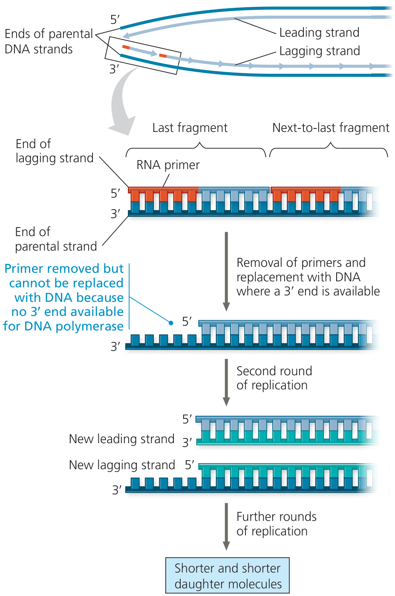
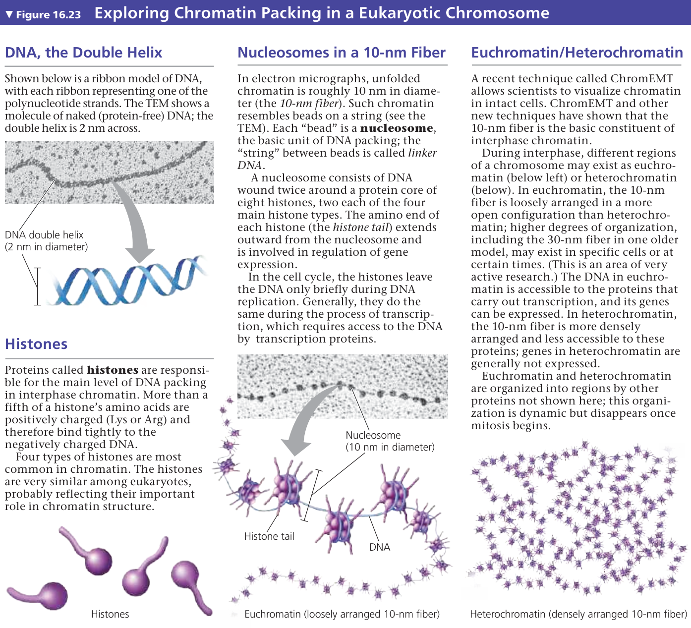
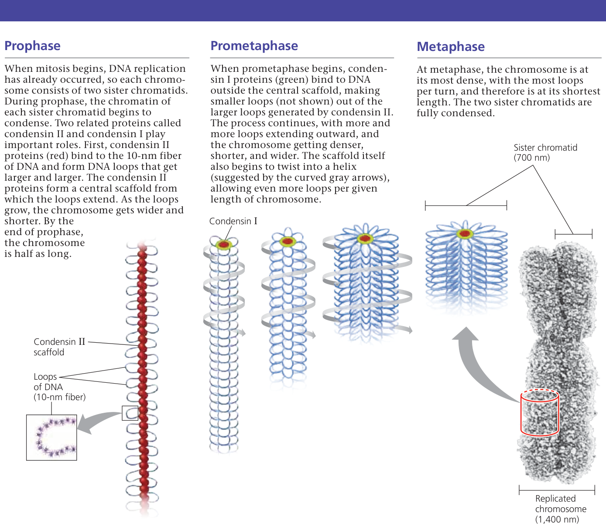

# 遗传的分子基础

## 实验

### 时间线

坎贝尔《生物学》第16章“遗传的分子基础”主要围绕“DNA是遗传物质”和“DNA如何复制”展开，常被提到的实验/研究有：

1. **格里菲斯肺炎链球菌转化实验（1928）**  
   用光滑型（S）和粗糙型（R）肺炎链球菌；加热杀死的S型菌与活R型菌混合后，出现活的S型菌。提出存在“转化因子”，但未确定是DNA。

2. **艾弗里、麦克劳德、麦卡蒂体外转化实验（1944）**  
   将S型菌的DNA、蛋白质、RNA等分开，分别用DNA酶、RNA酶、蛋白酶处理。只有DNA酶使转化活性消失，证明DNA是遗传物质。

3. **赫尔希和蔡斯噬菌体实验（1952）**  
   用T2噬菌体，分别以 \(^{32}P\) 标记DNA、\(^{35}S\) 标记蛋白质，侵染大肠杆菌后搅拌离心。结果 \(^{32}P\) 进入细菌，\(^{35}S\) 留在上清，证明DNA进入细菌并指导子代噬菌体形成。

4. **查加夫碱基组成分析（1950）**  
   分析不同物种DNA的碱基比例，发现 \(A=T\)、\(G=C\)，但 \((A+T)/(G+C)\) 因物种而异，为碱基互补配对提供了依据。

5. **富兰克林和威尔金斯的X射线衍射研究（1952）**  
   获得DNA的X射线衍射照片，显示DNA为螺旋结构，直径约2 nm，碱基间距约0.34 nm，每圈约3.4 nm，为双螺旋模型提供关键数据。

6. **沃森和克里克DNA双螺旋模型（1953）**  
   综合X射线衍射和查加夫规则，提出DNA为反向平行双螺旋，磷酸-脱氧核糖骨架在外，碱基在内，A与T、G与C配对，并推测半保留复制。

7. **梅塞尔森和斯塔尔密度梯度离心实验（1958）**  
   大肠杆菌先在 \(^{15}N\) 培养基中培养，再转入 \(^{14}N\) 培养基；用CsCl密度梯度离心。第一代出现杂合DNA，第二代出现杂合和轻DNA，证明DNA为半保留复制。

8. **科恩伯格等人的DNA聚合酶体外实验（1959年前后）**  
   从大肠杆菌中纯化DNA聚合酶I，在体外加入模板、引物和dNTP等合成DNA，证明DNA聚合酶能按模板合成DNA，为复制机制研究奠定基础。

9. **布莱克本和格雷德端粒酶研究（1984）**  
   在四膜虫中发现端粒酶，证明其以自身RNA为模板延长端粒重复序列，解释了真核生物染色体末端复制问题。

### 格里菲斯实验（1928）

**Griffith's experiment (1928)**

肺炎双球菌的两个不同菌株

| 类型 |       名称       |  荚膜  |                   致病性                   |
| :--: | :--------------: | :----: | :----------------------------------------: |
| S 型 | 光滑型（Smooth） | 有荚膜 |  **致病性强**，注射小鼠后小鼠患败血症死亡  |
| R 型 | 粗糙型（Rough）  | 无荚膜 | **不致病（或致病性很弱）**，注射后小鼠存活 |

研究目标

- 流行病学/疫苗目的：受 1918 流感大流行影响，他想弄清肺炎球菌不同血清型之间的关系，并尝试研制疫苗
- 隐含假设：肺炎球菌存在多个稳定的血清型（I、II、III 等），型别是稳定的遗传性状，不会轻易改变。
- 另一个隐含假设：R 型菌是从 S 型菌“退化”而来的无荚膜变体。

实验最初想要检验：用死的/弱毒菌能否诱导免疫保护。转化现象在很大程度上是意外发现。

格里菲斯实验室具备的能力

- 能够培养肺炎球菌
- 能够判断 S 型 / R 型（肉眼）
- 能够判断有无荚膜（显微镜）
- 能够判断菌体的血清型（I、II、III 型等）
- 能够判断加热菌液中有无存活细胞
- 能够对小鼠注射并观察发病和死亡
- 能够从小鼠体内回收活菌

观察

- 活 S 型菌 -> 小鼠死
- 活 R 型菌 -> 小鼠活
- 加热杀死的 S 型菌 -> 小鼠活

转化实验的假设

- 零假设 H0：加热杀死的 S 型已完全失活，活 R 型不致病 -> 而这混合注射小鼠应存活。
- 备择假设 H1：该组合会导致小鼠死亡。  
  - 加热杀死的 S 型菌 + 活 R 型菌 -> 小鼠死

实验结果（小鼠死亡，并从死鼠体内分离出活的 S 型菌）否定了 H0。真正的难点从这里才开始。

观察到死亡后，要解释“为什么能回收到活的 S 型菌”，至少有三种互斥的解释：

1. 加热杀死的 S 型菌并未完全死亡，残留的少量活 S 型菌导致小鼠死亡。
2. 活 R 型菌发生突变，变成了 S 型菌，从而导致小鼠死亡。
3. 加热杀死的 S 型菌中存在某种“转化因子”，使活 R 型菌转化为 S 型菌。

格里菲斯实验室能够判断加热菌液中有无存活细胞，第一种解释很容易验证真伪。

验证后两种解释的关键思路是，用血清型当遗传标记，并且必须用血清型彼此不同的供体 S 和受体 R 来配对（通常使用 III-S 和 II-R 配对做这个实验）。这样转化后得到的 S 型，才能和 R 自身回复突变区分开。回复突变是指 R 型菌自发变回 S 型菌，该过程不会改变其血清型。

II-R 是怎么来的？把 II-S 在实验室长期培养/传代，S 型会自发出现无荚膜的 R 型变异。跳去粗糙型菌落，确认它无毒力、无荚膜，就得到 II-R。R 型一般不能用荚膜分型，但它的来源是明确的，所以直到它“原本是 II 型”。

验证第 2 点：活 R 菌自发突变。

如果只是 II-R 自己突变成了 S 型，那么：

- 突变是随机的，不会因为旁边有热杀死的 III-S 就定向变成 III-S。
- 它最可能回复成自己原来的血清型，即 II-S。
- 并且回复过程不依赖热杀 S 的存在。

所以可以做这些对照：

1. 单独注射活 II-R：小鼠不死，血中查不到 S 型菌。
2. 大量培养活 II-R，利用平板涂布法（判断有没有活菌、有多少、菌落形态等，不能判断血清型）找 S 型菌落：通常没有，或极少数；若有，血清型应该是 II-S，不该是 III-S。
3. 在混合实验中分型：  
   热杀 III-S + 活 II-R -> 小鼠死，从血中分离出活菌。  
   如果分离到的是 III-S，而不是 II-S，就不能用“ II-R 自发突变”来解释。 
   因为 II-R 突变只能变成 II-S，不可能凭空变成 III-S。

验证第 3 点：存在转化因子

> 经典组合：加热杀死的 III-S + 活的 II-R → 小鼠死亡，血中分离出活的 III-S。

关键不是小鼠死了，而是分离出的 S 型菌是什么血清型。

如果转化因子来自热杀 III-S，那么 R 菌获得的是 III 型的遗传信息，转化后就应该变成 III-S。而它原本是 II-R，自己突变只会变回 II-S。所以：

| 供体（热杀） | 受体（活） | 若为突变 | 若为转化 |        实际结果        |
| :----------: | :--------: | :------: | :------: | :--------------------: |
|    III-S     |    II-R    |   II-S   |  III-S   |    III-S → 支持转化    |
|     I-S      |    II-R    |   II-S   |   I-S    |     I-S → 支持转化     |
|     II-S     |    II-R    |   II-S   |   II-S   | 无法区分，所以要用异型 |

也就是说：转化后 S 型的血清型随供体热杀 S 的型别而变，不随受体 R 的来源型别而变。这是证明“转化”不是“突变”的关键。

进一步验证：

1. 排除活菌残留：热杀 S 单独培养，培养皿无菌生长；单独注射小鼠不致病。
2. 体外重复：不必经过小鼠，在液体培养基中混合热杀 III-S 和活 II-R，涂板后可出现 S 型菌落，且其分型为 III-S。

格里菲斯实验的结论：

**加热杀死大的 S 型菌里存在某种物质，能把活 R 型菌定向转化为供体型 S 型菌；这不是 R 型菌自己随机突变的结果。**

### 梅塞尔森和斯塔尔密度梯度离心实验（1958）

## 核酸

核酸的分子组成层级

1. 碱基：含氮杂环，分为嘌呤（A、G）和嘧啶（T、U、C）。
2. 核苷：碱基 + 五碳糖（核糖或脱氧核糖）。
3. 核苷酸：核苷 + 磷酸基团。
4. 核酸：许多核苷酸通过磷酸二酯键聚合而成的大分子。

| 碱基 | RNA 底物 | DNA 底物 |
| :--: | :------: | :------: |
|  A   |   ATP    |   dATP   |
|  G   |   GTP    |   dGTP   |
|  C   |   CTP    |   dCTP   |
| U/T  |   UTP    |   dTTP   |

## 多起点复制

多起点复制

- 人体 DNA 的长度：人类单倍体基因组大约有 30 亿个碱基对。
- 复制引擎的上限：真核细胞的 DNA 聚合酶（复制 DNA 的“机器”）工作速度大约是每秒 50 个碱基。
- 单点复制的耗时：如果只从一个起点开始单向复制，复制一条染色体需要长达数月甚至数年的时间。
- 实际耗时：在真实的细胞周期中，DNA 复制（S 期）只需要大约 8 到 12 小时。

采用分布式策略

- 部署海量复制起点  
  人类细胞的染色体上分布着 30,000 到 50,000 个复制起点。在细胞准备分裂时，特定的蛋白质复合物（ORC）会像定位信标一样，预先附着在这些起点上。
- 形成双向复制泡  
  当复制信号下达，成千上万个起点会同时“点火”。DNA 双链在这些点位被解开，形成一个个像气泡一样的结构。每个气泡内都有两个“复制叉”，分别向相反的方向同时推进。
- 气泡融合完成复制  
  随着各个复制叉不断向前推进，相邻的复制泡最终会相遇并融合。当所有的复制泡全部连通时，一整条庞大的线性 DNA就完整地变成了两条。

原核生物的特例

值得一提的是，并非所有生物都需要分布式复制。像大肠杆菌这样的原核生物，其 DNA 是一个相对很小的环状结构（只有约 460 万个碱基对）。它们的 DNA 聚合酶工作速度也更快（每秒约 1000 个碱基），因此它们只需一个复制起点（单起点双向复制），只需几十分钟就能完成整个基因组的复制。

## DNA 复制流程

教材中以细菌（大肠杆菌）的 DNA 复制为基础，图解内容对应的是细菌的情况，而非真核细胞（如人类细胞）的情况。

| 酶                                   | 主要功能                                                   | 相关过程                  |
| ------------------------------------ | ---------------------------------------------------------- | ------------------------- |
| **解旋酶**（helicase）               | 解开DNA双链的氢键，使双链分开形成复制叉                    | DNA复制                   |
| **拓扑异构酶**（topoisomerase）      | 切断并重新连接DNA，缓解复制叉前方产生的超螺旋张力          | DNA复制                   |
| **引物酶**（primase）                | 合成一小段RNA引物，为DNA聚合酶提供3′‑OH起点                | DNA复制                   |
| **DNA聚合酶Ⅲ**（DNA polymerase III） | 以模板链为准，沿5′→3′方向合成新DNA链；具有校对功能         | DNA复制                   |
| **DNA聚合酶Ⅰ**（DNA polymerase I）   | 切除RNA引物，并用DNA填补留下的空隙                         | DNA复制/修复              |
| **DNA连接酶**（DNA ligase）          | 连接冈崎片段或修复切口，形成磷酸二酯键                     | DNA复制/修复              |
| **核酸酶**（nuclease）               | 切除受损或错误的DNA片段                                    | DNA修复，如核苷酸切除修复 |
| **端粒酶**（telomerase）             | 延长染色体末端的端粒DNA；自身携带RNA模板，属于一种逆转录酶 | 端粒维持                  |

前提与对象

- 教材主图通常以大肠杆菌为例。
- 原核（E. coli）：单起点 oriC，双向复制，一个复制泡、两个复制叉；主要酶：Pol III、Pol I、连接酶（NAD⁺）。
- 真核：多起点，多个复制泡；主要酶：Pol α（起始）、Pol ε（前导）、Pol δ（后随）、FEN1/RNase H、连接酶 I（ATP）；线粒体 Pol γ。
- 注意：多起点图是用于真核的，不要与 E. coli 单起点主图混用。
- 解旋酶方向：E. coli DnaB 沿后随链模板移动；真核 MCM 沿前导链模板移动。

总原则

- 半保留复制。
- 所有 DNA 聚合酶只能 5'→3' 合成新链，读模板 3'→5'。
- 需要 RNA 引物提供 3'-OH。
- 前导链连续合成；后随链不连续合成（冈崎片段）。
- 复制是双向的。

起始

1. 起始蛋白识别复制起点（E. coli：DnaA 结合 oriC）。
2. 解旋酶加载并解开双链，形成复制泡和两个复制叉。
3. 拓扑异构酶解除超螺旋。
4. 单链结合蛋白（SSB/RPA）稳定单链。
5. 引物酶合成 RNA 引物（E. coli：DnaG；真核：Pol α 含引物酶活性）。
6. 复制叉向两个方向前进。

拓扑异构酶（Topoisomerase）

当解旋酶像拉链一样强行扒开两股缠绕的 DNA 链时，前方的双螺旋结构会变得越来越紧（“正超螺旋”）。如果只靠在两端“旋转”来释放压力，对于极长且在细胞核内受限的 DNA 分子来说阻力太大，也太慢。

为了高效解决“打卷”问题，拓扑异构酶采用了三步走策略：

1. 剪断（Cut）：拓扑异构酶像一把微型剪刀，游走到打卷最严重的区域，直接切断 DNA 的一条链（拓扑异构酶 I）或两条链（拓扑异构酶 II）。
2. 旋转释放（Swivel）：断开后，原本积压的巨大扭转张力瞬间得到释放。DNA 链以切口为轴心自由旋转（或者让另一端 DNA 穿过缺口），“打卷”的死结被迅速解开。
3. 缝合（Seal）：张力释放完毕的瞬间，酶立刻像超级胶水一样，把切断的磷酸二酯键重新完美拼接起来。

细菌的 DNA 旋转酶在三维结构上与人类的拓扑异构酶截然不同。氟喹诺酮类抗生素通过精准劫持细菌的拓扑异构酶来发挥杀菌作用。

解旋酶（Helicase）

- 原核生物（如细菌）：在冈崎片段一侧
- 真核生物（如人类、动植物）和古菌：在前导链一侧。

前导链

- 每个复制叉一条前导链。
- 一个 RNA 引物即可。
- Pol III（E. coli）或 Pol ε（真核）沿模板连续合成，方向与复制叉前进方向一致。
- 一个复制泡有两条前导链，即两个引物。

后随链

- 模板方向与前导链相反，不能连续合成。
- 引物酶在模板上合成多个 RNA 引物。
- Pol III（E. coli）或 Pol δ（真核）从各引物 5'→3' 合成冈崎片段；整体方向与复制叉前进方向相反，呈不连续。
- Pol III 遇到相邻冈崎片段的 RNA 引物 5' 端时停止，脱离模板。
- 注意：不是每个冈崎片段一个独立的 Pol III；E. coli 中同一 Pol III 全酶可反复使用。

冈崎片段成熟

1. Pol I（E. coli）用 5'→3' 外切核酸酶活性去除 RNA 引物，同时用 5'→3' 聚合酶活性补 DNA。
2. 留下一个切口：一侧 3'-OH，另一侧 5'-磷酸。
3. DNA 连接酶催化 3'-OH 与 5'-磷酸形成磷酸二酯键，封闭切口。细菌连接酶用 NAD⁺，真核连接酶用 ATP。
4. 真核中：RNase H/FEN1 去除引物，Pol δ 填补，连接酶 I 封口。

终止

- E. coli：复制叉在终止区 ter 相遇，Tus 蛋白参与；拓扑异构酶解链，染色体二聚体解离等。
- 真核：相邻复制泡相遇；线性染色体末端由端粒酶处理端粒复制问题。
- 最终得到两个半保留的子代 DNA 分子。

关键酶/蛋白速查

| 功能 | E. coli | 真核 |
| :--: | :--: | :--: |
| 解旋 | DnaB | MCM |
| 引物 | DnaG | Pol α |
| 前导链延伸 | Pol III | Pol ε |
| 后随链延伸 | Pol III | Pol δ |
| 去引物/补 DNA | Pol I | FEN1/RNase H + Pol δ |
| 封口 | 连接酶（NAD⁺） | 连接酶 I（ATP） |
| 单链稳定 | SSB | RPA |
| 滑动夹 | β-clamp | PCNA |
| 拓扑 | 拓扑异构酶 | 拓扑异构酶 |

易错点

- “多个复制起点”只适用于真核；E. coli 只有一个起点。
- Pol III 遇引物停止只发生在后随链；前导链没有其他引物，会连续合成到终止。
- Pol I 后留下的是切口，不是直接连好；需连接酶封口。
- 所有 DNA 聚合酶都是 5'→3'，没有 3'→5' 聚合酶。
- 前导链每个复制叉一个引物；一个复制泡两个前导链引物。
- 后随链整体方向与复制叉前进方向相反，片段化。
- 不要把原核酶名（Pol III/I）套到人类细胞；真核用 Pol α/δ/ε 等。

关于 3'→5' 聚合酶的假设

- 若存在能 3'→5' 合成新链的聚合酶，两条子链都可朝复制叉方向连续合成，一个复制泡理论上只需 4 个引物。
- 现实中不存在：链延伸的化学机制是 3'-OH 亲核攻击 dNTP 的 α-磷酸，且难以与校对偶联。

一句话流程

起始识别 → 解旋/稳定 → 合成引物 → 前导链连续、后随链不连续延伸（冈崎片段） → Pol I 去引物补 DNA → 连接酶封口 → 复制叉相遇终止 → 两个半保留子代 DNA。

## DNA 校对与修复

## DNA 端粒

## 染色体由 DNA 与蛋白质共同包装而成

