# Chap 17. 基因表达：从基因到蛋白质

- 转录：以 DNA 模板为基础合成任何类型 RNA 的统称。
- 翻译：利用 mRNA 中的信息合成多肽的过程。翻译的场所是核糖体。
- 要注意，通常将这些基因产物称为蛋白质——这是坎贝尔教材中会遇到的做法——而不是更精确地称为多肽。

 

## Beadle 和 Tatum 粗糙孢菌实验

一个基因一个酶假说（The one gene–one enzyme hypothesis）

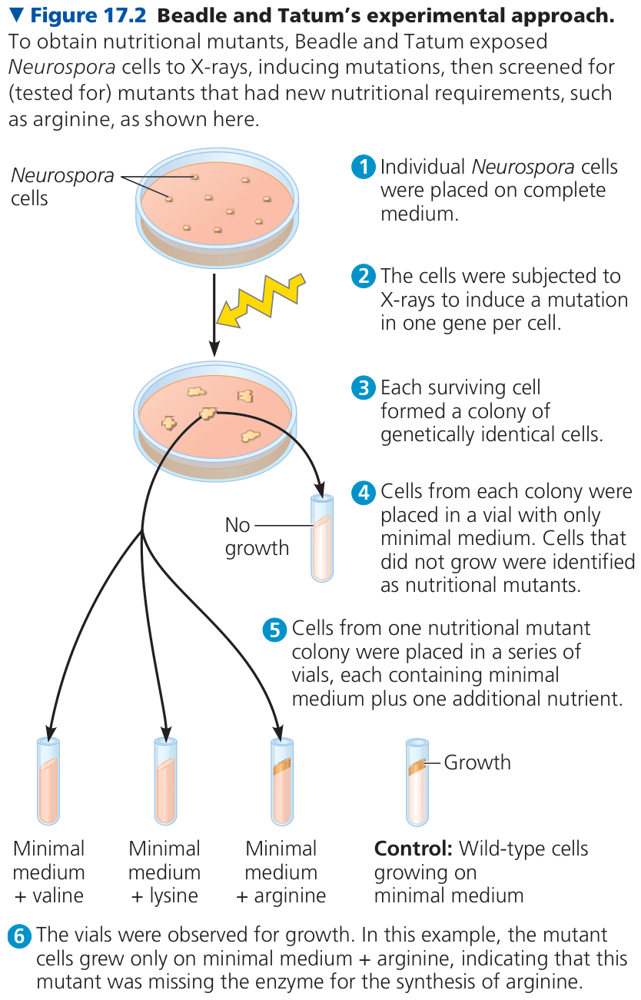

## 中心法则

### 遗传密码、密码子、核苷酸三联体

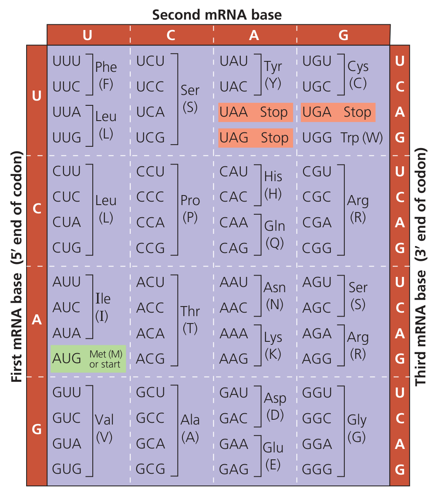

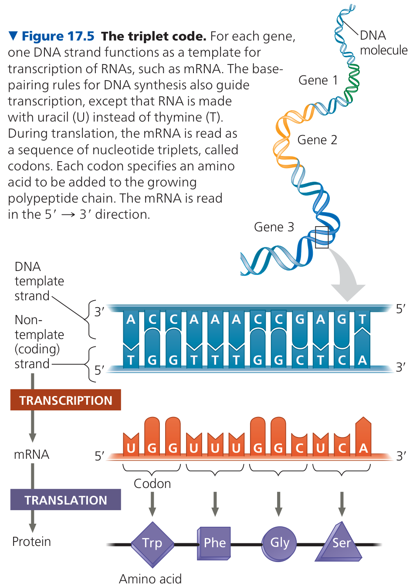

在现存生命中，三联体密码机制表现出强烈的单一起源信号；它很可能在共同祖先或其前身阶段建立，并被所有现存生命继承，但不能排除早期存在其他、后来灭绝的翻译系统。

没有已知的物理定律要求遗传密码必须是三联体；但在 4 种核苷酸、约 20 种氨基酸和固定长度读码这些条件下，二联体容量不足，四联体有增加了系统复杂度，因此三联体成为非常有利的折中方案。

### RNA 转录（RNA transcription）

> 先找新链末端的 3'-OH；聚合酶总是把新核苷酸接到这个 3'-OH 上，因此新链永远沿 5' -> 3' 合成，模板相应地按 3' -> 5' 读取。

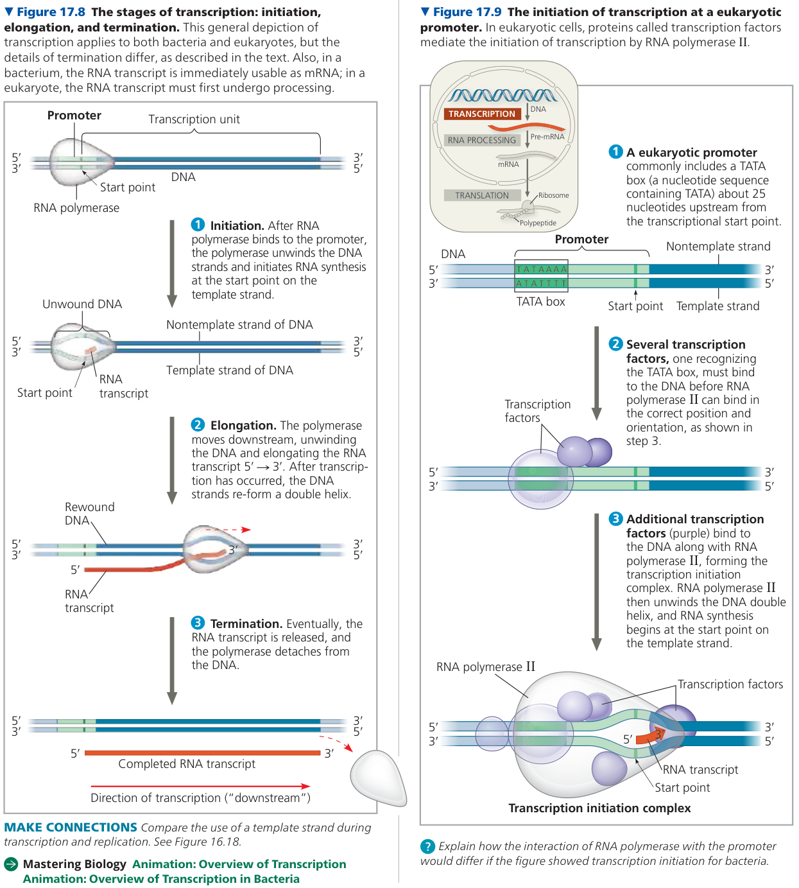

### RNA 加工（RNA processing）

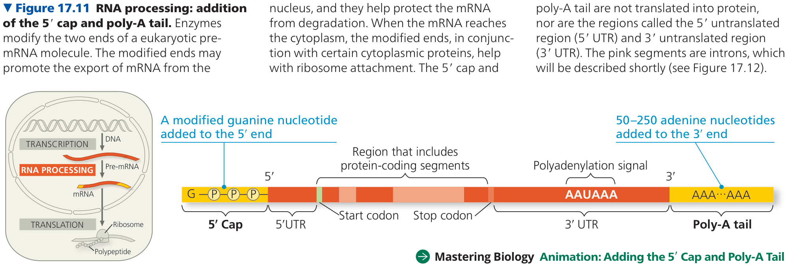

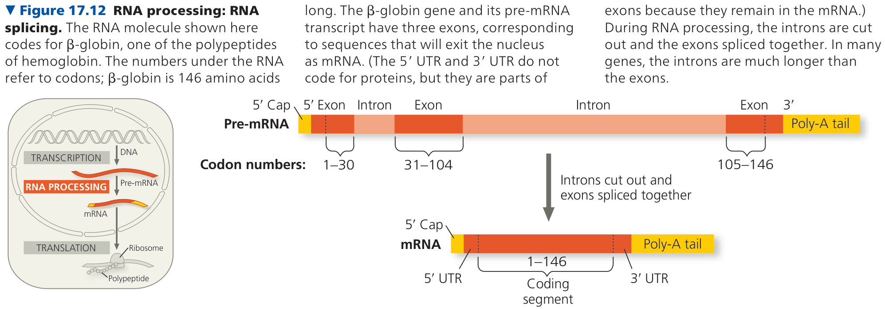

### RNA 剪接（RNA splicing）

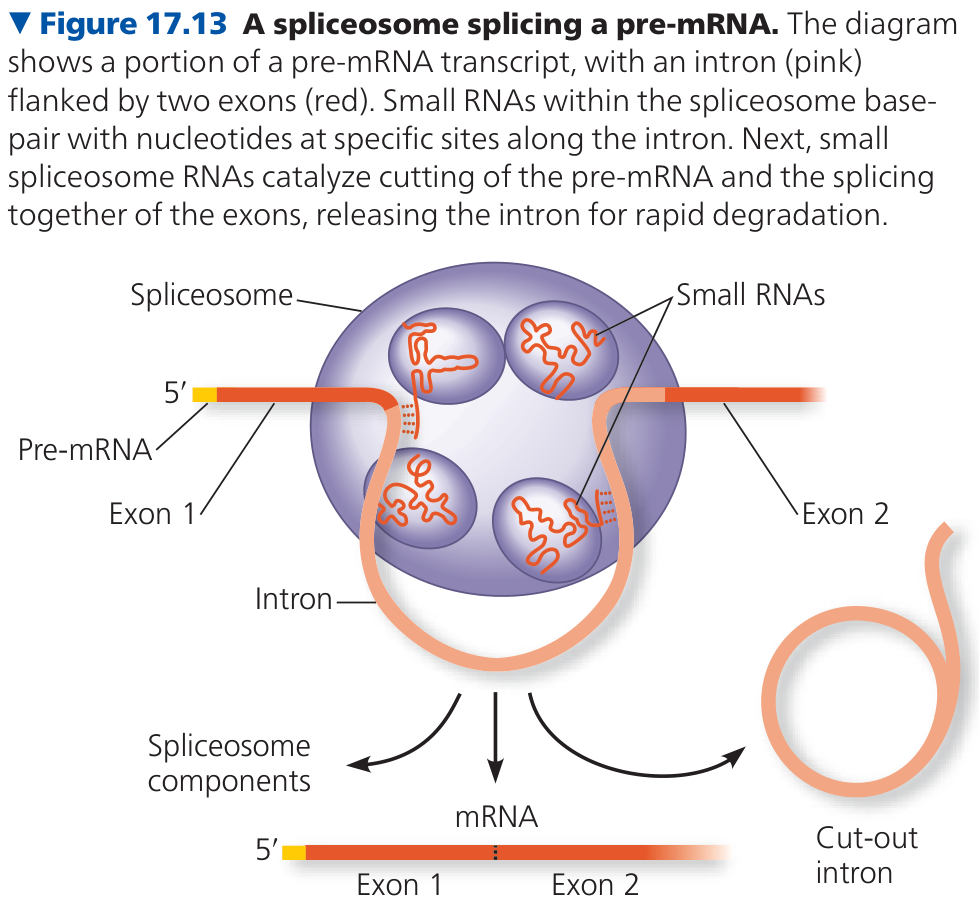

### 结构域（Domains）

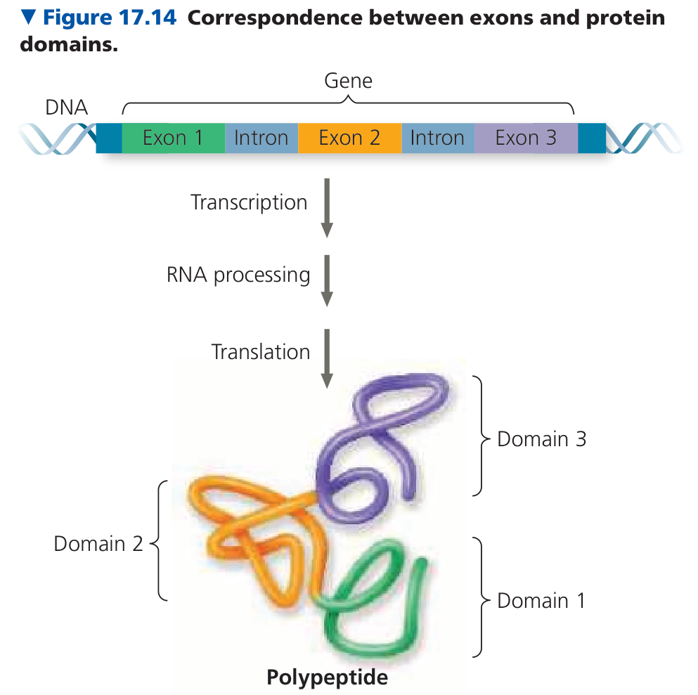

### tRNA、rRNA

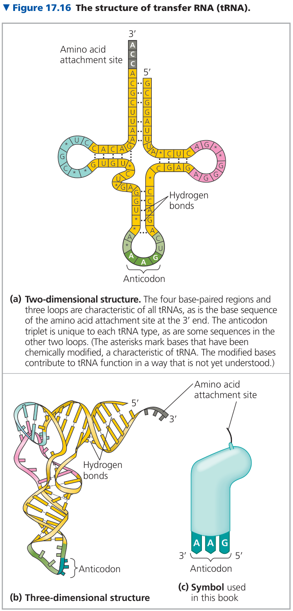

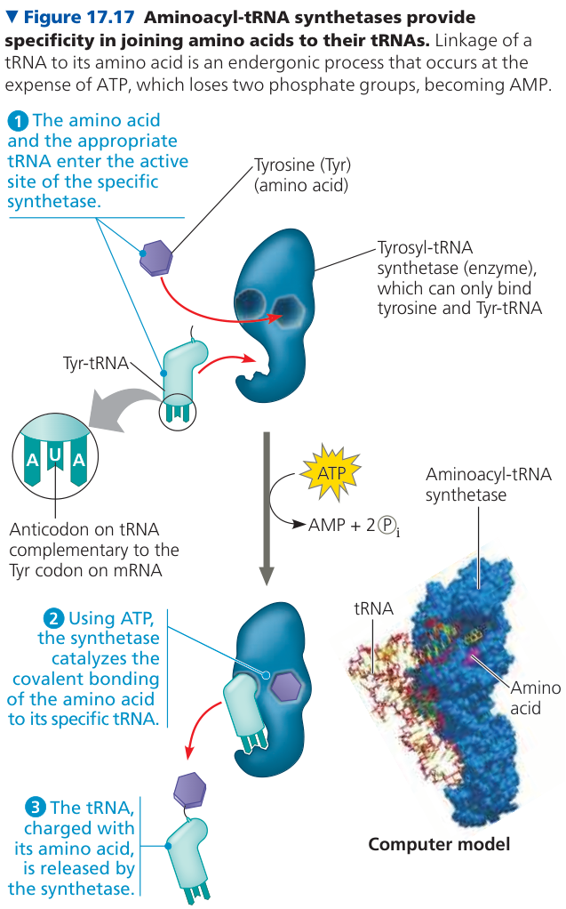

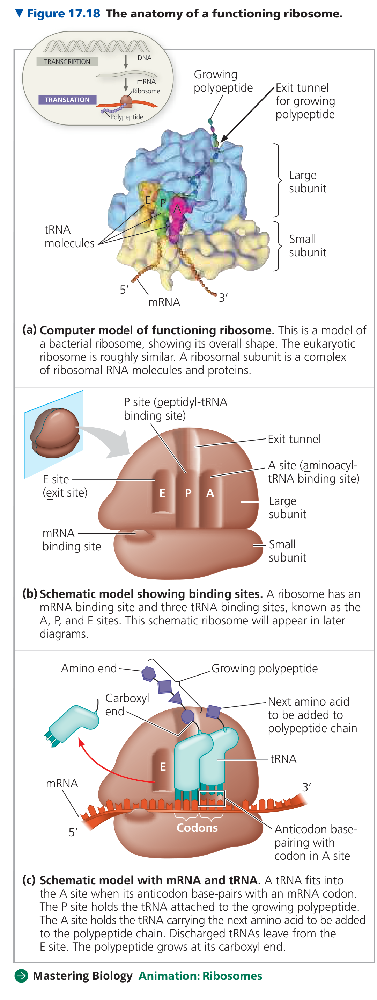

目前普遍接受的模型认为，主要负责核糖体的结构与功能的是 rRNA 而不是核糖体蛋白。

### 多肽的合成

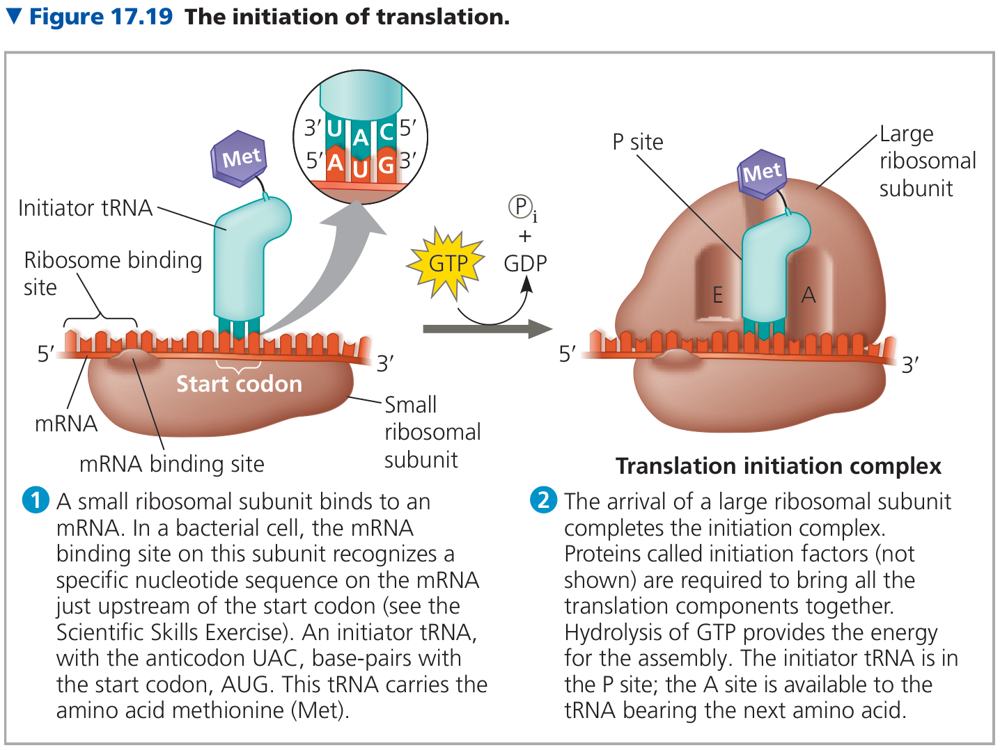

### 翻译后修饰

*post-translational modifications*

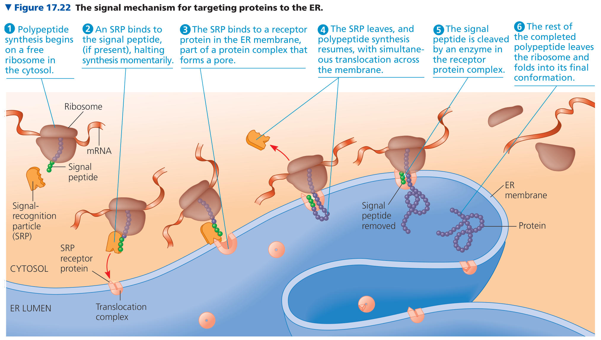

### 总览

