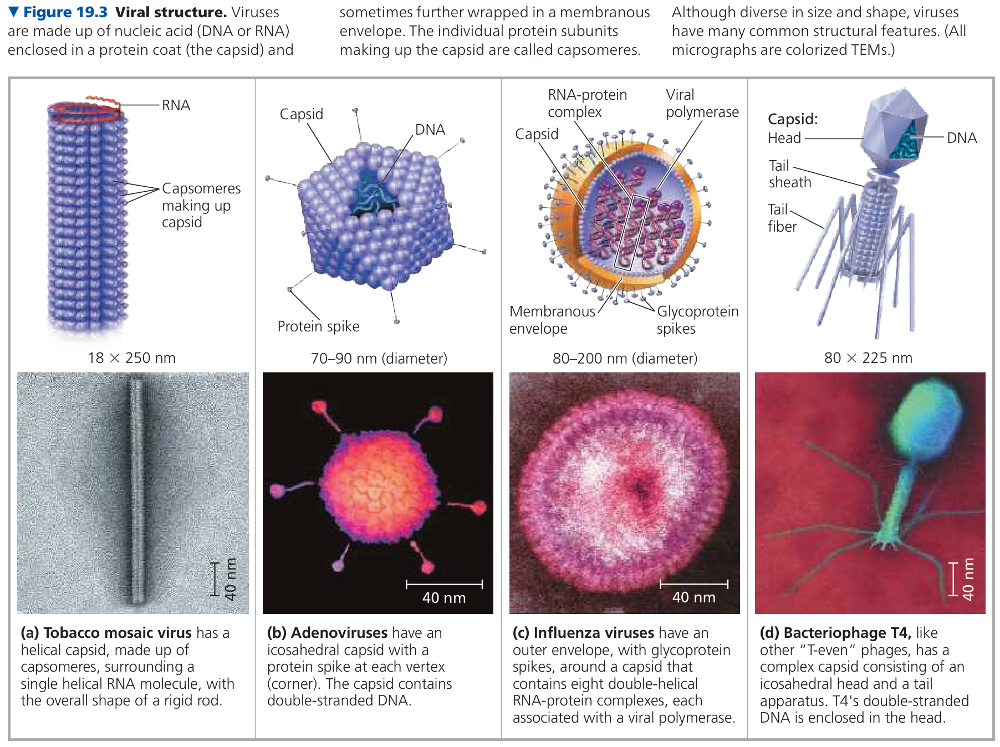
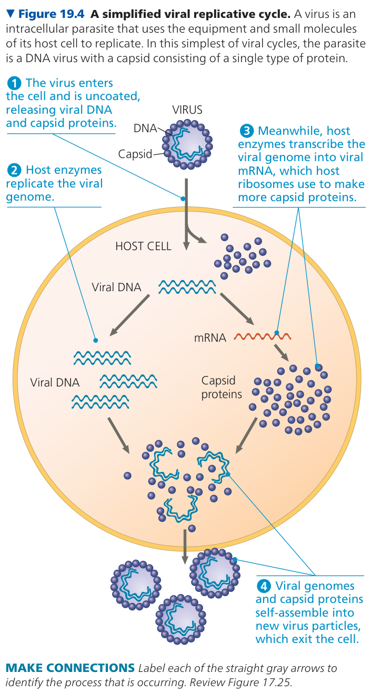
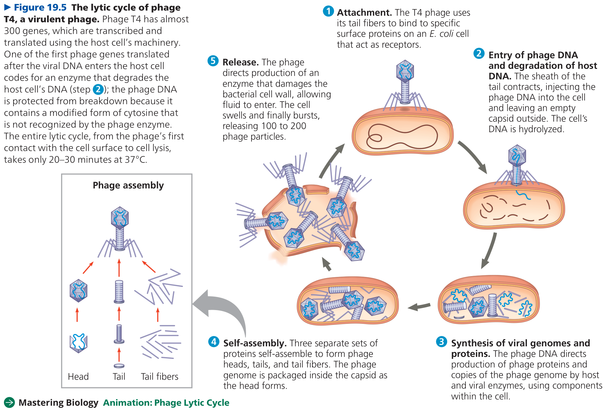
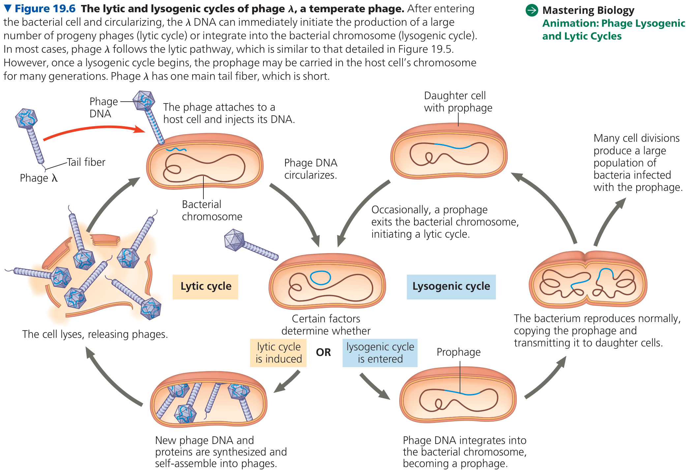
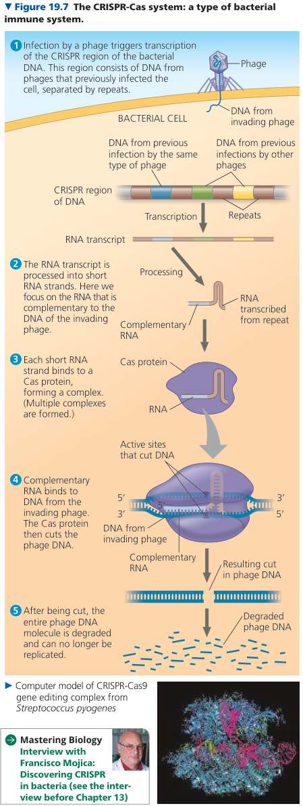
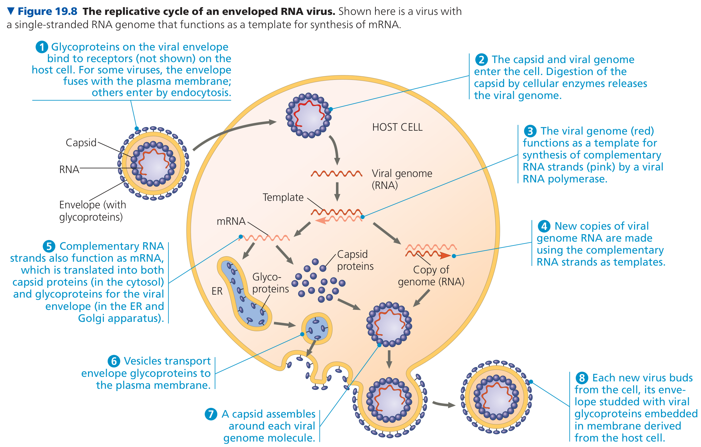
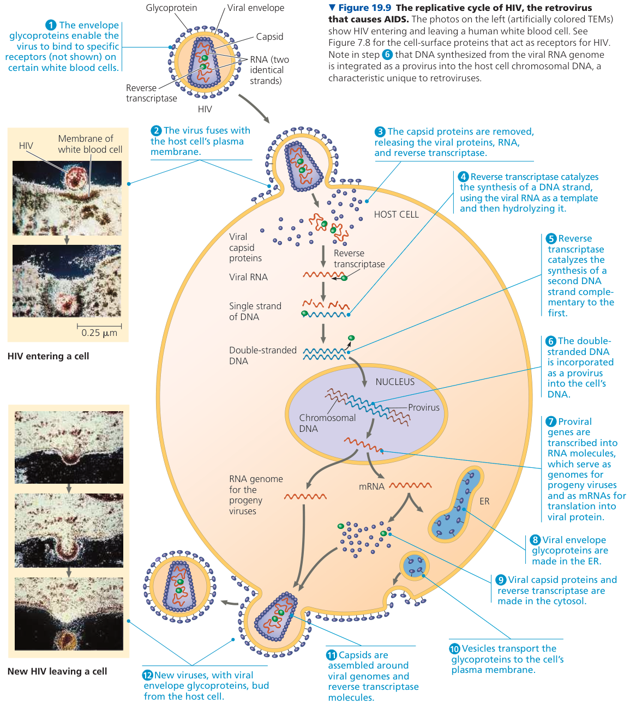

# 病毒

## 病毒的结构

- genome
- capsid
  - capsomer
- envelope

书中列出的常见病毒图示。

## 病毒的复制

- host range

书中给出的简明病毒复制周期示意图。

## 噬菌体的复制周期

dsDNA 的噬菌体有两种复制周期模型：

1. lytic cycle （书中以 T4 噬菌体为例）
2. lysogenic cycle （书中以 λ 噬菌体为例）

教材通过 T4 噬菌体来介绍 lytic cycle。仅以 lytic cycle 作为复制周期模式的噬菌体被称作 virulent phage。

教材通过 λ 噬菌体来介绍 lysogenic cycle。既利用 lytic cycle 也利用 lysogenic cycle 作为复制周期模式的噬菌体被称作 temperate phages。

当噬菌体通过 lysogenic cycle 将病毒 DNA 整合进宿主 DNA 后，噬菌体便被称为 prophage。

## 大肠杆菌防御噬菌体

大肠杆菌采用三种策略来防御噬菌体入侵：

1. 通过 mutant 改变表面蛋白，让噬菌体无法识别大肠杆菌。
2. 通过 restriction enzymes 来限制噬菌体在大肠杆菌细胞内的复制能力。
3. 通过被称为 CRISPR-Cas system 的系统来防御噬菌体的入侵。

CRISPR-Cas system 工作示意图：

## 动物病毒的复制周期

几乎所有的 RNA 动物病毒已具备 envelope 结构，有些 DNA 动物病毒也具有。

书中以 (-) ssRNA 病毒为例：

## 病毒的遗传物质

书中给出了动物病毒的一种经典分类（第 VII 类书中没有给出，这里是自己补充的）：

1. dsDNA
2. ssDNA
3. dsRNA
4. (+)ssRNA
5. (-)ssRNA
6. ssRNA-RT
7. dsDNA-RT

艾滋病的复制周期示意图：

