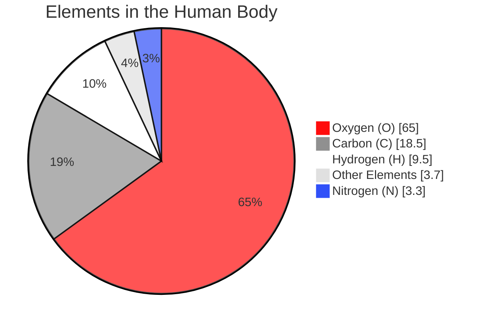

## 元素周期表

<iframe src="https://chemistry.matsubarasoda.com/projects/periodic-table/dist/" width="100%" style="height: 80vh;"></iframe>

直接访问：[元素周期表](https://chemistry.matsubarasoda.com/projects/periodic-table/dist/)。

## 元素和化合物

- elements

- compounds

  - in pure form

  - in combinations

## 人体内的元素

| Element    | Symbol | Percentage of Body Mass (including water) |
| ---------- | ------ | ----------------------------------------- |
| Oxygen     | O      | 65.0%                                     |
| Carbon     | C      | 18.5%                                     |
| Hydrogen   | H      | 9.5%                                      |
| Nitrogen   | N      | 3.3%                                      |
| Calcium    | Ca     | 1.5%                                      |
| Phosphorus | P      | 1.0%                                      |
| Potassium  | K      | 0.4%                                      |
| Sulfur     | S      | 0.3%                                      |
| Sodium     | Na     | 0.2%                                      |
| Chlorine   | Cl     | 0.2%                                      |
| Magnesium  | Mg     | 0.1%                                      |

### 饼状图

颜色采用 CPK 的 Jmol / PyMOL 变体。

> `mermaid` 饼图顺时针排序总是按照 items 的值作降序 order，没有可调 api。

## sp杂化轨道

见笔记：[sp杂化轨道](../思考/sp杂化轨道.md)

