## 烃或烃的衍生物

| 有机物名称 |         分子式          | 官能团  |        表达式        |                 2D 骨架图                 |
| :---: | :------------------: | :--: | :---------------: | :------------------------------------: |
|  乙烷   |     $\ce{C2H6}$      |  -   |         -         | 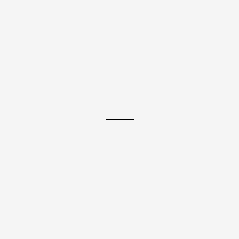  |
|  乙醇   |    $\ce{C2H5OH}$     |  羟基  |    $\ce{-OH}$     | 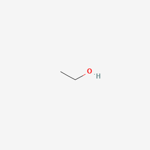 |
|  丙醛   |   $\ce{CH3CH2CHO}$   |  羰基  |    $\ce{>C=O}$    | 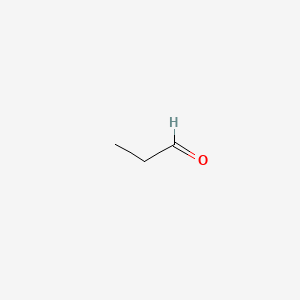  |
|  丙酮   |   $\ce{CH3COCH3}$    |  羰基  |    $\ce{>C=O}$    | 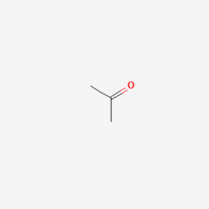  |
|  乙酸   |    $\ce{CH3COOH}$    |  羧基  |   $\ce{-COOH}$    | 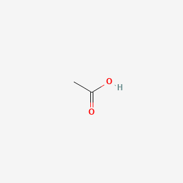 |
|  乙胺   |   $\ce{CH3CH2NH2}$   |  氨基  |    $\ce{-NH2}$    | 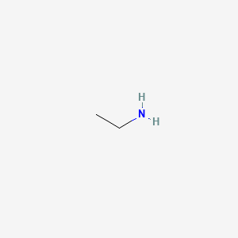 |
|  乙硫醇  |   $\ce{CH3CH2SH}$    |  巯基  |    $\ce{-SH}$     | 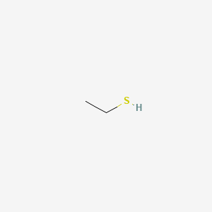 |
| 磷酸乙酯  | $\ce{C2H5OPO3^{2-}}$ | 磷酸基团 | $\ce{-OPO3^{2-}}$ | 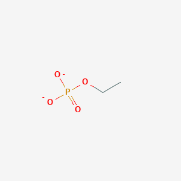 |
|  异丁烷  |     $\ce{C4H10}$     |  甲基  |    $\ce{-CH3}$    | 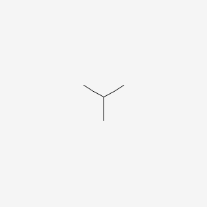 |

> 命名优先级为：羧 > 醛 > 酮 > 羟 > 巯 > 氨

## 异构体

### 结构异构体

|                 正丁烷                 |                 异丁烷                 |
| :------------------------------------: | :------------------------------------: |
|              $\ce{C4H10}$              |              $\ce{C4H10}$              |
| 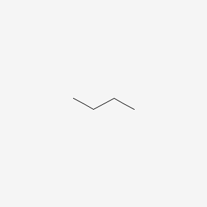 |  |

### 顺反异构体

|               顺-2-丁烯                |               反-2-丁烯                |
| :------------------------------------: | :------------------------------------: |
|              $\ce{C4H8}$               |              $\ce{C4H8}$               |
| 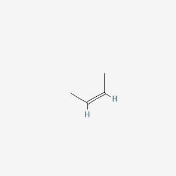 | 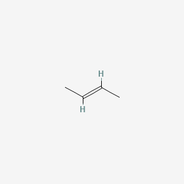 |

> 注：必须存在**碳碳双键**

### 对映异构体 / **手性异构体**

|                L-丙氨酸                |                D-丙氨酸                |
| :------------------------------------: | :------------------------------------: |
|             $\ce{C3H7NO2}$             |             $\ce{C3H7NO2}$             |
| 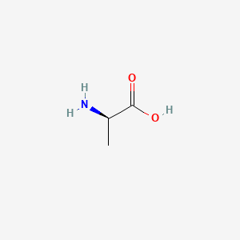 | 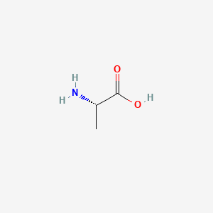 |

## Diagram as Code

**PubChem - NIH**

笔记中图片写法：`}.png)`。`[]` 保留完整来源链接（溯源）；本地文件名取该 URL 的 MD5（小写十六进制），以避冲突、便于去重；不限 PubChem，其它 DasC 服务同理。

1. 通过 smiles 获取 2D 化学结构图：

```markdown

```

2. 通过化合物名称获取 2D 化学结构图：

```markdown

```

3. 通过化合物 cid 获取 2D 化学结构图：

```markdown

```

4. 其它

```url
https://pubchem.ncbi.nlm.nih.gov/rest/pug/<domain>/<namespace>/<identifier>/<operation>/<output>
```

   
