## 四类重要生物分子

- 碳水化合物
- 蛋白质
- 核酸
- 脂质

## 碳水化合物

### 葡萄糖

- 英语：Glucose
- 分子式：$\ce{C6H12O6}$

|       名称       |                          2D 平面图                           |
| :--------------: | :----------------------------------------------------------: |
| D-葡萄糖（开链） | 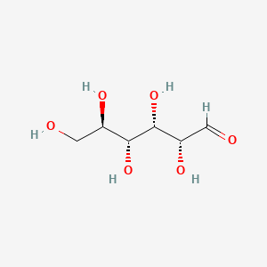 |
| D-葡萄糖（环状） | 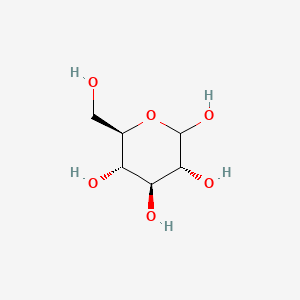 |
|  alpha-D-葡萄糖  | 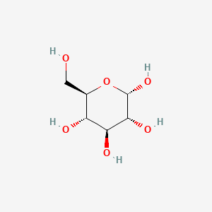 |
|  beta-D-葡萄糖   | 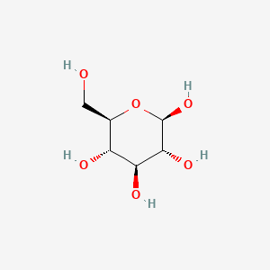 |

葡萄糖的开链形式含有一个醛基。开链 D-葡萄糖分子中的 C1 醛基可以与同一分子中 C5 上的羟基发生分子内反应，形成一个新的半缩醛结构。

具体过程如下：

1. C5 羟基中的氧原子进攻 C1 醛基中的碳原子；
2. 分子内部形成一个新的 C1—O 键；
3. 原来的醛基转变为羟基；
4. 这样形成一个含有 5 个碳原子和 1 个氧原子的六元环。

葡萄糖形成的这种六元环称为吡喃糖环，因此环状葡萄糖常称为 D-葡萄吡喃糖或 D-glucopyranose。

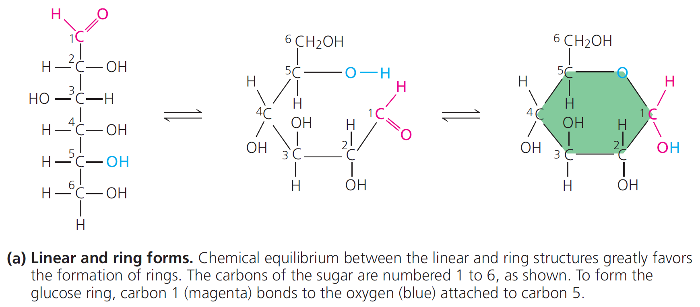

成环后，原来醛基中的 C1 碳原子变成一个新的手性中心，称为异头碳（anomeric carbon）。由于 C1 上新形成的羟基可以有两种空间方向，便产生了两种异头物：

- α-D-葡萄糖
- β-D-葡萄糖

α-D-葡萄糖和 β-D-葡萄糖之间可以通过短暂的开链形式相互转化，这种相互转化称为变旋（mutarotation）。因此，在水溶液中，α-D-葡萄糖和 β-D-葡萄糖会达到动态平衡。

在室温水溶液中，葡萄糖大致以以下比例存在：

- β-D-葡萄糖：约 64%
- α-D-葡萄糖：约 36%
- 开链葡萄糖：约 0.003%～0.004%

这些数值会随温度和溶液条件略有变化。

### 半乳糖

> **⚠️ 构型提示：** 在《坎贝尔生物学》语境下，自然界中合成的**糖类**（碳水化合物）默认绝大多数为 **D- 构型**（而组成蛋白质的氨基酸则默认是 L- 构型）。

| 结构 | 半乳糖 | 葡萄糖 |
| :--------------: | :-----------: | :-----------: | 
| 开链 | 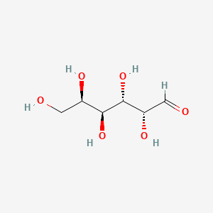 |  |
| 环状 | 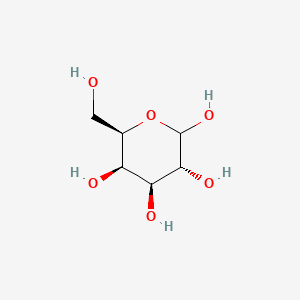 |  |
| alpha | 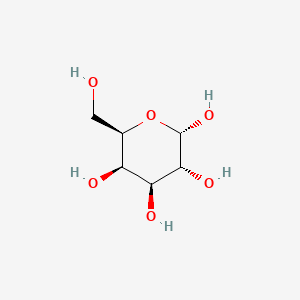 |  |
| beta | 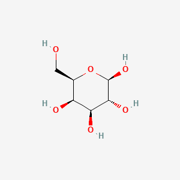 |  |

1. 结构差异：C4 差向异构体
半乳糖与葡萄糖互为差向异构体 (Epimers)，它们的唯一差别在于 4号碳 (C4) 上羟基 (-OH) 的空间排布：
	- 在标准的 Haworth 投影式（环状平面图）中，葡萄糖的 C4 羟基是朝下的，而半乳糖的 C4 羟基是朝上的。
	- 生物学意义： 结构决定功能。仅仅是这一个空间位置的微小差异，就使得它们在三维形状上完全不同。因此，细胞内识别葡萄糖的酶通常无法识别半乳糖，它们需要完全不同的酶系来进行代谢。

2. 水溶液中的动态平衡 (变旋现象)
   在细胞内的水环境（如室温水溶液）中，单糖并不是静止不动的，而是在开链和各种环状结构之间不断自发转换，处于一种动态平衡。
   与葡萄糖（几乎只形成六元环）略有不同，半乳糖的平衡混合物包含少量的五元环：
	- β-D-半乳吡喃糖 (六元环)：约 64% （最稳定的构象）
	- α-D-半乳吡喃糖 (六元环)：约 30%  
	- 呋喃糖 (五元环)：约 6%
	- 开链半乳糖：约 0.02% （极少，但作为成环转换的中间态必不可少）

### 果糖

| 结构  |                             果糖                             | 葡萄糖                                                       |
| :---: | :----------------------------------------------------------: | ------------------------------------------------------------ |
| 开链  | 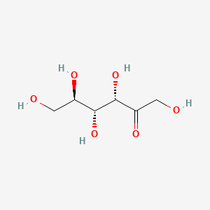 |  |
| 环状  | 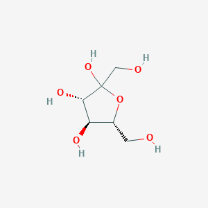 |  |
| alpha | 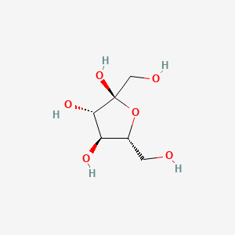 |  |
| beta  | 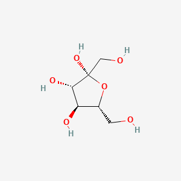 |  |

1. 水溶液中的动态平衡 (变旋现象)

在室温（约 20-25 摄氏度）的水溶液中，纯果糖自发进行变旋，在开链和不同的环状结构间达到动态平衡。与葡萄糖（几乎只形成六元环）不同，果糖的平衡混合物中六元环占绝对优势，但也存在相当比例的五元环：

- β-D-吡喃果糖 (六元环，C2-C6 结合)：约 70% (这是所有单糖形态中甜度最高的一种)
- β-D-呋喃果糖 (五元环，C2-C5 结合)：约 23%
- α-D-呋喃果糖 (五元环，C2-C5 结合)：约 5%
- α-D-吡喃果糖 (六元环，C2-C6 结合)：约 2%
- 开链果糖：极微量 (小于 0.1%)

补充说明：这种平衡对温度极其敏感。加热溶液会促使较甜的六元环大量转化为较不甜的五元环，导致整体甜度下降（例如热饮中的果糖不如冷饮中甜）。

2. 学科视角的差异：生物学 vs 普通化学

- 坎贝尔生物学的关注点 (生物体内形态)
生物学和生物化学几乎只关注果糖的五元环形态（呋喃糖）。因为在生物体内，果糖主要是以五元环的形式参与代谢和组装。例如，植物合成的蔗糖是由葡萄糖和五元环果糖缩合而成；在细胞呼吸的糖酵解途径以及光合作用的卡尔文循环中，所有涉及果糖的中间产物（如果糖-6-磷酸、果糖-1,6-二磷酸）均呈现五元环结构。细胞内的酶系统专一性地识别这种五元环形态。

- 普通化学的关注点 (游离状态热力学)
普通化学在讨论果糖的水溶液性质时，更关注其六元环形态（吡喃糖）。因为从热力学角度来看，C2 和 C6 结合形成的六元环在游离状态下空间张力更小、能量更低，因而在室温水溶液的动态平衡中占据了约 70% 的主导地位。

### 单糖环状结构：异头碳的鉴定与碳骨架定位

1. 核心原理

在单糖成环反应中，原本的羰基碳演变为异头碳。在环状结构中，异头碳是唯一同时具有两个C-O键的碳原子：它一端连接构成糖环的氧原子，另一端连接游离的羟基（-OH）。

2. 碳原子序号判定

单糖的种类决定了羰基的初始位置，进而决定了异头碳的序号：

- 醛糖（葡萄糖、半乳糖）：异头碳为C1。 因直链形态下醛基位于1号位。在环上找到具有双C-O键的异头碳即为C1，其余碳原子沿成环骨架依次编号，C6通常位于环外。
- 酮糖（果糖）：异头碳为C2。 因直链形态下酮基位于2号位。在环上找到具有双C-O键的异头碳即为C2，它的C1作为一个独立的游离基团（-CH2OH）直接连接在C2上，位于环外。

3. 图谱快速识别步骤

    1. 定位糖环上的氧原子。
    2. 观察与其相邻的左右两个碳原子。
    3. 找出直接连接着游离羟基（-OH）的碳，这就是异头碳。
    4. 若为葡萄糖或半乳糖，该碳计为C1；若为果糖，该碳计为C2。

### 麦芽糖

|      名称      |                          2D 平面图                           |
| :------------: | :----------------------------------------------------------: |
|    D-麦芽糖    |  |
| alpha-D-麦芽糖 |  |
| beta-D-麦芽糖  |  |

在普通生物学（如《坎贝尔生物学》）的语境下，麦芽糖的结构特征可以规范地表述为：

D-麦芽糖是由一分子 $\alpha$-D-葡萄糖与另一分子 D-葡萄糖通过脱水缩合反应形成的二糖。在该反应中，作为左侧单体的 $\alpha$-D-葡萄糖，利用其1号碳（C1）上处于 $\alpha$ 构型的羟基，与右侧 D-葡萄糖单体的4号碳（C4）羟基结合，两者脱去一分子水，从而形成特异性的 **α-1,4-糖苷键**。

| alpha-D-葡萄糖（左）                                                                                                    | D-葡萄糖（右）                                                                                                 | D-麦芽糖                                                                                                                                   |
| ----------------------------------------------------------------------------------------------------------------- | -------------------------------------------------------------------------------------------------------- | --------------------------------------------------------------------------------------------------------------------------------------- |
|  |  |  |

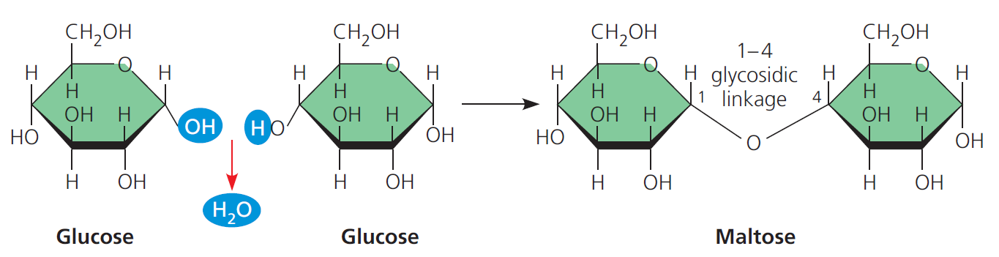

在这一分子结构中，左侧葡萄糖的异头碳（C1）因参与成键，其 $\alpha$ 构型已被固定；而右侧葡萄糖残基的异头碳（C1，即分子的还原端）则保持游离状态。在水环境中，该游离端会自发发生变旋现象，在 $\alpha$ 和 $\beta$ 构型之间维持动态平衡。

然而在普通生物学的探讨范围内，由于生物体内相关酶（如麦芽糖酶）的识别与催化机制具有高度的结构特异性，其作用位点仅针对 $\alpha$-1,4-糖苷键，因此右侧还原端的具体构型变化对麦芽糖的宏观生物学功能与消化代谢途径没有实质性影响。基于这一生物学逻辑，教材与课程在定义麦芽糖时，通常只强调形成糖苷键的 $\alpha$ 构型前提，而不去区分或关注第二个葡萄糖残基游离端的变旋状态。

### 蔗糖

| alpha-D-葡萄糖（左） | beta-D-果糖（右） | D-蔗糖    |
| :---------------: | :--: | :--: |
|  |  |  |

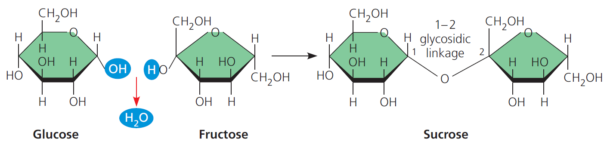

**α-1,β-2-糖苷键**的形成过程：

由一分子α-D-葡萄糖和一分子β-D-果糖经过脱水反应形成。葡萄糖提供其1号碳（异头碳）上的羟基，果糖提供其2号碳（异头碳）上的羟基。两者发生反应脱去一分子水，剩余的一个桥氧原子将葡萄糖的C1与果糖的C2连接起来，完成成键。

结构特性说明：

在《坎贝尔生物学》等基础生物学语境下，提到的蔗糖均单指自然界天然存在的 D-蔗糖。由于蔗糖的α-1,β-2-糖苷键是由两个单糖的异头碳直接结合而成，导致蔗糖分子中没有游离的异头碳。因此，它的糖环被彻底锁死，在水溶液中无法开环，不能发生变旋现象，也就没有其他构型变体。这也决定了蔗糖是一种非还原糖。

### 乳糖

| beta-D-半乳糖（左）                                          | D-葡萄糖（右）                                               | D-乳糖                                                       |
| ------------------------------------------------------------ | ------------------------------------------------------------ | ------------------------------------------------------------ |
|  |  |  |

**β-1,4-糖苷键**

由一分子β-D-半乳糖和一分子D-葡萄糖经过脱水反应形成。半乳糖提供其1号碳（异头碳）上的羟基，葡萄糖提供其4号碳上的羟基，脱去一分子水后连接而成。

### 淀粉、糖原和纤维素

|        名称        |                          2D 平面图                           |
| :----------------: | :----------------------------------------------------------: |
| α-麦芽四糖（直链） | 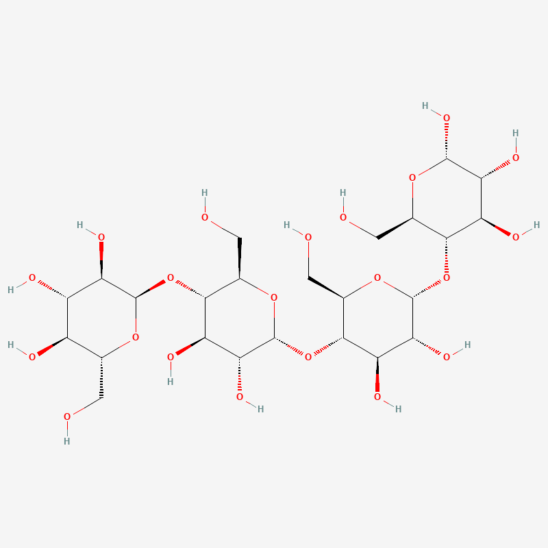 |
|    糖原（支链）    | 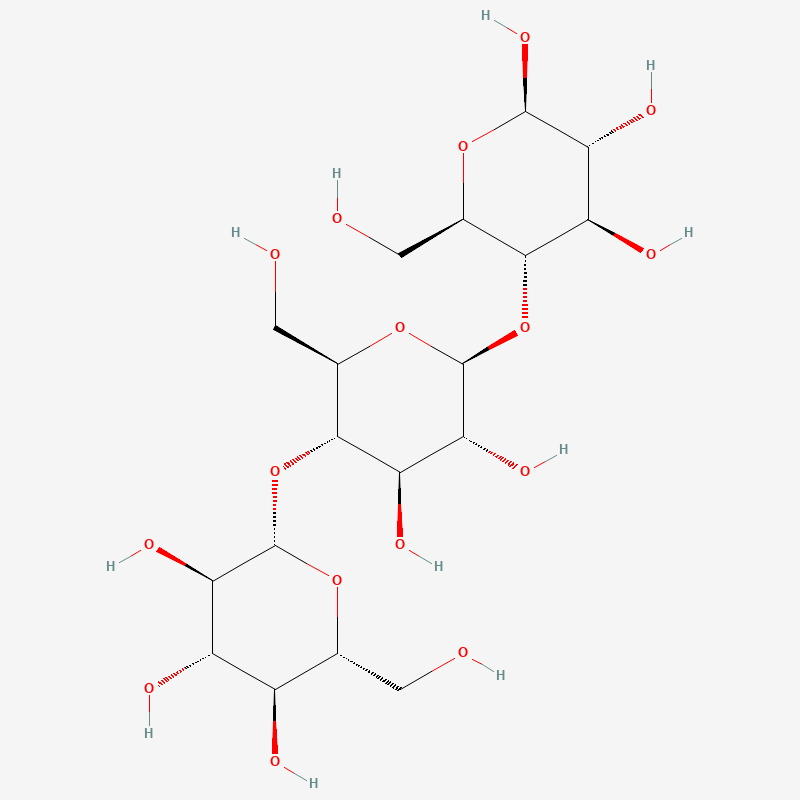 |
| β-纤维三糖（直链） |  |

1. 多糖结构特征概述

淀粉、糖原和纤维素均属于多糖类生物大分子。表格中的三种化合物可作为局部结构模型，清晰地展示了这三种大分子的核心特征。

关于模型命名的补充说明：表格中选用的 α-麦芽四糖代表了由四个葡萄糖单体脱水缩合形成的直链结构；糖原的命名直接对应其在 PubChem 数据库中的词条；<del>而代表 β-纤维三糖的图片链接中出现了 Cellulase（纤维素酶），这可能是数据库历史遗留的命名偏差，但该图仍能有效展示纤维素的局部片段特征。</del> β-纤维三糖改为使用 InChIKey 表示。

2. 淀粉与糖原的结构对比

淀粉和糖原均在生物体内承担储能功能，两者在结构上有高度的相似性，但也存在分支程度的差异。

- 单体组成：两者的单体均为 α-D-葡萄糖。
- 直链连接方式：两者的直链骨架均通过 α-1,4-糖苷键连接。在上述示例图中，α-麦芽四糖包含三个 α-1,4-糖苷键，而糖原模型图的直链部分显示了两个该化学键。
- 支链连接方式：淀粉（特指支链淀粉）和糖原都具有分支结构，其中糖原的分支密度和频率显著高于淀粉。两者形成分支的节点均依靠 α-1,6-糖苷键连接。在示例图中，α-麦芽四糖为纯直链，不含 α-1,6-糖苷键；而糖原模型中明确展示了一个 α-1,6-糖苷键分支点。

3. 纤维素的结构特征

纤维素主要构成植物细胞壁，承担结构支持功能，其结构特点与储能多糖有显著区别。

- 单体组成：纤维素的单体为 β-D-葡萄糖。
- 直链连接方式：单体之间通过 β-1,4-糖苷键连接。在上述的 β-纤维三糖示例中，共包含两个 β-1,4-糖苷键。
- 空间构象：纤维素仅存在直链结构，完全没有分支（支链）。这种线性的结构使得纤维素分子之间能够通过氢键紧密结合，形成坚韧的微纤维。

## 脂质

### 脂肪

| 甘油                                                         | 棕榈酸                                                       | **三棕榈酸甘油酯**‌                                           |
| ------------------------------------------------------------ | ------------------------------------------------------------ | ------------------------------------------------------------ |
| 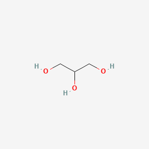 | 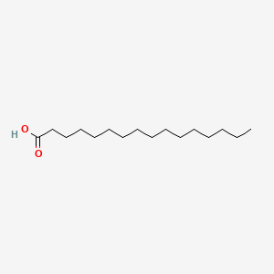 | 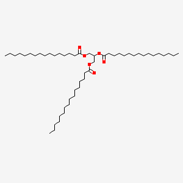 |

**酯键 Ester linkage**

|   名称   |     化学式     | 基团 |    表达式    |                          2D 平面图                           |
| :------: | :------------: | :--: | :----------: | :----------------------------------------------------------: |
|   甲醇   |  $\ce{CH3OH}$  | 羟基 |  $\ce{-OH}$  | 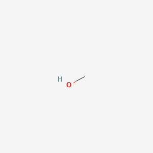 |
|   甲酸   |  $\ce{HCOOH}$  | 羧基 | $\ce{-COOH}$ | 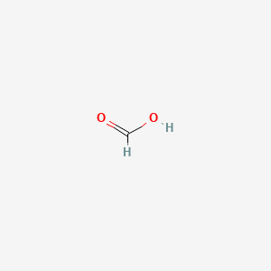 |
| 甲酸甲酯 | $\ce{HCOOCH3}$ | 酯基 | $\ce{-COO-}$ | 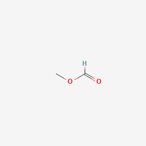 |

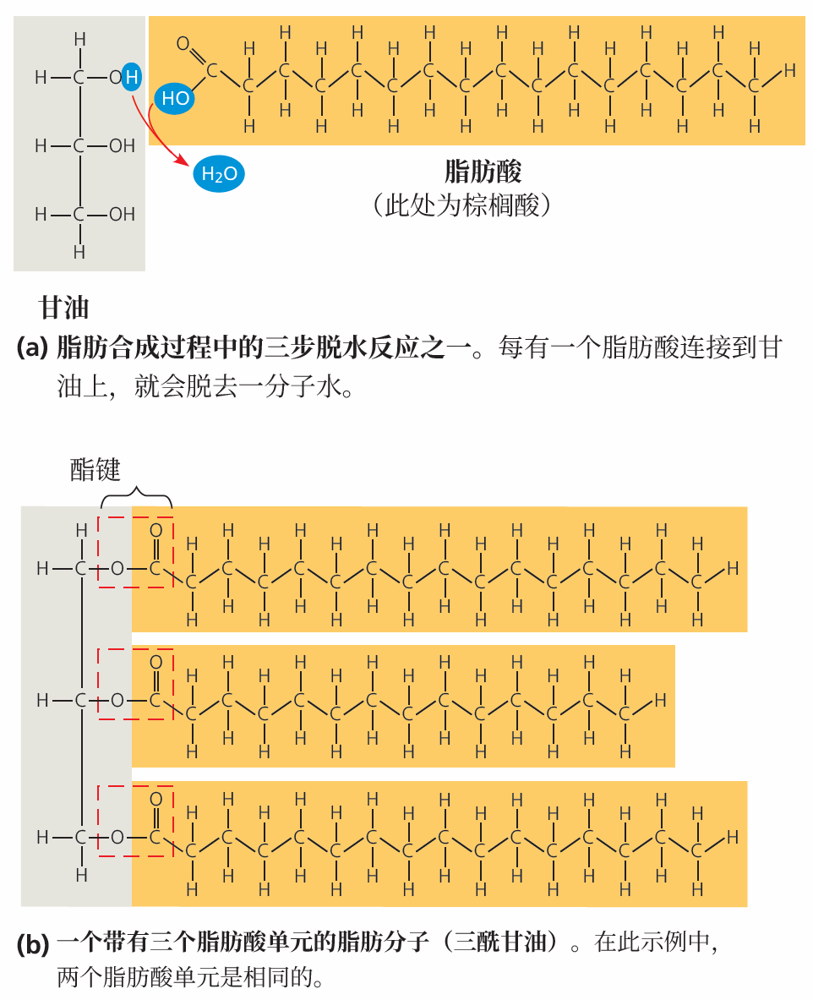

### 磷脂

|                             POPC                             |                             PLPC                             |
| :----------------------------------------------------------: | :----------------------------------------------------------: |
| 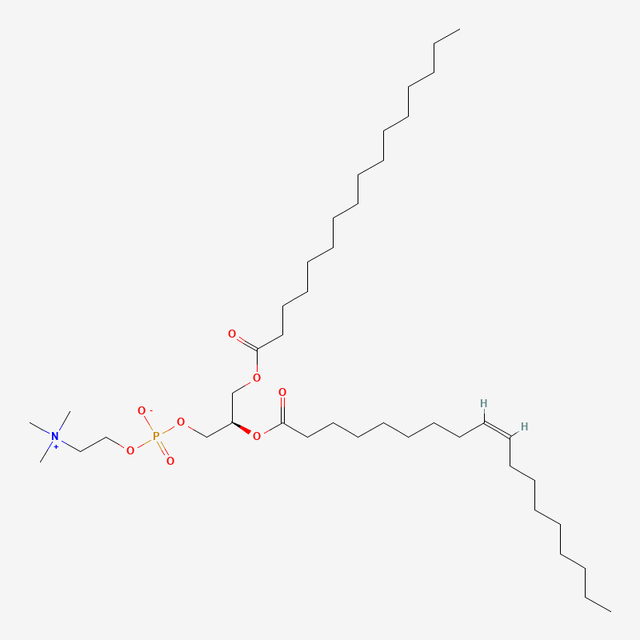 | 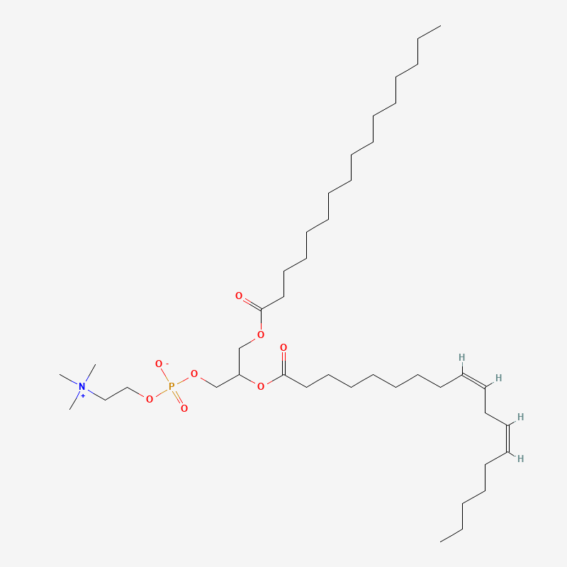 |

### 类固醇

|                            胆固醇                            |                             睾酮                             |                            雌二醇                            |
| :----------------------------------------------------------: | :----------------------------------------------------------: | :----------------------------------------------------------: |
| 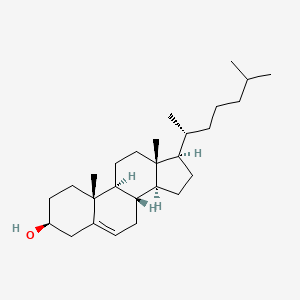 | 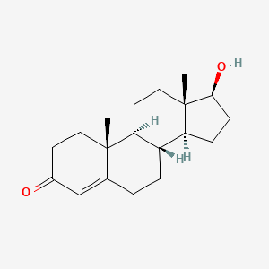 | 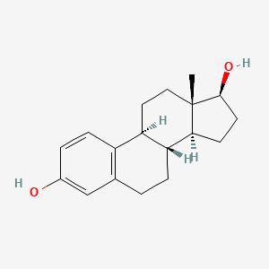 |

## 蛋白质

### 氨基酸

|                            非电离                            |                             电离                             |
| :----------------------------------------------------------: | :----------------------------------------------------------: |
| 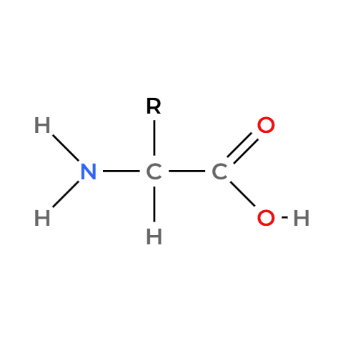 | 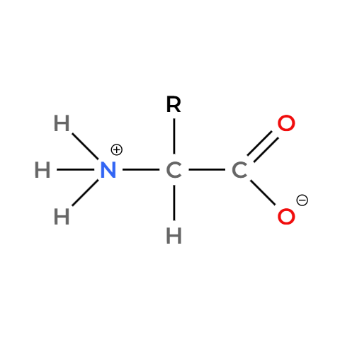 |

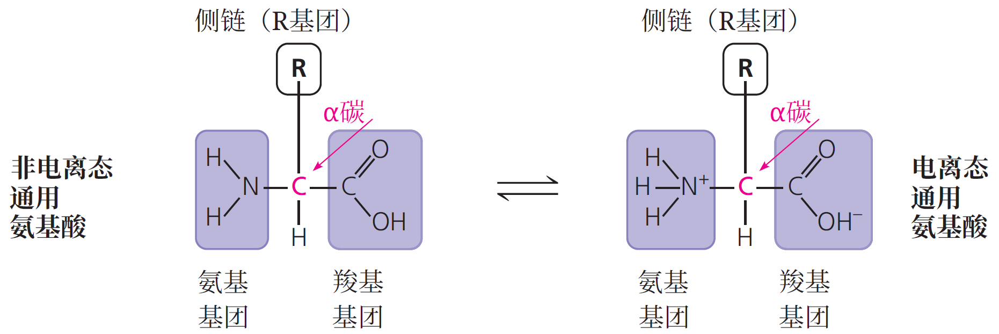

### 多肽

1. **一级结构（Primary Structure）**：也就是氨基酸在多肽链上的线性排列顺序。这是由基因直接决定的，并决定了后续所有的结构层级。  
2. **二级结构（Secondary Structure）**：由多肽骨架中原子间的**氢键**引起的局部折叠。主要的两种形式是 $\alpha$ 螺旋（精细的卷曲）和 $\beta$ 折叠（并排的链）。  
3. **三级结构（Tertiary Structure）**：由各种氨基酸的 **侧链（R 基团）** 相互作用决定的整体 3D 形状。参与的力包括疏水相互作用、范德华力、氢键、离子键以及二硫键（一种强共价键）。  
4. **四级结构（Quaternary Structure）**：由两条或多条多肽链聚合成一个大分子的结构（不是所有蛋白质都有）。比如胶原蛋白和血红蛋白。

## 核酸

|      |                            五碳糖                            |                            磷酸化                            |
| :--: | :----------------------------------------------------------: | :----------------------------------------------------------: |
| DNA  | 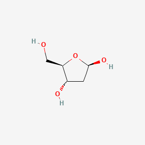 | 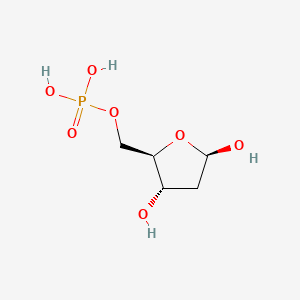 |
| RNA  | 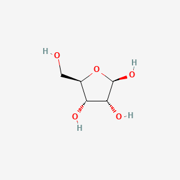 | 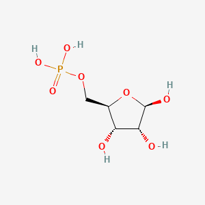 |

|                       3',5'-磷酸二酯键                       |                       3',5'-磷酸二酯键                       |
| :----------------------------------------------------------: | :----------------------------------------------------------: |
| 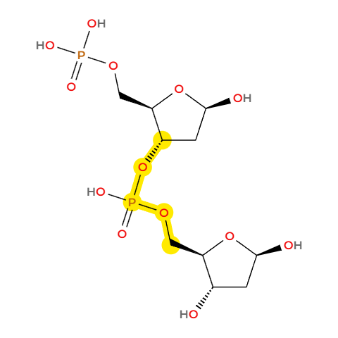 | 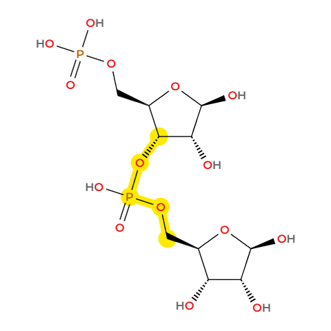 |

| A                                                            | T                                                            | G                                                            | C                                                            |
| ------------------------------------------------------------ | ------------------------------------------------------------ | ------------------------------------------------------------ | ------------------------------------------------------------ |
| 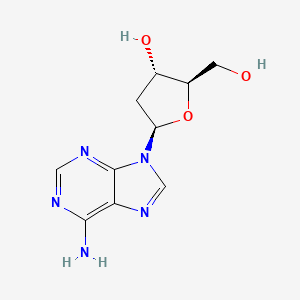 | 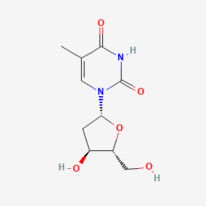 | 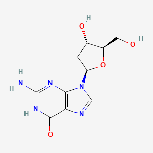 | 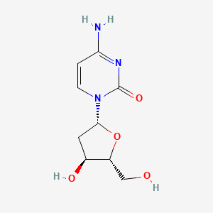 |

| A                                                            | U                                                            | G                                                            | C                                                            |
| ------------------------------------------------------------ | ------------------------------------------------------------ | ------------------------------------------------------------ | ------------------------------------------------------------ |
| 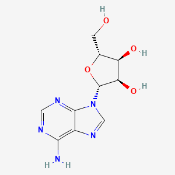 | 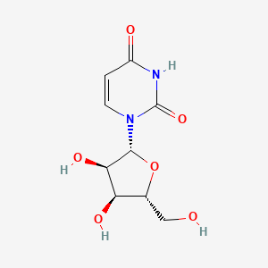 | 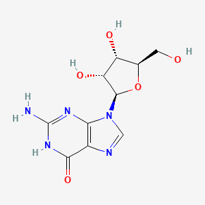 | 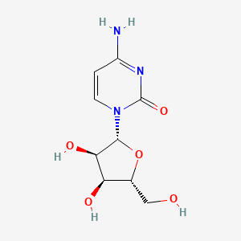 |
