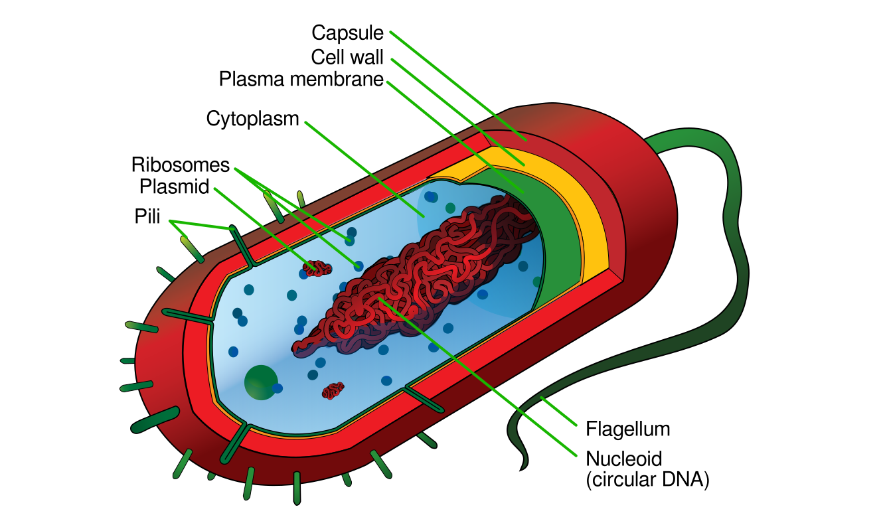
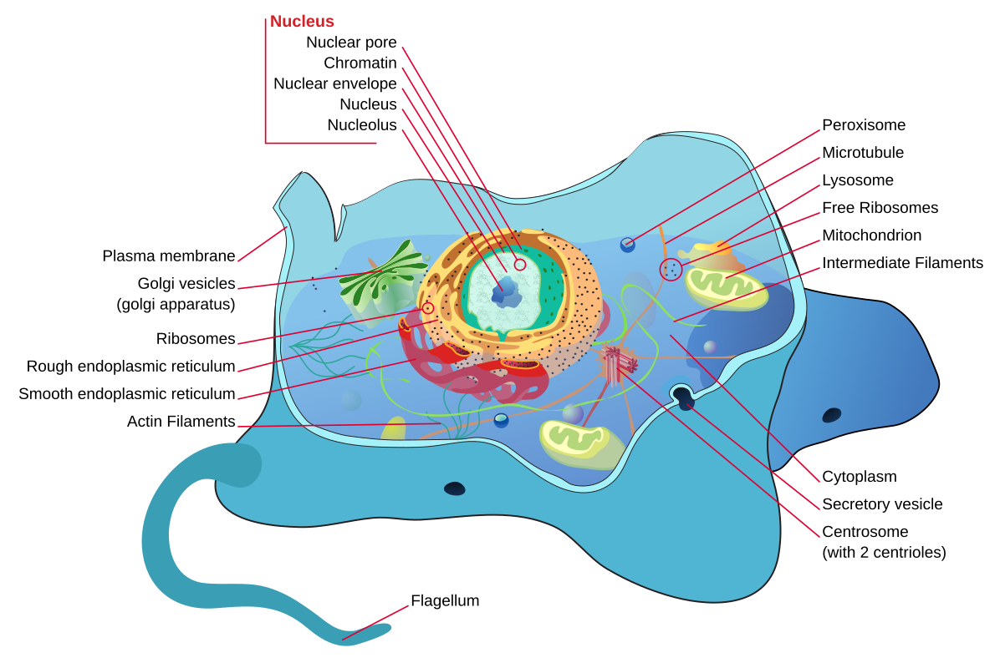
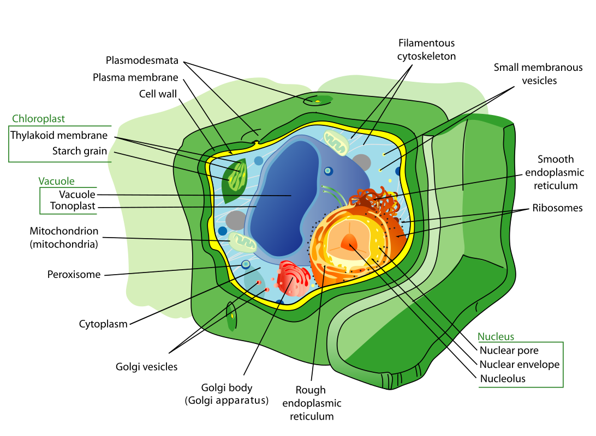
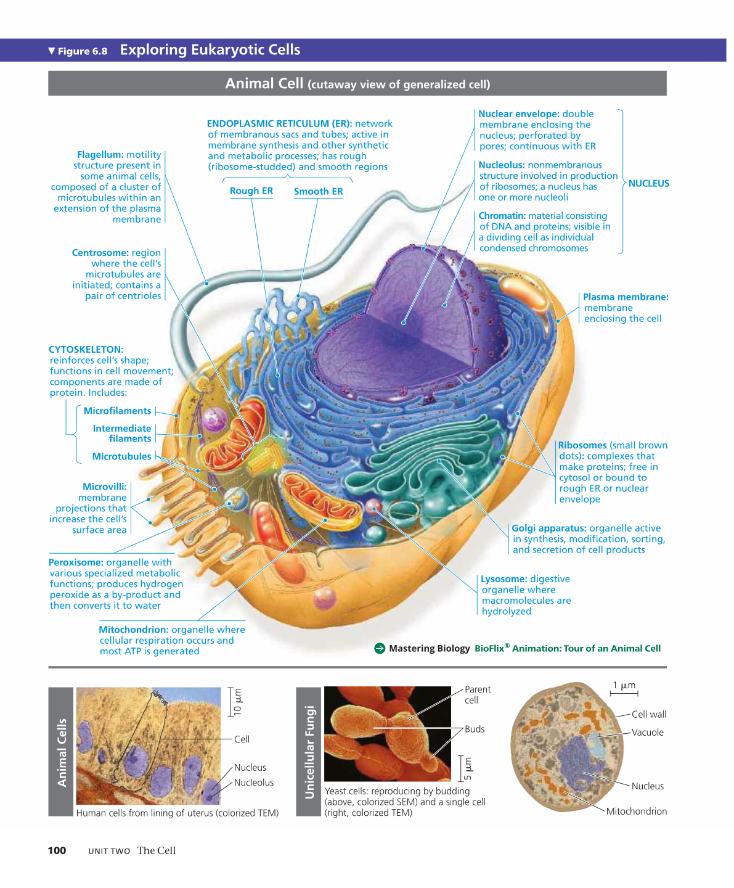
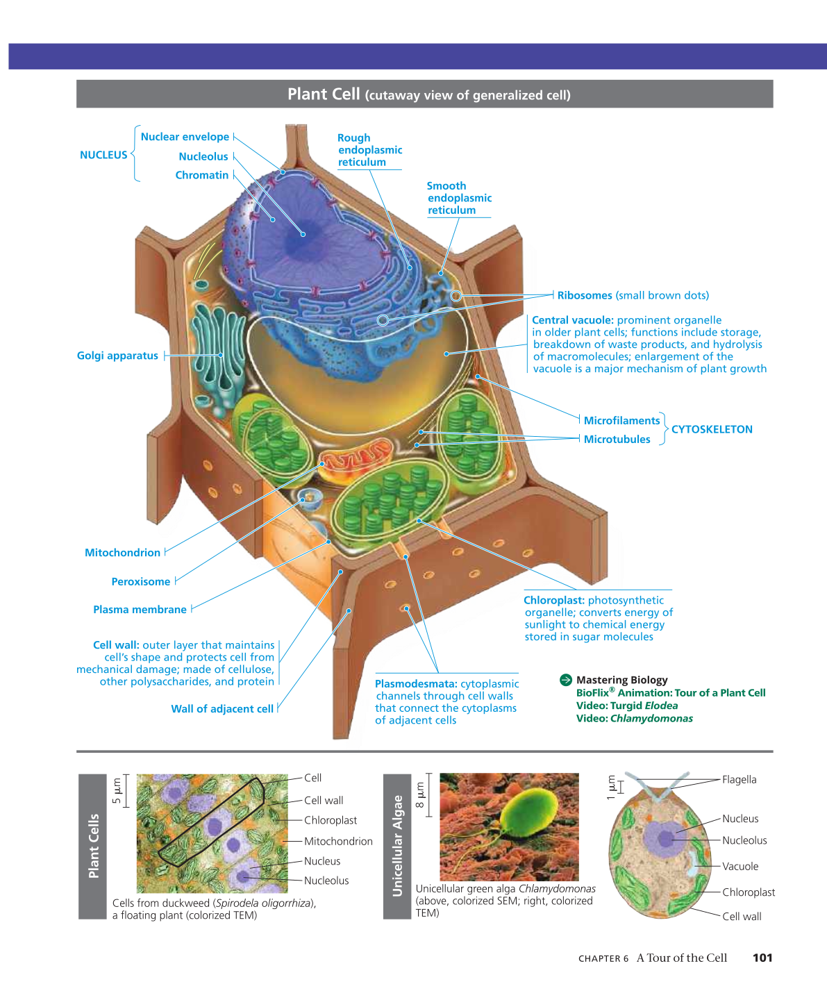
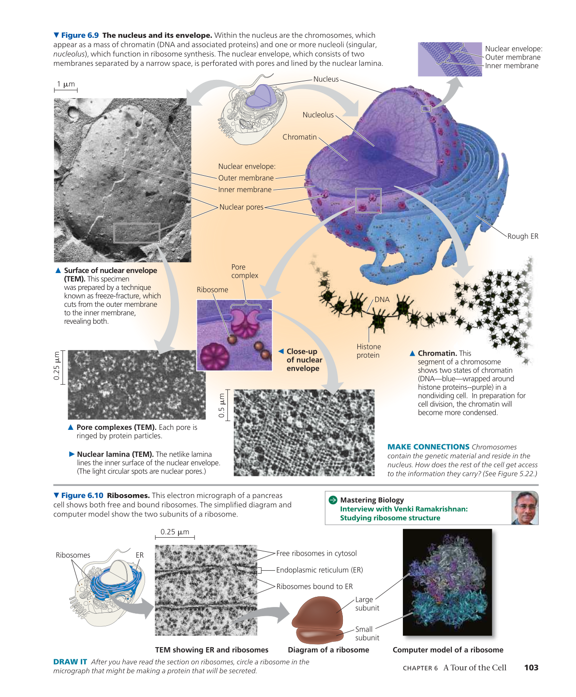
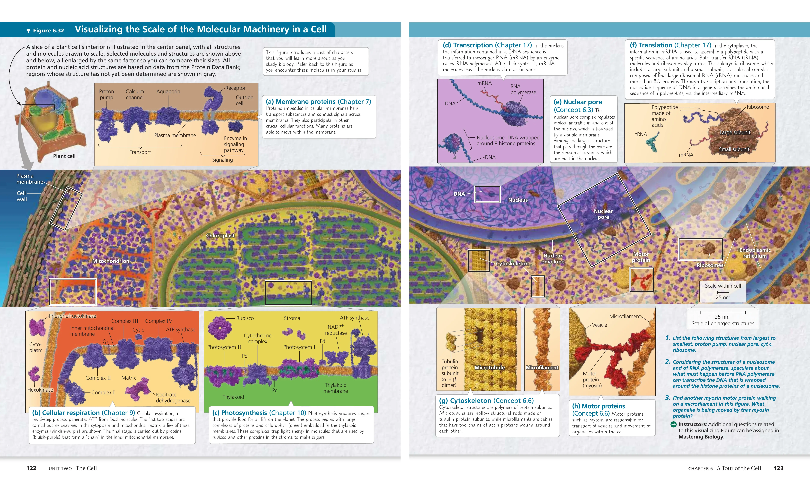

## Biologists use microscopes and biochemistry to study cells
> 科学发现往往是由技术的进步驱动的。

### 显微镜

#### 科技史关键节点

- 光学显微镜 (SM/LM)：1665年，罗伯特·胡克使用复合显微镜观察软木塞切片，首次发现并命名了细胞。1670年代，安东尼·范·列文虎克利用打磨精良的单片显微镜，首次观察到了活体微生物。
- 透射电子显微镜 (TEM)：1931年由恩斯特·鲁斯卡发明。它彻底打破了光学显微镜的分辨率极限，将人类视野首次带入细胞的内部超微结构。
- 扫描电子显微镜 (SEM)：20世纪中叶逐渐成熟并投入使用，让生物学家能够清晰地看到细胞表面的 3D 立体形貌。

#### 显微镜的三大核心参数与工作原理差异

不论是 SM 还是 TEM、SEM，任何成像系统都受制于以下三个共同的参数：

- 分辨率：指区分两个相邻点为独立实体的能力。SM 受限于可见光的波长，其分辨率上限约为 0.2 微米。EM 使用波长极短的电子束，分辨率可达纳米级，突破了光学极限。
- 放大率：指图像放大的倍数。因为有了极高分辨率的支撑，EM 的有效放大率远超 SM，能够让我们看见极其微观的细胞器内部结构。若分辨率不够，单纯提高放大率只会得到模糊的图像。
- 对比度：指目标与背景的明暗差异。SM 可以通过调节光线或使用对细胞无害的简单染料直接观察活体细胞；而 EM 由于电子束穿透力极强，生物组织缺乏自然对比度，必须使用重金属（如铅或铀）进行染色，这意味着 EM 只能用于观察死细胞。

#### 细胞结构尺寸阶梯与观察极限

以下是以 0.2 微米（光学显微镜极限）为分水岭的生物结构一般尺寸降序列表。由此可以清晰看出，哪些微观结构必须依赖电子显微镜才能被人类所了解。

| **结构名称**       | **近似尺寸**   | **必需的观测工具**                            |
| ------------------ | -------------- | --------------------------------------------- |
| 蛙卵               | 1 毫米         | 肉眼 / 光学显微镜                             |
| 典型植物与动物细胞 | 10 至 100 微米 | 光学显微镜                                    |
| 细胞核             | 5 微米         | 光学显微镜                                    |
| 线粒体             | 1 至 2 微米    | 光学显微镜 (仅见轮廓) / 电子显微镜 (见内部嵴) |
| 最小的细菌         | 0.2 微米       | 光学显微镜的分辨率极限                        |
| 病毒               | 50 至 100 纳米 | 电子显微镜                                    |
| 核糖体             | 25 至 30 纳米  | 电子显微镜                                    |
| 典型球状蛋白质     | 5 至 10 纳米   | 电子显微镜                                    |
| 脂质分子           | 2 纳米         | 电子显微镜 / X射线衍射                        |

### 细胞分级分离

#### 离心机的基本工作原理

离心机通过高速旋转产生巨大的相对离心力。在离心管中，被匀浆（物理粉碎）后的细胞混合液里的不同细胞器，会根据自身的体积、密度和形状产生不同的沉降速度。通常情况下，体积越大、密度越高的结构，越容易在较低的转速和较短的时间内被离心力甩至管底形成沉淀。

#### 学科交汇：功能与结构的相辅相成

生物化学与细胞学在细胞分级分离这一领域实现了完美的学科互补：

- 生物化学家利用分级分离技术，将完整的细胞捣碎，提取出相对纯净的单一细胞器组分，并在试管中测试这些组分的化学代谢功能。
- 细胞学家将这些分离出来的沉淀物置于电子显微镜下，观察它们的超微物理形态。
- 通过两者的结合，科学家能够确切地证明，试管中发生的生化反应正是由显微镜下看到的特定物理结构执行的。这种互补最终揭示了形式服从功能的生命基本法则。


## Eukaryotic cells have internal membranes that compartmentalize their functions

### 原核细胞



### 动物细胞



### 植物细胞



### 教材截图





## The eukaryotic cell’s genetic instructions are housed in the nucleus and carried out by the ribosomes

### 知识树

```
Concept 6.3 细胞核与核糖体
│
├── 一、细胞核 (nucleus)
│   │
│   ├── 1. 核膜 (nuclear envelope)
│   │   ├── 双层膜结构 (double membrane)
│   │   │   ├── 外膜 (outer membrane)
│   │   │   │   └── 与内质网相连 (continuous with ER)
│   │   │   └── 内膜 (inner membrane)
│   │   ├── 核周隙 (perinuclear space)
│   │   │
│   │   ├── 核孔 (nuclear pore)
│   │   │   └── 核孔复合体 (pore complex)
│   │   │       └── 功能：调控大分子选择性进出
│   │   │
│   │   └── 核纤层 (nuclear lamina)
│   │       ├── 组成：核纤层蛋白 (lamins)
│   │       └── 功能：支撑核膜内膜，维持核形状
│   │
│   ├── 2. 核基质 (nuclear matrix)
│   │   └── 功能：为核内组分提供支架结构
│   │
│   ├── 3. 染色质 (chromatin)
│   │   ├── 组成：DNA + 组蛋白 (histone)
│   │   ├── 细胞分裂间期形态：松散染色质 (chromatin)
│   │   └── 细胞分裂期形态：凝聚为染色体 (chromosome)
│   │
│   └── 4. 核仁 (nucleolus / 复数 nucleoli)
│       ├── 功能①：合成核糖体RNA (ribosomal RNA, rRNA)
│       └── 功能②：组装核糖体亚基
│           ├── 大亚基 (large subunit)
│           └── 小亚基 (small subunit)
│               └── 通过核孔运出到细胞质
│
└── 二、核糖体 (ribosome)
    │
    ├── 1. 基本组成
    │   ├── 核糖体RNA (rRNA)
    │   └── 蛋白质
    │
    ├── 2. 组装过程
    │   └── 核仁 (nucleolus) 中合成 → 大/小亚基分别运出 → 
    │       细胞质中结合形成功能性核糖体
    │
    ├── 3. 核心功能
    │   ├── 蛋白质合成 (protein synthesis)
    │   └── 翻译过程 (translation)
    │
    └── 4. 按位置分类（结构相同，可互相转换）
        ├── 游离核糖体 (free ribosomes)
        │   ├── 位置：细胞质基质 (cytosol)
        │   └── 产物：主要在细胞质内发挥作用的蛋白
        │
        └── 附着核糖体 (bound ribosomes)
            ├── 位置：附着于内质网外表面或核膜外表面
            ├── 关联结构：粗面内质网 (rough ER)
            └── 产物：
                ├── 分泌蛋白 (secretory protein)
                ├── 膜蛋白 (membrane protein)
                └── 运往其他细胞器的蛋白
```

### 教材截图



## The endomembrane system regulates protein traffic and performs metabolic functions

内膜系统是真核细胞内通过囊泡运输和膜流动相互连接的膜性细胞器网络，本质上是一条实现蛋白质与脂质从合成、加工、分拣、分泌到降解回收全生命周期管理的智能流水线。

### 知识树

```
Concept 6.4 内膜系统 (endomembrane system)
│
├── 一、内膜系统概述
│   ├── 定义：一组功能协调的膜性细胞器系统
│   ├── 核心功能：蛋白质和脂质的合成、加工、运输
│   │
│   └── 包含的细胞器
│       ├── 核膜 (nuclear envelope)
│       ├── 内质网 (endoplasmic reticulum, ER)
│       ├── 高尔基体 (Golgi apparatus)
│       ├── 溶酶体 (lysosome)
│       ├── 液泡 (vacuole)
│       └── 质膜/细胞膜 (plasma membrane)
│
├── 二、内质网 (endoplasmic reticulum, ER)
│   │
│   ├── 基本特征
│   │   ├── 连续的膜管道和扁囊网络系统
│   │   ├── 内腔 (lumen) 或池 (cisternae)
│   │   └── 与核膜外膜连续
│   │
│   ├── 1. 滑面内质网 (smooth ER)
│   │   ├── 形态：表面无核糖体
│   │   ├── 功能①：脂质合成 (lipid synthesis)
│   │   │   └── 包括磷脂、类固醇 (steroid)
│   │   ├── 功能②：碳水化合物代谢 (carbohydrate metabolism)
│   │   ├── 功能③：钙离子储存 (calcium ion storage)
│   │   │   └── 肌肉细胞中尤为重要
│   │   └── 功能④：解毒 (detoxification)
│   │       └── 肝脏细胞中尤为发达
│   │
│   └── 2. 粗面内质网 (rough ER)
│       ├── 形态：表面附着核糖体 (bound ribosomes)
│       │
│       ├── 功能①：合成分泌蛋白 (secretory protein)
│       │   └── 过程：
│       │       ├── 核糖体识别信号序列 (signal sequence/signal peptide)
│       │       ├── 新生肽链进入 ER 内腔
│       │       └── 信号肽被切除 (cleaved)
│       │
│       ├── 功能②：合成膜蛋白 (membrane protein)
│       │
│       ├── 功能③：蛋白质折叠 (protein folding)
│       │   └── 伴侣蛋白 (chaperone protein) 辅助
│       │
│       ├── 功能④：蛋白质质量控制
│       │   └── 错误折叠的蛋白被降解
│       │
│       ├── 功能⑤：糖基化修饰 (glycosylation)
│       │   └── 形成糖蛋白 (glycoprotein)
│       │
│       └── 功能⑥：形成运输囊泡 (transport vesicle)
│           └── 将蛋白质运往高尔基体
│
├── 三、高尔基体 (Golgi apparatus)
│   │
│   ├── 基本结构
│   │   ├── 由扁平囊泡堆叠而成 (flattened sacs/cisternae)
│   │   ├── 顺面 (cis face) —— 接收来自 ER 的囊泡
│   │   ├── 反面 (trans face) —— 发出囊泡到目的地
│   │   └── 中间区域 (medial region)
│   │
│   ├── 核心功能：蛋白质和脂质的修饰、分拣、包装
│   │
│   ├── 详细过程
│   │   ├── ① 接收：来自 ER 的运输囊泡与顺面融合
│   │   ├── ② 修饰：
│   │   │   ├── 继续糖基化修饰
│   │   │   ├── 磷酸化 (phosphorylation)
│   │   │   └── 切割蛋白质
│   │   ├── ③ 分拣 (sorting)：
│   │   │   └── 根据信号标记 (signal tag) 决定去向
│   │   └── ④ 包装：形成不同类型的囊泡发往不同目的地
│   │
│   └── 囊泡运输目的地
│       ├── 溶酶体 (lysosome)
│       ├── 液泡 (vacuole)
│       ├── 质膜 (plasma membrane)
│       └── 细胞外（胞吐作用，exocytosis）
│
├── 四、溶酶体 (lysosome)
│   │
│   ├── 基本特征
│   │   ├── 膜包裹的囊泡
│   │   ├── 内含水解酶 (hydrolytic enzyme) / 酸性水解酶 (acid hydrolase)
│   │   └── 内部 pH 值约为 5（酸性环境）
│   │
│   ├── 来源：由高尔基体产生
│   │
│   ├── 功能：细胞内消化 (intracellular digestion)
│   │
│   └── 具体作用
│       ├── ① 吞噬作用 (phagocytosis)
│       │   └── 吞噬体 (phagosome) + 溶酶体 → 消化
│       ├── ② 自噬 (autophagy)
│       │   ├── 自噬体 (autophagosome) 包裹受损细胞器
│       │   └── 与溶酶体融合进行降解
│       └── ③ 程序性细胞死亡 (apoptosis) 的参与
│
├── 五、液泡 (vacuole)
│   │
│   ├── 基本特征
│   │   ├── 膜包裹的囊泡
│   │   ├── 膜称为液泡膜 (tonoplast)
│   │   └── 主要存在于植物细胞和真菌
│   │
│   ├── 来源：由内质网和高尔基体衍生
│   │
│   ├── 类型与功能
│   │   │
│   │   ├── 1. 中央液泡 (central vacuole) —— 植物细胞
│   │   │   ├── 占据细胞体积的 30%-90%
│   │   │   ├── 内含细胞液 (cell sap)
│   │   │   ├── 功能①：储存水分和溶质
│   │   │   ├── 功能②：维持膨压 (turgor pressure)
│   │   │   │   └── 支撑植物体
│   │   │   ├── 功能③：储存色素（如花青素）
│   │   │   ├── 功能④：储存有毒化合物（防御）
│   │   │   └── 功能⑤：分解代谢废物
│   │   │
│   │   ├── 2. 食物液泡 (food vacuole)
│   │   │   └── 原生动物摄食后形成，参与消化
│   │   │
│   │   └── 3. 伸缩液泡 (contractile vacuole)
│   │       └── 淡水原生生物排水调节渗透压
│   │
│   └── 与溶酶体的关系
│       └── 植物细胞的中央液泡兼具溶酶体功能
│
└── 六、内膜系统的物质运输机制
    │
    ├── 1. 囊泡运输 (vesicular transport)
    │   ├── 运输囊泡 (transport vesicle)
    │   ├── 被膜蛋白 (coat protein)
    │   │   ├── COPII —— ER → 高尔基体
    │   │   ├── COPI —— 高尔基体内部及逆向运输
    │   │   └── 网格蛋白 (clathrin) —— 质膜 → 内部
    │   │
    │   └── 过程：
    │       ├── 出芽 (budding)
    │       ├── 运输
    │       └── 融合 (fusion)
    │
    ├── 2. 胞吐作用 (exocytosis)
    │   ├── 分泌囊泡与质膜融合
    │   └── 释放内容物到细胞外
    │
    └── 3. 胞吞作用 (endocytosis)
        ├── 吞噬作用 (phagocytosis) —— 吞入大颗粒
        ├── 胞饮作用 (pinocytosis) —— 吞入液体
        └── 受体介导的胞吞 (receptor-mediated endocytosis)
            └── 特异性识别并摄取特定分子
```

## Mitochondria and chloroplasts change energy from one form to another

### 知识树

```
📂 线粒体和叶绿体的能量转换 (Mitochondria and chloroplasts change energy from one form to another)
│
├─📁 线粒体 (Mitochondria) - "细胞的发电厂"
│  │
│  ├─📄 结构特征 (Structure)
│  │  ├─ 双层膜系统 (double membrane)
│  │  │  ├─ 外膜 (outer membrane) - 光滑，通透性高
│  │  │  └─ 内膜 (inner membrane) - 高度折叠
│  │  │     └─ 嵴 (cristae) - 增加表面积，镶嵌电子传递链
│  │  ├─ 膜间隙 (intermembrane space) - 质子储存区
│  │  ├─ 基质 (matrix) - 内膜包裹的内部空间
│  │  │  ├─ 含有酶（克雷布斯循环）
│  │  │  ├─ 线粒体DNA (mtDNA)
│  │  │  └─ 核糖体 (ribosomes) - 70S型（类似细菌）
│  │  └─ 大小：直径约1-10微米
│  │
│  ├─📄 主要功能 (Function)
│  │  ├─ 细胞呼吸 (cellular respiration)
│  │  │  ├─ 糖酵解产物进入线粒体
│  │  │  ├─ 克雷布斯循环/柠檬酸循环 (Krebs cycle/citric acid cycle) [基质]
│  │  │  └─ 电子传递链与氧化磷酸化 (electron transport chain & oxidative phosphorylation) [内膜]
│  │  │
│  │  ├─ 能量转换路径
│  │  │  └─ 有机物（葡萄糖）+ O₂ → CO₂ + H₂O + ATP (约30-32个/葡萄糖)
│  │  │
│  │  └─ 化学渗透 (chemiosmosis)
│  │     ├─ 质子梯度 (proton gradient) 的建立
│  │     └─ ATP合成酶 (ATP synthase) 驱动ATP生成
│  │
│  └─📄 进化起源
│     └─ 内共生理论 (endosymbiotic theory) 证据
│        ├─ 拥有自己的DNA（环状，类似细菌）
│        ├─ 双层膜结构
│        ├─ 70S核糖体（原核型）
│        ├─ 可独立复制（二分裂）
│        └─ 推测起源：古老的需氧细菌 (aerobic bacteria)
│
├─📁 叶绿体 (Chloroplasts) - "植物的太阳能转换器"
│  │
│  ├─📄 结构特征 (Structure)
│  │  ├─ 三层膜系统
│  │  │  ├─ 外膜 (outer membrane)
│  │  │  ├─ 内膜 (inner membrane)
│  │  │  └─ 类囊体膜 (thylakoid membrane) - 第三层膜系统
│  │  │
│  │  ├─ 类囊体 (thylakoids) - 扁平囊状结构
│  │  │  ├─ 基粒 (grana) - 类囊体堆叠形成（复数：granum）
│  │  │  ├─ 基粒类囊体 (granal thylakoids) - 堆叠部分
│  │  │  └─ 基质类囊体 (stromal thylakoids) - 连接不同基粒
│  │  │
│  │  ├─ 基质 (stroma) - 类囊体外的液体空间
│  │  │  ├─ 含有卡尔文循环酶
│  │  │  ├─ 叶绿体DNA (cpDNA)
│  │  │  ├─ 核糖体 (70S型)
│  │  │  └─ 淀粉颗粒储存区
│  │  │
│  │  └─ 大小：直径约5-10微米
│  │
│  ├─📄 主要功能 (Function)
│  │  ├─ 光合作用 (photosynthesis)
│  │  │  │
│  │  │  ├─ 光反应 (light reactions) [类囊体膜]
│  │  │  │  ├─ 光系统 (photosystems) - PS I 和 PS II
│  │  │  │  ├─ 捕获光能，激发电子
│  │  │  │  ├─ 光解水 (photolysis of water) - 2H₂O → O₂ + 4H⁺ + 4e⁻
│  │  │  │  ├─ 电子传递链
│  │  │  │  ├─ 化学渗透产生ATP
│  │  │  │  └─ 生成NADPH (还原型辅酶)
│  │  │  │
│  │  │  └─ 暗反应/卡尔文循环 (Calvin cycle) [基质]
│  │  │     ├─ 碳固定 (carbon fixation) - CO₂固定到有机物
│  │  │     ├─ 使用ATP和NADPH（来自光反应）
│  │  │     └─ 合成葡萄糖 (glucose) 和其他糖类
│  │  │
│  │  ├─ 能量转换路径
│  │  │  └─ 光能 + CO₂ + H₂O → 葡萄糖 (C₆H₁₂O₆) + O₂
│  │  │
│  │  └─ 其他功能
│  │     ├─ 脂肪酸合成
│  │     └─ 氨基酸合成
│  │
│  └─📄 进化起源
│     └─ 内共生理论证据
│        ├─ 拥有环状DNA
│        ├─ 双层膜（现在是三层膜系统）
│        ├─ 70S核糖体
│        ├─ 可独立复制
│        └─ 推测起源：古代光合蓝细菌 (cyanobacteria)
│
├─📁 能量转换的共同机制 (Shared mechanisms)
│  │
│  ├─📄 化学渗透 (Chemiosmosis) - 彼得·米切尔 (Peter Mitchell) 提出
│  │  ├─ 原理
│  │  │  ├─ 电子传递链泵出质子 (H⁺)
│  │  │  ├─ 形成质子浓度梯度和电化学梯度
│  │  │  └─ 质子回流驱动ATP合成酶
│  │  │
│  │  ├─ 线粒体中的应用
│  │  │  ├─ 质子从基质泵入膜间隙
│  │  │  └─ 质子回流到基质，合成ATP
│  │  │
│  │  └─ 叶绿体中的应用
│  │     ├─ 质子从基质泵入类囊体腔 (thylakoid lumen)
│  │     └─ 质子回流到基质，合成ATP
│  │
│  ├─📄 ATP合成酶 (ATP synthase)
│  │  ├─ 结构：F₀ (跨膜部分) + F₁ (催化部分)
│  │  ├─ 机制：旋转催化 (rotational catalysis)
│  │  └─ 两种细胞器中的结构高度相似
│  │
│  └─📄 电子传递链 (Electron transport chain)
│     ├─ 都包含蛋白质复合体
│     ├─ 都涉及电子载体（如细胞色素 cytochromes）
│     └─ 都将电子传递与质子泵送偶联
│
├─📁 线粒体与叶绿体的对比 (Comparison)
│  │
│  ├─📄 相似性 (Similarities)
│  │  ├─ 都有双层膜（叶绿体有额外的类囊体膜）
│  │  ├─ 都有自己的DNA和核糖体
│  │  ├─ 都进行能量转换
│  │  ├─ 都使用化学渗透机制
│  │  ├─ 都支持内共生理论
│  │  └─ 都可以半自主复制
│  │
│  ├─📄 差异性 (Differences)
│  │  ├─ 分布
│  │  │  ├─ 线粒体：几乎所有真核细胞
│  │  │  └─ 叶绿体：植物和藻类细胞
│  │  │
│  │  ├─ 能量方向
│  │  │  ├─ 线粒体：分解有机物，释放能量（异化）
│  │  │  └─ 叶绿体：合成有机物，储存能量（同化）
│  │  │
│  │  ├─ 原料与产物
│  │  │  ├─ 线粒体：消耗O₂，产生CO₂
│  │  │  └─ 叶绿体：消耗CO₂，产生O₂
│  │  │
│  │  └─ 能量来源
│  │     ├─ 线粒体：化学能（有机物）
│  │     └─ 叶绿体：光能
│  │
│  └─📄 互补性 (Complementarity)
│     ├─ 在植物细胞中共存
│     ├─ 叶绿体的产物（葡萄糖、O₂）是线粒体的原料
│     ├─ 线粒体的产物（CO₂、H₂O）是叶绿体的原料
│     └─ 构成生态系统的物质循环基础
│
├─📁 进化与生态意义 (Evolutionary and ecological significance)
│  │
│  ├─📄 内共生理论 (Endosymbiotic theory) - 琳·马古利斯 (Lynn Margulis)
│  │  ├─ 核心观点
│  │  │  ├─ 真核细胞起源于原核细胞之间的共生
│  │  │  ├─ 宿主细胞吞噬但未消化能量细菌
│  │  │  └─ 建立互利共生关系（宿主提供保护和营养，共生体提供ATP）
│  │  │
│  │  ├─ 时间线
│  │  │  ├─ 约20亿年前：线粒体的祖先（需氧细菌）被吞噬
│  │  │  └─ 约10-15亿年前：叶绿体的祖先（蓝细菌）被吞噬
│  │  │
│  │  └─ 证据汇总
│  │     ├─ 双层膜（内膜来自原始细菌，外膜来自吞噬泡）
│  │     ├─ 环状DNA（细菌特征）
│  │     ├─ 70S核糖体（原核型）
│  │     ├─ 二分裂方式复制
│  │     ├─ 基因序列与现代细菌/蓝细菌相似
│  │     └─ 某些抗生素对它们有效（如链霉素）
│  │
│  ├─📄 对生命演化的意义
│  │  ├─ 使真核生物获得高效能量系统
│  │  ├─ 支持复杂多细胞生物的演化
│  │  └─ 展示"合作"作为进化策略的重要性
│  │
│  └─📄 对生态系统的意义
│     ├─ 能量流动的基础
│     │  ├─ 生产者（叶绿体）：固定太阳能
│     │  └─ 消费者/分解者（线粒体）：释放化学能
│     │
│     └─ 物质循环的驱动
│        ├─ 碳循环：CO₂ ⇄ 有机物
│        └─ 氧循环：O₂ ⇄ H₂O
│
└─📁 与《坎贝尔生物学》五大主题的关联
   │
   ├─📄 组织结构 (Organization) - 结构决定功能
   │  └─ 嵴、类囊体等精巧结构直接决定能量转换效率
   │
   ├─📄 信息 (Information)
   │  └─ 拥有自己的遗传系统，但大部分基因已转移到核
   │
   ├─📄 能量与物质 (Energy and Matter) ⭐核心主题
   │  ├─ 展示能量如何在生物圈中流动和转换
   │  └─ 体现热力学定律在生物系统中的应用
   │
   ├─📄 相互作用 (Interactions)
   │  ├─ 细胞器之间的协作（如过氧化物酶体清理ROS）
   │  └─ 构成生态系统的基础（生产者-消费者关系）
   │
   └─📄 进化 (Evolution)
      ├─ 内共生理论是真核生物起源的关键事件
      └─ 展示"共生"作为进化创新的机制
```


## The cytoskeleton is a network of fibers that organizes structures and activities in the cell

### 知识树

```
Concept 6.6 细胞骨架 (The Cytoskeleton)
│
├── 【总体概述】
│   ├── 定义：组织细胞结构和活动的纤维网络
│   ├── 三大组成成分
│   │   ├── 微管 (Microtubules) - 最粗 (25 nm)
│   │   ├── 微丝 (Microfilaments) - 最细 (7 nm)
│   │   └── 中间丝 (Intermediate Filaments) - 中等 (8-12 nm)
│   └── 共同特征
│       ├── 都是蛋白质聚合物
│       ├── 都具有动态性（程度不同）
│       └── 都参与细胞的结构组织
│
├── 【I. 微管系统 (Microtubule System)】
│   │
│   ├── 1. 基本结构
│   │   ├── 组成单元
│   │   │   ├── α-微管蛋白 (α-tubulin)
│   │   │   └── β-微管蛋白 (β-tubulin)
│   │   │       └── 形成二聚体 (dimer)
│   │   ├── 整体结构
│   │   │   ├── 13根原丝 (protofilaments) 围成空心管
│   │   │   ├── 直径：25 nm
│   │   │   └── 管腔：15 nm
│   │   └── 极性 (Polarity)
│   │       ├── 正极 (+端)：朝向细胞边缘，生长快
│   │       └── 负极 (-端)：埋在中心体，相对稳定
│   │
│   ├── 2. 组织中心
│   │   ├── 中心体 (Centrosome)
│   │   │   ├── 定义：微管组织中心 (MTOC)
│   │   │   ├── 组成
│   │   │   │   ├── 一对中心粒 (pair of centrioles)
│   │   │   │   └── 周围物质 (pericentriolar material, PCM)
│   │   │   │       └── 含γ-微管蛋白环复合体 (γ-TuRC)
│   │   │   └── 功能：微管成核和组织
│   │   │
│   │   └── 中心粒 (Centrioles)
│   │       ├── 结构：9组三联微管 (9+0结构)
│   │       ├── 直径：~0.2 μm，长度：~0.5 μm
│   │       ├── 排列：两个互相垂直 (90度)
│   │       ├── 数量变化
│   │       │   ├── G1期：2个 (1个中心体)
│   │       │   ├── S/G2期：4个 (2个中心体)
│   │       │   └── M期：分散到两极
│   │       └── 功能
│   │           ├── 组织中心体的PCM
│   │           └── 可转化为基体 (basal body)
│   │
│   ├── 3. 主要功能
│   │   ├── 维持细胞形状
│   │   ├── 细胞运动性 (纤毛/鞭毛)
│   │   ├── 染色体移动 (有丝分裂)
│   │   │   └── 形成纺锤体 (spindle apparatus)
│   │   └── 细胞器运输
│   │       ├── 分子马达
│   │       │   ├── 驱动蛋白 (Kinesin) - 向+端移动
│   │       │   └── 动力蛋白 (Dynein) - 向-端移动
│   │       └── 运输对象：囊泡、线粒体、内质网等
│   │
│   ├── 4. 纤毛和鞭毛 (Cilia and Flagella)
│   │   ├── 共同特征
│   │   │   ├── 由微管构成的可移动附属物
│   │   │   ├── 从细胞表面伸出
│   │   │   └── 基部有基体 (basal body)
│   │   │
│   │   ├── 基体 (Basal Body)
│   │   │   ├── 结构：9组三联微管 (9+0) - 与中心粒相同
│   │   │   ├── 位置：锚定在质膜下方
│   │   │   ├── 功能
│   │   │   │   ├── 作为纤毛/鞭毛的组装模板
│   │   │   │   ├── 锚定装置 (通过基底足)
│   │   │   │   └── 门控装置 (选择性蛋白运输)
│   │   │   └── 与中心粒的关系：可相互转化
│   │   │
│   │   ├── 鞭毛 (Flagella)
│   │   │   ├── 特征
│   │   │   │   ├── 长 (可达200 μm)
│   │   │   │   ├── 少 (通常1-2根)
│   │   │   │   └── 波浪式摆动
│   │   │   └── 例子：精子、衣藻
│   │   │
│   │   ├── 纤毛 (Cilia)
│   │   │   ├── 特征
│   │   │   │   ├── 短 (5-10 μm)
│   │   │   │   ├── 多 (可达数百根)
│   │   │   │   └── 桨式划动
│   │   │   └── 例子：呼吸道上皮、输卵管内壁
│   │   │
│   │   ├── 轴丝结构 (Axoneme)
│   │   │   ├── 运动型：9+2结构
│   │   │   │   ├── 9组双联微管 (外周)
│   │   │   │   ├── 2根单微管 (中央)
│   │   │   │   └── 动力蛋白臂 (dynein arms)
│   │   │   └── 感觉型：9+0结构
│   │   │       └── 无中央微管对，不能运动
│   │   │
│   │   ├── 运动机制
│   │   │   ├── 动力蛋白臂在相邻微管间"行走"
│   │   │   ├── 微管相对滑动
│   │   │   └── 因两端固定，产生弯曲
│   │   │
│   │   └── 相关疾病
│   │       └── 原发性纤毛运动障碍 (Primary Ciliary Dyskinesia)
│   │           ├── 原因：动力蛋白基因突变
│   │           └── 症状：呼吸道感染、不育、内脏位置异常
│   │
│   └── 5. 动态特性
│       ├── 动态不稳定性 (Dynamic Instability)
│       ├── 聚合/解聚受GTP水解调控
│       └── 半衰期：分钟级
│
├── 【II. 微丝系统 (Microfilament System)】
│   │
│   ├── 1. 基本结构
│   │   ├── 组成单元
│   │   │   ├── G-肌动蛋白 (G-actin, Globular actin)
│   │   │   │   ├── 分子量：~42 kDa
│   │   │   │   └── 结合ATP/ADP
│   │   │   └── F-肌动蛋白 (F-actin, Filamentous actin)
│   │   │       └── 两条链右旋缠绕
│   │   ├── 整体结构
│   │   │   ├── 直径：7 nm
│   │   │   └── 螺旋周期：37 nm
│   │   └── 极性 (Polarity)
│   │       ├── 正极 (+端)：朝向质膜，聚合快
│   │       └── 负极 (-端)：通常被加帽蛋白保护
│   │
│   ├── 2. 成核机制 (分散式)
│   │   ├── Arp2/3复合体
│   │   │   ├── 位置：现有微丝侧面
│   │   │   ├── 作用：形成70度角分支
│   │   │   └── 主要区域：片状伪足
│   │   └── Formin蛋白家族
│   │       ├── 位置：骑在+端
│   │       ├── 作用：促进线性生长
│   │       └── 产物：应力纤维、收缩环、丝状伪足
│   │
│   ├── 3. 主要功能
│   │   ├── 3.1 细胞运动 (Cell Motility)
│   │   │   ├── 片状伪足 (Lamellipodia)
│   │   │   │   ├── 结构：Arp2/3分支网络
│   │   │   │   ├── 机制："踏板车"模型 (Treadmilling)
│   │   │   │   │   ├── +端快速聚合
│   │   │   │   │   ├── -端快速解聚
│   │   │   │   │   └── 推动质膜前进
│   │   │   │   └── 功能：细胞爬行 (白细胞、癌细胞)
│   │   │   │
│   │   │   └── 丝状伪足 (Filopodia)
│   │   │       ├── 结构：15-20根平行微丝束
│   │   │       ├── 长度：数微米
│   │   │       └── 功能：探测环境、感知化学信号
│   │   │
│   │   ├── 3.2 肌肉收缩 (Muscle Contraction)
│   │   │   ├── 肌节 (Sarcomere)
│   │   │   │   ├── 细肌丝 (thin filaments)：F-actin
│   │   │   │   ├── 粗肌丝 (thick filaments)：肌球蛋白
│   │   │   │   └── 长度：2-2.5 μm (松弛时)
│   │   │   │
│   │   │   ├── 滑动丝理论 (Sliding Filament Theory)
│   │   │   │   ├── 肌球蛋白头部结合ATP
│   │   │   │   ├── 头部摆动拉动肌动蛋白
│   │   │   │   └── 细肌丝向中线滑动
│   │   │   │
│   │   │   └── 分子马达：肌球蛋白 (Myosin)
│   │   │       └── 沿微丝向+端移动
│   │   │
│   │   ├── 3.3 胞质分裂 (Cytokinesis)
│   │   │   ├── 收缩环 (Contractile Ring)
│   │   │   │   ├── 位置：赤道位置
│   │   │   │   ├── 组成：肌动蛋白 + 肌球蛋白II
│   │   │   │   └── 调控：RhoA信号通路
│   │   │   └── 与微管协作
│   │   │       └── 微管纺锤体决定收缩环位置
│   │   │
│   │   ├── 3.4 维持细胞形状
│   │   │   ├── 细胞皮层 (Cell Cortex)
│   │   │   │   ├── 位置：质膜下方100-200 nm
│   │   │   │   └── 功能：机械强度、表面张力
│   │   │   │
│   │   │   └── 应力纤维 (Stress Fibers)
│   │   │       ├── 结构：平行微丝束
│   │   │       ├── 锚定：黏着斑 (focal adhesions)
│   │   │       └── 功能：连接细胞外基质与细胞核
│   │   │
│   │   └── 3.5 其他功能
│   │       ├── 胞质环流 (植物细胞)
│   │       ├── 内吞和外吞作用
│   │       └── 细胞分裂时的缢缩
│   │
│   ├── 4. 调控蛋白
│   │   ├── 封端蛋白 (Capping Proteins)
│   │   │   └── 稳定微丝长度
│   │   ├── 切割蛋白 (Severing Proteins)
│   │   │   └── Cofilin：加速解聚和切割
│   │   └── 交联蛋白 (Cross-linking Proteins)
│   │       ├── Fimbrin/Fascin：形成平行束
│   │       └── Filamin：形成网状结构
│   │
│   └── 5. 动态特性
│       ├── 聚合速度：5-10 μm/min
│       ├── 半衰期：秒级
│       └── 重塑时间：秒到分钟
│
├── 【III. 中间丝系统 (Intermediate Filament System)】
│   │
│   ├── 1. 基本结构
│   │   ├── 命名由来
│   │   │   └── 直径介于微丝和微管之间
│   │   ├── 组成单元
│   │   │   └── 纤维状蛋白 (非球状)
│   │   │       ├── N端：可变
│   │   │       ├── 中央α-螺旋区：保守 (~310氨基酸)
│   │   │       └── C端：可变
│   │   ├── 整体结构
│   │   │   ├── 直径：8-12 nm
│   │   │   └── 绳索式结构
│   │   └── 组装过程
│   │       ├── 步骤1：两个单体 → 二聚体 (螺旋卷曲)
│   │       ├── 步骤2：两个二聚体反向 → 四聚体
│   │       ├── 步骤3：多个四聚体侧向 → 原纤维
│   │       └── 步骤4：8个原纤维扭在一起 → 成熟中间丝
│   │
│   ├── 2. 蛋白家族 (组织特异性)
│   │   ├── I型 & II型：角蛋白 (Keratins)
│   │   │   ├── 分布：上皮细胞
│   │   │   └── 功能：抗机械应力
│   │   ├── III型
│   │   │   ├── 波形蛋白 (Vimentin)
│   │   │   │   ├── 分布：间充质细胞
│   │   │   │   └── 功能：维持细胞形状
│   │   │   ├── 结蛋白 (Desmin)
│   │   │   │   ├── 分布：肌肉细胞
│   │   │   │   └── 功能：连接肌节
│   │   │   └── 胶质纤维酸性蛋白 (GFAP)
│   │   │       ├── 分布：星形胶质细胞
│   │   │       └── 功能：支撑神经组织
│   │   ├── IV型：神经丝蛋白 (Neurofilaments)
│   │   │   ├── 分布：神经元
│   │   │   └── 功能：支撑轴突、决定轴突直径
│   │   └── V型：核纤层蛋白 (Lamins)
│   │       ├── 分布：所有有核细胞的核内
│   │       └── 功能：维持核形状
│   │
│   ├── 3. 主要功能
│   │   ├── 3.1 机械强度
│   │   │   ├── 核纤层 (Nuclear Lamina)
│   │   │   │   ├── 位置：核膜内侧
│   │   │   │   ├── 组成：Lamin A/B/C
│   │   │   │   ├── 结构：正交网格
│   │   │   │   └── 功能
│   │   │   │       ├── 维持核形状
│   │   │   │       ├── 组织染色质
│   │   │   │       ├── 调控基因表达
│   │   │   │       └── DNA修复
│   │   │   │
│   │   │   └── 细胞质网络
│   │   │       ├── 从核延伸到质膜
│   │   │       └── 终止于桥粒/半桥粒
│   │   │
│   │   ├── 3.2 抗拉伸应力
│   │   │   ├── 桥粒-角蛋白系统
│   │   │   │   ├── 桥粒 (Desmosomes)
│   │   │   │   │   ├── 细胞外：钙粘蛋白连接
│   │   │   │   │   └── 细胞内：角蛋白丝锚定
│   │   │   │   └── 功能：细胞间机械连接
│   │   │   │
│   │   │   └── 半桥粒 (Hemidesmosomes)
│   │   │       └── 连接上皮与基底膜
│   │   │
│   │   ├── 3.3 定位细胞器
│   │   │   ├── 结蛋白在肌肉中
│   │   │   │   ├── 连接Z线
│   │   │   │   ├── 定位线粒体
│   │   │   │   └── 维持肌节对齐
│   │   │   │
│   │   │   └── 神经丝在轴突中
│   │   │       ├── 交联成网格
│   │   │       └── 决定轴突直径
│   │   │
│   │   └── 3.4 细胞身份标志
│   │       └── 不同中间丝蛋白表达反映细胞类型
│   │
│   ├── 4. 特殊性质
│   │   ├── 无极性（因反向排列）
│   │   ├── 不需要核苷酸 (ATP/GTP)
│   │   ├── 无分子马达
│   │   ├── 高度稳定
│   │   │   ├── 聚合速度：0.01-0.1 μm/min
│   │   │   ├── 半衰期：小时到天
│   │   │   └── 解聚需要磷酸化
│   │   └── 组织特异性极高
│   │
│   ├── 5. 动态行为
│   │   ├── 细胞分裂时
│   │   │   ├── CDK磷酸化 → 部分解聚
│   │   │   └── 分裂后去磷酸化 → 重新组装
│   │   └── 核纤层
│   │       ├── 有丝分裂时解聚（核膜破裂）
│   │       └── 分裂后重建
│   │
│   └── 6. 相关疾病
│       ├── 早老症 (Progeria)
│       │   ├── 受影响：Lamin A
│       │   └── 症状：儿童早衰、核膜异常
│       ├── 大疱性表皮松解症 (Epidermolysis Bullosa)
│       │   ├── 受影响：角蛋白
│       │   └── 症状：皮肤起泡
│       ├── 扩张型心肌病 (Dilated Cardiomyopathy)
│       │   ├── 受影响：结蛋白
│       │   └── 症状：心力衰竭、肌节紊乱
│       └── 肌萎缩侧索硬化 (ALS)
│           ├── 受影响：神经丝蛋白
│           └── 症状：运动神经元死亡
│
├── 【IV. 三大系统的比较】
│   │
│   ├── 结构比较
│   │   ├── 直径：微丝(7) < 中间丝(8-12) < 微管(25) nm
│   │   ├── 单体形状：微管(球状) | 微丝(球状) | 中间丝(纤维状)
│   │   ├── 组装方式：微管(头尾) | 微丝(头尾) | 中间丝(侧向)
│   │   ├── 极性：微管(有) | 微丝(有) | 中间丝(无)
│   │   └── 核苷酸需求：微管(GTP) | 微丝(ATP) | 中间丝(不需要)
│   │
│   ├── 功能比较
│   │   ├── 微管：运输、分裂、结构支撑
│   │   ├── 微丝：运动、收缩、形状变化
│   │   └── 中间丝：机械支撑、抗拉力
│   │
│   ├── 动态性比较
│   │   ├── 微管：中等动态性
│   │   ├── 微丝：高度动态性
│   │   └── 中间丝：低动态性（最稳定）
│   │
│   └── 组织方式比较
│       ├── 微管：集中式（中心体）
│       ├── 微丝：分散式（多个成核点）
│       └── 中间丝：分散式（自发组装）
│
├── 【V. 细胞骨架的相互作用】
│   │
│   ├── 1. 三大系统间的交联
│   │   ├── Plectin
│   │   │   └── 连接中间丝与微管/微丝
│   │   └── 其他交联蛋白
│   │       └── 在黏着斑处共同锚定
│   │
│   ├── 2. 协同功能
│   │   ├── 细胞分裂
│   │   │   ├── 微管：形成纺锤体，分离染色体
│   │   │   ├── 微丝：形成收缩环，完成缢缩
│   │   │   └── 中间丝：解聚后重新分配
│   │   │
│   │   ├── 细胞运动
│   │   │   ├── 微管：运输材料到前沿
│   │   │   ├── 微丝：推动质膜、产生力
│   │   │   └── 中间丝：提供整体稳定性
│   │   │
│   │   └── 支撑细胞核
│   │       ├── 微管：定位核的位置
│   │       ├── 微丝：连接核与质膜
│   │       └── 中间丝：维持核形状
│   │
│   └── 3. 与其他细胞结构的互作
│       ├── 与细胞膜：整合素等连接蛋白
│       ├── 与细胞器：定位和运输
│       └── 与细胞连接：桥粒、黏着斑
│
└── 【VI. 与五大生物学主题的联系】
    │
    ├── 1. 组织 (Organization)
    │   └── 细胞骨架组织细胞内部结构和空间排列
    │
    ├── 2. 信息 (Information)
    │   ├── 中间丝蛋白表达作为细胞身份标志
    │   └── 机械信号通过细胞骨架传递到细胞核
    │
    ├── 3. 能量与物质 (Energy and Matter)
    │   ├── 微管和微丝利用核苷酸水解产生力
    │   └── 分子马达消耗ATP进行运输
    │
    ├── 4. 相互作用 (Interactions)
    │   ├── 三大细胞骨架相互协作
    │   ├── 与细胞外基质的相互作用
    │   └── 细胞间通过桥粒等结构连接
    │
    └── 5. 进化 (Evolution)
        ├── 微管和微丝在真核生物中高度保守
        ├── 中间丝是脊椎动物特有的创新
        └── 结构决定功能的普遍原理
```

## Extracellular components and connections between cells help coordinate cellular activities

### 植物细胞的细胞外系统

1\. 细胞壁 (Cell Wall)

结构层次：

- 初生壁：纤维素 + 半纤维素 + 果胶，可生长
- 次生壁：木质化，极硬，不可逆
- 胞间层：果胶，粘合相邻细胞

功能：

- 机械支撑（抵抗膨压，可达 1 Mpa）
- 形态控制（微纤维取向决定生长方向）
- 防御屏障（物理 + 化学）
- 信号传递（机械应力 -> 基因表达）

**2\. 胞间连丝 (Plasmodesmata)**

结构：

- 质膜内陷形成的通道（20 - 40 nm）
- 中央有连丝小管（连接两细胞的内质网）

功能：

- **共质体途径**：水、例子、小分子、mRNA、蛋白质直接交流
- 发育信号传递（如转录因子移动）
- 病毒利用其扩散

意义：植物细胞的 ER 系统在整个植物体内连续

### 动物细胞的细胞外系统

1\. 细胞外基质（ECM）

主要成分：

A. 结构蛋白

- 胶原蛋白：三螺旋，自组装成纤维，抗拉强度高
- 弹性蛋白：可回弹（如动脉壁）
- 纤连蛋白：连接细胞与 ECM，细胞迁移的“轨道”，含 RGD 序列
- 层粘连蛋白：基膜特有，上皮细胞锚定平台

B. 蛋白聚糖

- 核心蛋白 + 糖胺聚糖链（GAG）
- 高度负电荷 -> 吸水形成凝胶
- 功能：抗压缩（如软骨）、分子筛、储存生长因子

C. 整合素（Integrins）

- 跨膜受体（α + β 亚基）
- 双向信号：
  - 外 -> 内：ECM 机械特性 -> 细胞骨架 -> 基因表达
  - 内 -> 外：细胞信号 -> 整合素亲和力变化

功能：

- 机械支撑与组织架构
- 细胞锚定（失去锚定 -> 凋亡）
- **调控细胞行为**：ECM 硬度影响干细胞分化
- 生长因子储存库
- 细胞迁移引导

2\. 细胞连接（Cell Junctions）

| 类型                            | 结构               | 功能                   | 典型位置         |
| ------------------------------- | ------------------ | ---------------------- | ---------------- |
| **紧密连接**<br>Tight junctions | 质膜紧密融合       | 密封细胞间隙，形成屏障 | 肠道上皮         |
| **桥粒**<br>Desmosomes          | 中间丝锚定的"铆钉" | 抵抗机械应力           | 皮肤、心肌       |
| **间隙连接**<br>Gap junctions   | 连接蛋白形成小孔   | 离子、小分子快速通过   | 心肌（同步收缩） |

### 植物 vs 动物对比

| 特征             | 植物                               | 动物                    |
| ---------------- | ---------------------------------- | ----------------------- |
| **细胞外主成分** | 多糖（纤维素）                     | 蛋白质（胶原）          |
| **直接连接**     | 胞间连丝（质膜连续）               | 间隙连接（蛋白通道）    |
| **策略**         | 坚固 + 连续（弥补无骨骼/循环系统） | 灵活 + 动态（适应运动） |
| **物质途径**     | 共质体 vs 质外体                   | 通过ECM/血液            |

### 核心概念

1. 涌现属性（Emergent Properties）
   1. 单细胞做不到的功能，组织层级可实现
   2. 例：心肌细胞通过间隙连接同步收缩 -> 心跳
2. 结构决定功能
   1. 胶原纤维抗拉 <-> 蛋白聚糖凝胶抗压
   2. 纤维素微纤维取向 <-> 细胞生长方向
3. 相互作用主题
   1. 细胞-ECM双向对话（整合素介导）
   2. 细胞-细胞协调（连接和信号传递）
4. 从细胞生物学到组织生物学的桥梁
   1. 前五节：细胞内部分工（细胞器）
   2. 本节：细胞间协作（连接与基质）
   3. 为理解组织、器官系统奠定基础

## 可视化



## 免费图片搜索网站

[Wikimedia Commons](https://commons.wikimedia.org/wiki/Main_Page)

