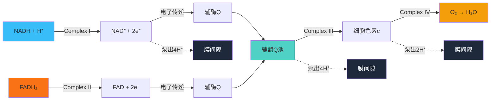
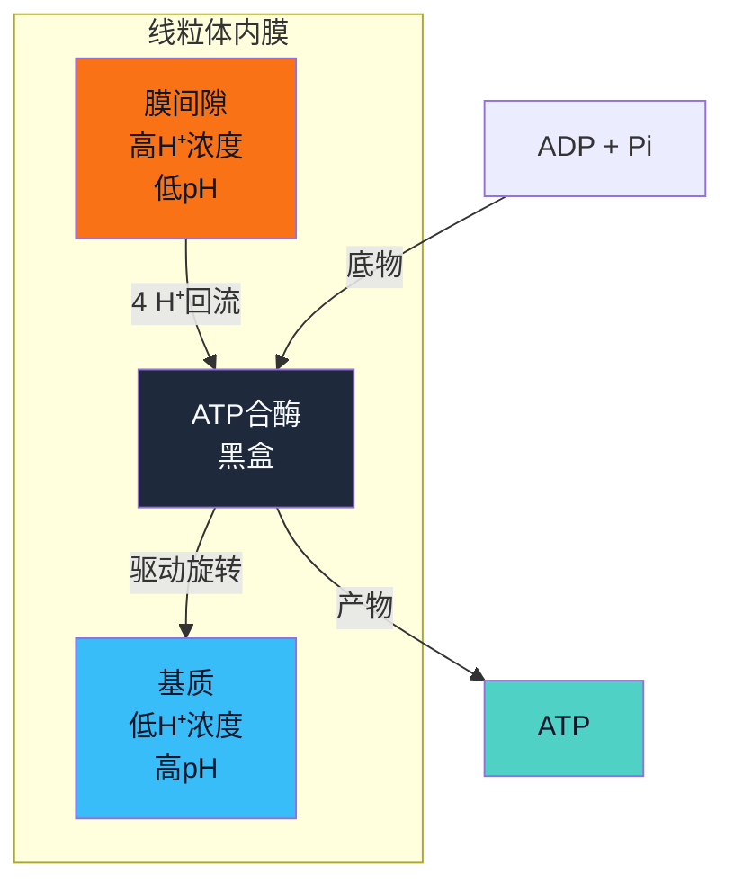

# 细胞呼吸与发酵

## 分子变化角度

以下三篇笔记记录了我对这三个过程中各个物质的结构上的理解。明白每一步的化学反应的反应物和生成物分别是什么。利用 Pubchem 的 Diagram as Code 服务获取了相关分子的结构平面图，加深了我对这些分子结构的理解。

之所以先从分子变化的角度学习这三个过程，是因为我在进入这一章学习之前，并不了解这三个过程发生什么。随着学习的开始，我遇见了许多没有见过的物质，对他们的外观结构一无所知。在与 LLM （通常是网页版 Gemini 3 pro）的对话中，知悉存在 Diagram as Code 这样的服务。人们可以通过 URL 链接遵循特定的语法约定获取你想知道的分子的结构示意图。这对我的学习提供了非常大的帮助，我可以很方便的获取分子的结构图，来思考它们在反应过程中，具体发生了什么变化。

这三篇笔记的几乎全部内容，都是通过 LibreChat 与 LLM （通常是 Sonnet-5）对话生成的。为了让 LLM 能够在 LibreChat 中接入我的笔记，我使用 Cursor 打开本地的 LibreChat/ 项目，让它帮我搭建了“网络搜索”、pubchem mcp 和 filesystem mcp 工具。“网络搜索”让 LLM 能够精准找出我想要了解的物质的 PID 编号，接着通过 pubchem mcp 让 LLM 帮我将图片下载到本地，最后使用 filesystem mcp 进行 markdown 文件的编辑、图片的整理，最终完成这三篇笔记。

笔记的结构大致分为两个部分。第一个部分是介绍每一步的化学反应，第二个部分是列出所有出现的物质的基本信息和从 Pubchem 得到的分子结构平面图。

[糖酵解](../思考/糖酵解学习.md)

[丙酮酸氧化](../思考/丙酮酸氧化学习.md)

[柠檬酸循环](../思考/柠檬酸循环学习.md)

## 能量流动角度

仅仅知道各个步骤的化学反应和参与者们的结构，是不足以真正理解细胞呼吸的。并且这样的学习方法不足以理解氧化磷酸化，因为这一过程涉及到ATP合酶、化学渗透、质子梯度等概念。老实说，我在这里的学习碰了壁，失去了学习的动力。教材讲得内容过于细节，让我失去了对整体的把握，我继续一种新的生物学宏大叙述来拯救我。我认定仅凭《坎贝尔生物学》是无法给予我知识上的帮助，于是我把我的困惑告知 Gemini 3 pro 和 Opus 5，并希望推荐一些书籍来拯救我的学习动机。最终我选择了《复杂生命的起源》。阅读这本书后，我发现我对坎贝尔生物学第九章的内容欠缺从能量流动角度的理解。我太过执着于化学反应与分子结构的分析了。

总之，《复杂生命的起源》中的以下观点为我的《坎贝尔学习》之旅提供了新一轮的燃料：

- **真核细胞源自一次几乎不可能重演的内共生事件**：细菌与古菌的偶然相遇催生了线粒体，这一演化奇迹在地球生命史上很可能只发生过一次。正是这场唯一的能量革命，使得最后真核生物共同祖先（LECA）得以一步跨越漫长的过渡阶段——它在诞生之初，就已经完整具备了现代真核细胞的所有核心功能。（真核生命的诞生是一次几乎不可能重复的奇迹）
- **质子梯度先于细胞而存在**：生命并非诞生于"原始汤"，而是起源于深海碱性热泉。在那里，海水与热泉之间天然的酸碱差异，为最早的生命提供了现成的化学渗透环境。这意味着，驱动一切生命活动的能量机制——质子梯度，早在真正意义上的细胞出现之前，就已经存在于地球上了。（能量机制是生命最根本的约束）

----

### 糖酵解

| 步数     | 反应式                                     | ATP    | NADH   | 类型            |
| -------- | ------------------------------------------ | ------ | ------ | --------------- |
| 1        | 葡萄糖 + ATP → G6P + ADP                   | -1     |        | 磷酸化          |
| 2        | G6P → F6P                                  |        |        | 异构化          |
| 3        | F6P + ATP → FBP + ADP                      | -1     |        | 磷酸化          |
| 4        | FBP → DHAP + G3P                           |        |        | 裂解            |
| 5        | DHAP → G3P                                 |        |        | 异构化          |
| 6        | G3P + NAD⁺ + Pi → 1,3-BPG + NADH + H⁺ (x2) |        | +2     | 氧化脱氢+磷酸化 |
| 7        | 1,3-BPG + ADP → 3-PG + ATP (x2)            | +2     |        | 底物水平磷酸化  |
| 8        | 3-PG → 2-PG (x2)                           |        |        | 异构化          |
| 9        | 2-PG → PEP + H₂O (x2)                      |        |        | 脱水            |
| 10       | PEP + ADP → 丙酮酸 + ATP (x2)              | +2     |        | 底物水平磷酸化  |
| **合计** | 葡萄糖 → 2 丙酮酸                          | **+2** | **+2** |                 |

### 丙酮酸氧化

| 步数     | 反应式                                               | NADH   | 乙酰CoA | 类型     |
| -------- | ---------------------------------------------------- | ------ | ------- | -------- |
| 1        | 丙酮酸 + NAD⁺ + CoA → 乙酰CoA + CO₂ + NADH + H⁺ (x2) | +2     | +2      | 氧化脱羧 |
| **合计** | 2 丙酮酸 → 2 乙酰CoA + 2 CO₂                         | **+2** | **+2**  |          |

### 柠檬酸循环（单轮）

| 步数               | 反应式                                           | NADH   | FADH₂  | ATP/GTP | 类型           |
| ------------------ | ------------------------------------------------ | ------ | ------ | ------- | -------------- |
| 1                  | 乙酰CoA + 草酰乙酸 + H₂O → 柠檬酸 + CoA          |        |        |         | 缩合           |
| 2                  | 柠檬酸 → 顺乌头酸 → 异柠檬酸                     |        |        |         | 异构化/重排    |
| 3                  | 异柠檬酸 + NAD⁺ → α-酮戊二酸 + CO₂ + NADH        | +1     |        |         | 氧化脱羧       |
| 4                  | α-酮戊二酸 + NAD⁺ + CoA → 琥珀酰CoA + CO₂ + NADH | +1     |        |         | 氧化脱羧       |
| 5                  | 琥珀酰CoA + GDP + Pi → 琥珀酸 + CoA + GTP        |        |        | +1      | 底物水平磷酸化 |
| 6                  | 琥珀酸 + FAD → 富马酸 + FADH₂                    |        | +1     |         | 氧化脱氢       |
| 7                  | 富马酸 + H₂O → 苹果酸                            |        |        |         | 水合           |
| 8                  | 苹果酸 + NAD⁺ → 草酰乙酸 + NADH                  | +1     |        |         | 氧化脱氢       |
| **单轮合计**       | 乙酰CoA → 2 CO₂                                  | **+3** | **+1** | **+1**  |                |
| **×2（每葡萄糖）** | 2 乙酰CoA → 4 CO₂                                | **+6** | **+2** | **+2**  |                |

### 细胞呼吸能量汇总（1个葡萄糖）

| 阶段               | ATP    | NADH    | FADH₂  |
| ------------------ | ------ | ------- | ------ |
| 糖酵解             | +2     | +2      | 0      |
| 丙酮酸氧化         | 0      | +2      | 0      |
| 柠檬酸循环（单轮） | +2     | +6      | +2     |
| **合计**           | **+4** | **+10** | **+2** |

### 氧化磷酸化

#### 电子传递链

#### ATP合酶

把ATP合酶想象为一个货币兑换机：

- 投入：4个质子币（从膜间隙流回基质）
- 产出：1个ATP币
- 固定汇率：4比1

#### NADH和FADH₂账目

| 电子供体 | 入口       | 泵质子位点   | 泵出H⁺ | 产生ATP |
| -------- | ---------- | ------------ | ------ | ------- |
| NADH     | Complex I  | I → III → IV | ∼10    | ∼2.5    |
| FADH₂    | Complex II | III → IV     | ∼6     | ∼1.5    |

### 总账

每个葡萄糖的氧化磷酸化

| 来源                  | 数量 | 每个泵出H⁺ | 总H⁺    | 产生ATP (÷4) |
| --------------------- | ---- | ---------- | ------- | ------------ |
| NADH (来自糖酵解)     | 2    | 10         | 20      | 5            |
| NADH (来自丙酮酸氧化) | 2    | 10         | 20      | 5            |
| NADH (来自TCA)        | 6    | 10         | 60      | 15           |
| FADH₂ (来自TCA)       | 2    | 6          | 12      | 3            |
| **合计**              | -    | -          | **112** | **28**       |

加上底物水平磷酸化的4个ATP，总计约**32个ATP**（理论值，实际约30）。
